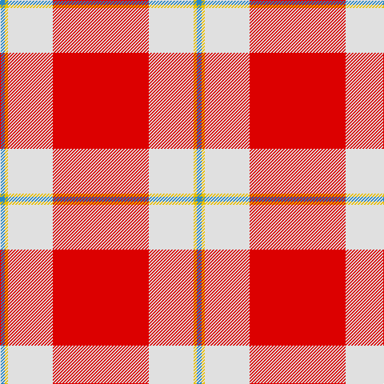

In pattern [BYWR](/patterns/bywr/).

This was sourced from register-of-tartans.  It is a [4 stripes tartan](/stripes/stripes4/).

Original link https://www.tartanregister.gov.uk/tartanDetails.aspx?ref=11283

## Thread count
B/6 Y4 LN56 R/120

## Palette
Each colour and its ΔE from the base-6 reference it is a variant of.

| Colour | Shade | Base | ΔE (OKLab) |
|---|---|---|---|
| B | <code style="background-color:#2888C4;">#2888C4</code> `#2888C4` | B <code style="background-color:#2A418A;">#2A418A</code> | 0.21 |
| LN | <code style="background-color:#E0E0E0;">#E0E0E0</code> `#E0E0E0` | W <code style="background-color:#F7F7F7;">#F7F7F7</code> | 0.07 |
| R | <code style="background-color:#DC0000;">#DC0000</code> `#DC0000` | R <code style="background-color:#CC0000;">#CC0000</code> | 0.03 |
| Y | <code style="background-color:#E8C000;">#E8C000</code> `#E8C000` | Y <code style="background-color:#F2BF00;">#F2BF00</code> | 0.02 |

# Sample pattern

## Nearest tartans

The nearest existing variants by ΔTartan distance.

1. [Willis, H Graham](/setts/s4/r60w28y2b3~b5c8ca8-rc80000-wfcfcfc-yfccc00~x2/) — ΔT 0.66
1. [MacLaine of Lochbuie](/setts/s4/r32g8w4y1~g004c00-rc80000-wd0d0d0-yffc800/) — ΔT 1.49
1. [National Defense (Unauthorised)](/setts/s6/r40w2b2w2r1y20~b2c2c80-rc80000-we0e0e0-ye8c000~x2/) — ΔT 1.56
1. [Nicolson Dress (Clan)](/setts/s5/r62b8w20k3g4~b2c2c80-g006818-k101010-rc80000-we0e0e0~x2/) — ΔT 1.58
1. [MacGregor - 2005 (Black - Personal)](/setts/s6/r41w19r7w8w1k3~k101010-rc80000-wfcfcfc~x2/) — ΔT 1.62
1. [Davet (2014)](/setts/s6/b5k1w11k1r42k1~b5c8ca8-k101010-rc80000-wfcfcfc~x2/) — ΔT 1.64
1. [Davet (2014)](/setts/s6/y5k1w11k1r42k1~k000000-rdc0000-wffffff-y48a4c0~x2/) — ΔT 1.67
1. [Unidentified Locket](/setts/s4/b4r50g25w2~b2c4084-g005020-rdc0000-we0e0e0~x2/) — ΔT 1.69
1. [Sildesalaten](/setts/s5/r32w4b7y2ba2~b2f2f4f-ba2888c4-rc80000-wffffff-yffe600~x5/) — ΔT 1.80
1. [Sildesalaten](/setts/s5/r32w4b7y2ba2~b003c64-ba2888c4-rc80000-we8ccb8-yfccc00~x5/) — ΔT 1.85

## Neighbour map

Every grey dot is one of 15726 variants placed by the first two principal components of the ΔTartan feature space (44% of its variance). Red is this tartan; blue dots are its nearest — click one to open its page.

<svg viewBox="0 0 640 380" role="img" style="max-width:100%;height:auto;border:1px solid #e0e0e0;border-radius:4px;display:block" xmlns="http://www.w3.org/2000/svg"><image href="/nn/cloud.v1.png" width="640" height="380"/><a href="/setts/s4/r60w28y2b3~b5c8ca8-rc80000-wfcfcfc-yfccc00~x2/"><circle cx="413.1" cy="147.7" r="4" fill="#3465a4"><title>Willis, H Graham</title></circle></a><a href="/setts/s4/r32g8w4y1~g004c00-rc80000-wd0d0d0-yffc800/"><circle cx="492.2" cy="162.6" r="4" fill="#3465a4"><title>MacLaine of Lochbuie</title></circle></a><a href="/setts/s6/r40w2b2w2r1y20~b2c2c80-rc80000-we0e0e0-ye8c000~x2/"><circle cx="430.8" cy="112.0" r="4" fill="#3465a4"><title>National Defense (Unauthorised)</title></circle></a><a href="/setts/s5/r62b8w20k3g4~b2c2c80-g006818-k101010-rc80000-we0e0e0~x2/"><circle cx="376.3" cy="134.4" r="4" fill="#3465a4"><title>Nicolson Dress (Clan)</title></circle></a><a href="/setts/s6/r41w19r7w8w1k3~k101010-rc80000-wfcfcfc~x2/"><circle cx="409.5" cy="130.7" r="4" fill="#3465a4"><title>MacGregor - 2005 (Black - Personal)</title></circle></a><a href="/setts/s6/b5k1w11k1r42k1~b5c8ca8-k101010-rc80000-wfcfcfc~x2/"><circle cx="465.6" cy="100.1" r="4" fill="#3465a4"><title>Davet (2014)</title></circle></a><a href="/setts/s6/y5k1w11k1r42k1~k000000-rdc0000-wffffff-y48a4c0~x2/"><circle cx="458.8" cy="95.3" r="4" fill="#3465a4"><title>Davet (2014)</title></circle></a><a href="/setts/s4/b4r50g25w2~b2c4084-g005020-rdc0000-we0e0e0~x2/"><circle cx="415.5" cy="180.3" r="4" fill="#3465a4"><title>Unidentified Locket</title></circle></a><a href="/setts/s5/r32w4b7y2ba2~b2f2f4f-ba2888c4-rc80000-wffffff-yffe600~x5/"><circle cx="404.6" cy="142.3" r="4" fill="#3465a4"><title>Sildesalaten</title></circle></a><a href="/setts/s5/r32w4b7y2ba2~b003c64-ba2888c4-rc80000-we8ccb8-yfccc00~x5/"><circle cx="418.2" cy="148.5" r="4" fill="#3465a4"><title>Sildesalaten</title></circle></a><circle cx="433.1" cy="153.9" r="5" fill="#c00000"/></svg>

ID: /setts/s4/r60w28y2b3~b2888c4-rdc0000-we0e0e0-ye8c000~x2/
