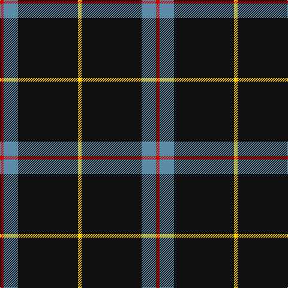

In pattern [RBKY](/patterns/rbky/).

This was sourced from tartans-authority.  It is a [4 stripes tartan](/stripes/stripes4/).

Original link http://www.tartansauthority.com/tartan-ferret/display/10749/

## Thread count
R/6 B24 K100 Y/6

## Palette
Each colour and its ΔE from the base-6 reference it is a variant of.

| Colour | Shade | Base | ΔE (OKLab) |
|---|---|---|---|
| B | <code style="background-color:#5C8CA8;">#5C8CA8</code> `#5C8CA8` | B <code style="background-color:#2A418A;">#2A418A</code> | 0.23 |
| K | <code style="background-color:#101010;">#101010</code> `#101010` | K <code style="background-color:#000000;">#000000</code> | 0.17 |
| R | <code style="background-color:#C80000;">#C80000</code> `#C80000` | R <code style="background-color:#CC0000;">#CC0000</code> | 0.01 |
| Y | <code style="background-color:#FCCC00;">#FCCC00</code> `#FCCC00` | Y <code style="background-color:#F2BF00;">#F2BF00</code> | 0.04 |

# Sample pattern

## Nearest tartans

The nearest existing variants by ΔTartan distance.

1. [Rogues (United States), The](/setts/s4/r6b24k100y6-b506987-k101010-rff2400-yffc125/) — ΔT 0.33
1. [C-Tec N.I. Ltd](/setts/s4/k124b30w12y8-b000080-k1c1714-wf8f8f8-yfccc00/) — ΔT 0.64
1. [Dobelman (Personal)](/setts/s4/r4k80w20r4-k101010-r880000-wc0c0c0/) — ΔT 0.97
1. [Dhillon (Personal)](/setts/s4/k140y12w12g12-g006818-k101010-wf8f8f8-yd87c00/) — ΔT 1.08
1. [Friends of Nordegg (Corporate)](/setts/s5/k100b12r12ra12w6-b2c2c80-k101010-rc80000-ra888888-we0e0e0/) — ΔT 1.23
1. [Perry Ancient (Personal)](/setts/s5/k150g52g6k8y12-g808080-k101010-ye8c000/) — ΔT 1.23
1. [Fily, Sylvain Roger](/setts/s5/r12g12k120w6b6-b0000cd-g008b00-k101010-rff0000-wffffff/) — ΔT 1.26
1. [Westgate Fashion Tartan Tartan Number: 6019. Earliest known date: pre 2003 A fashion tartan See products available Copyright © Blair Urquhart, Comrie, 2015](/setts/s4/g28k160g28y10-g5c6428-k101010-ye8c000/) — ΔT 1.29
1. [Perry (Calgary), Alex (Personal)](/setts/s4/k124b48y10w6-b3f4441-k120a01-wf7f1e8-yef8f06/) — ΔT 1.29
1. [Union Fire Club Pipes & Drums (Corp.](/setts/s5/k120r40y4k32w12-k101010-rc80000-we0e0e0-ye8c000/) — ΔT 1.38

## Neighbour map

Every grey dot is one of 15726 variants placed by the first two principal components of the ΔTartan feature space (44% of its variance). Red is this tartan; blue dots are its nearest — click one to open its page.

<svg viewBox="0 0 640 380" role="img" style="max-width:100%;height:auto;border:1px solid #e0e0e0;border-radius:4px;display:block" xmlns="http://www.w3.org/2000/svg"><image href="/nn/cloud.v1.png" width="640" height="380"/><a href="/setts/s4/r6b24k100y6-b506987-k101010-rff2400-yffc125/"><circle cx="465.1" cy="199.6" r="4" fill="#3465a4"><title>Rogues (United States), The</title></circle></a><a href="/setts/s4/k124b30w12y8-b000080-k1c1714-wf8f8f8-yfccc00/"><circle cx="423.4" cy="199.4" r="4" fill="#3465a4"><title>C-Tec N.I. Ltd</title></circle></a><a href="/setts/s4/r4k80w20r4-k101010-r880000-wc0c0c0/"><circle cx="479.2" cy="199.2" r="4" fill="#3465a4"><title>Dobelman (Personal)</title></circle></a><a href="/setts/s4/k140y12w12g12-g006818-k101010-wf8f8f8-yd87c00/"><circle cx="489.8" cy="203.1" r="4" fill="#3465a4"><title>Dhillon (Personal)</title></circle></a><a href="/setts/s5/k100b12r12ra12w6-b2c2c80-k101010-rc80000-ra888888-we0e0e0/"><circle cx="416.8" cy="163.7" r="4" fill="#3465a4"><title>Friends of Nordegg (Corporate)</title></circle></a><a href="/setts/s5/k150g52g6k8y12-g808080-k101010-ye8c000/"><circle cx="461.6" cy="182.1" r="4" fill="#3465a4"><title>Perry Ancient (Personal)</title></circle></a><a href="/setts/s5/r12g12k120w6b6-b0000cd-g008b00-k101010-rff0000-wffffff/"><circle cx="474.8" cy="149.6" r="4" fill="#3465a4"><title>Fily, Sylvain Roger</title></circle></a><a href="/setts/s4/g28k160g28y10-g5c6428-k101010-ye8c000/"><circle cx="475.3" cy="228.0" r="4" fill="#3465a4"><title>Westgate Fashion Tartan Tartan Number: 6019. Earliest known date: pre 2003 A fashion tartan See products available Copyright © Blair Urquhart, Comrie, 2015</title></circle></a><a href="/setts/s4/k124b48y10w6-b3f4441-k120a01-wf7f1e8-yef8f06/"><circle cx="420.4" cy="201.9" r="4" fill="#3465a4"><title>Perry (Calgary), Alex (Personal)</title></circle></a><a href="/setts/s5/k120r40y4k32w12-k101010-rc80000-we0e0e0-ye8c000/"><circle cx="462.5" cy="170.0" r="4" fill="#3465a4"><title>Union Fire Club Pipes &amp; Drums (Corp.</title></circle></a><circle cx="455.3" cy="196.0" r="5" fill="#c00000"/></svg>

ID: /setts/s4/r6b24k100y6-b5c8ca8-k101010-rc80000-yfccc00/
