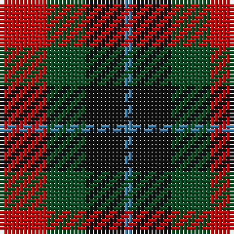

This page is one **sett** — a single exact thread-count. It belongs to the [tartan](/tartans/r6g5k5b1/)
(the same proportion at any scale), whose colour order is pattern [BKGR](/stripes/bkgr/).

Sourced from register-of-tartans.  It is a [4 stripe tartan](/stripes/stripes4/).

Original link https://www.tartanregister.gov.uk/tartanDetails.aspx?ref=4319

## Also known as

This cloth is also recorded under:

- Unnamed, No 28

## Register references

External register numbers recorded for this tartan.

- Scottish Register of Tartans: [4319](https://www.tartanregister.gov.uk/tartanDetails.aspx?ref=4319)
- Scottish Tartans World Register: 1982

## Thread count
R/12 G10 K10 B/2

## Palette
Each colour and the base-6 reference it is a variant of.

| Colour | Shade | Base |
|---|---|---|
| B | <code style="background-color:#3C82AF;">#3C82AF</code> `oklch(58.1% 0.099 239.8)` <small>#3C82AF</small> | B <code style="background-color:#2A418A;">#2A418A</code> |
| G | <code style="background-color:#005020;">#005020</code> `oklch(37.7% 0.105 149.6)` <small>#005020</small> | G <code style="background-color:#006100;">#006100</code> |
| K | <code style="background-color:#101010;">#101010</code> `oklch(17.3% 0.000 89.9)` <small>#101010</small> | K <code style="background-color:#000000;">#000000</code> |
| R | <code style="background-color:#DC0000;">#DC0000</code> `oklch(56.2% 0.230 29.2)` <small>#DC0000</small> | R <code style="background-color:#CC0000;">#CC0000</code> |

# Sample pattern

## Nearest tartans

The nearest existing variants by ΔTartan distance, with this tartan at the top so the swatches line up against it.

ΔTartan

Tartan

Sett

—

<a href="/ttd/edit/#slug=r6dg5k5t1~x2">Unidentified No 28</a> <a class="nn-out" href="/setts/s4/r6dg5k5t1~x2/" title="open its dictionary page">↗</a>

0.63

<a href="/ttd/edit/#slug=r9g9k10t2~x2">Wilson's No.196</a> <a class="nn-out" href="/setts/s4/r9g9k10t2~x2/" title="open its dictionary page">↗</a>

0.96

<a href="/ttd/edit/#slug=dt6k6dt6r14ly3~x2">Chivas Regal</a> <a class="nn-out" href="/setts/s5/dt6k6dt6r14ly3~x2/" title="open its dictionary page">↗</a>

1.02

<a href="/ttd/edit/#slug=r6g5k5t1~x2">Unnamed, No 28</a> <a class="nn-out" href="/setts/s4/r6g5k5t1~x2/" title="open its dictionary page">↗</a>

1.07

<a href="/ttd/edit/#slug=dt2k2dt2r5ly1~x12">Chivas Regal (Corporate)</a> <a class="nn-out" href="/setts/s5/dt2k2dt2r5ly1~x12/" title="open its dictionary page">↗</a>

1.22

<a href="/ttd/edit/#slug=db9r12dg9db5w2~x4">Battle of Prestonpans (1745) Herit</a> <a class="nn-out" href="/setts/s5/db9r12dg9db5w2~x4/" title="open its dictionary page">↗</a>

1.25

<a href="/ttd/edit/#slug=dp8k11g9r2~x2">Norwich Collection No. 60</a> <a class="nn-out" href="/setts/s4/dp8k11g9r2~x2/" title="open its dictionary page">↗</a>

1.34

<a href="/ttd/edit/#slug=r13dt13o5lo2dt13lo13~x2">Torana</a> <a class="nn-out" href="/setts/s6/r13dt13o5lo2dt13lo13~x2/" title="open its dictionary page">↗</a>

1.38

<a href="/ttd/edit/#slug=r6g5k5g5r6t1~x4">Norwich No.028</a> <a class="nn-out" href="/setts/s6/r6g5k5g5r6t1~x4/" title="open its dictionary page">↗</a>

1.38

<a href="/ttd/edit/#slug=dp5k5g5w1~x4">Wilson's No.220</a> <a class="nn-out" href="/setts/s4/dp5k5g5w1~x4/" title="open its dictionary page">↗</a>

1.40

<a href="/ttd/edit/#slug=p6k5g5r1~x2">Unnamed, No 60</a> <a class="nn-out" href="/setts/s4/p6k5g5r1~x2/" title="open its dictionary page">↗</a>

## Neighbour map

Every grey dot is one of 14299 variants placed by the first two principal components of the ΔTartan feature space (44% of its variance). Red is this tartan; blue dots are its nearest — click one to open its page.

<svg viewBox="0 0 640 380" role="img" style="max-width:100%;height:auto;border:1px solid #e0e0e0;border-radius:4px;display:block" xmlns="http://www.w3.org/2000/svg"><image href="/nn/cloud.v1.png" width="640" height="380"/><a href="/setts/s4/r9g9k10t2~x2/"><circle cx="124.6" cy="290.8" r="4" fill="#3465a4"><title>Wilson's No.196</title></circle></a><a href="/setts/s5/dt6k6dt6r14ly3~x2/"><circle cx="160.9" cy="268.3" r="4" fill="#3465a4"><title>Chivas Regal</title></circle></a><a href="/setts/s4/r6g5k5t1~x2/"><circle cx="118.6" cy="268.6" r="4" fill="#3465a4"><title>Unnamed, No 28</title></circle></a><a href="/setts/s5/dt2k2dt2r5ly1~x12/"><circle cx="176.1" cy="261.3" r="4" fill="#3465a4"><title>Chivas Regal (Corporate)</title></circle></a><a href="/setts/s5/db9r12dg9db5w2~x4/"><circle cx="150.6" cy="262.8" r="4" fill="#3465a4"><title>Battle of Prestonpans (1745) Herit</title></circle></a><a href="/setts/s4/dp8k11g9r2~x2/"><circle cx="157.4" cy="296.1" r="4" fill="#3465a4"><title>Norwich Collection No. 60</title></circle></a><a href="/setts/s6/r13dt13o5lo2dt13lo13~x2/"><circle cx="163.6" cy="245.4" r="4" fill="#3465a4"><title>Torana</title></circle></a><a href="/setts/s6/r6g5k5g5r6t1~x4/"><circle cx="150.2" cy="266.2" r="4" fill="#3465a4"><title>Norwich No.028</title></circle></a><a href="/setts/s4/dp5k5g5w1~x4/"><circle cx="112.5" cy="291.2" r="4" fill="#3465a4"><title>Wilson's No.220</title></circle></a><a href="/setts/s4/p6k5g5r1~x2/"><circle cx="121.7" cy="273.4" r="4" fill="#3465a4"><title>Unnamed, No 60</title></circle></a><circle cx="144.5" cy="277.3" r="5" fill="#c00000"/></svg>

ID: /setts/s4/r6dg5k5t1~x2/
