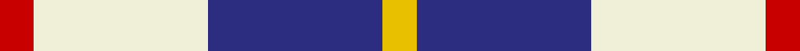

In pattern [RWBY](/stripes/rwby/).

This was sourced from register-of-tartans.  It is a [4 stripe tartan](/stripes/stripes4/).

Original link https://www.tartanregister.gov.uk/tartanDetails.aspx?ref=2750

## Also known as

This cloth is also recorded under:

- MacRae of Conchra #3

## Attestations

This cloth appears in 2 source records; the oldest owns this page.

- 01/01/1893 — MacRae of Conchra #3 (register-of-tartans, [record](https://www.tartanregister.gov.uk/tartanDetails.aspx?ref=2750))
- 1893 — MacRae of Conchra - 1893 (Clan) (tartans-authority, [record](http://www.tartansauthority.com/tartan-ferret/display/1683/))

## Register references

External register numbers recorded for this tartan.

- Scottish Register of Tartans: [2750](https://www.tartanregister.gov.uk/tartanDetails.aspx?ref=2750)
- Scottish Tartans Authority (ITI): 1683
- Scottish Tartans World Register: 1683

## Thread count
R/14 LY72 DB72 Y/14

## Palette
Each colour and the base-6 reference it is a variant of.

| Colour | Shade | Base |
|---|---|---|
| DB | <code style="background-color:#2C2C80;">#2C2C80</code> `oklch(35.0% 0.138 276.6)` <small>#2C2C80</small> | B <code style="background-color:#2A418A;">#2A418A</code> |
| LY | <code style="background-color:#F0F0D8;">#F0F0D8</code> `oklch(94.9% 0.032 107.0)` <small>#F0F0D8</small> | W <code style="background-color:#F7F7F7;">#F7F7F7</code> |
| R | <code style="background-color:#C80000;">#C80000</code> `oklch(52.3% 0.215 29.2)` <small>#C80000</small> | R <code style="background-color:#CC0000;">#CC0000</code> |
| Y | <code style="background-color:#E8C000;">#E8C000</code> `oklch(81.9% 0.168 93.7)` <small>#E8C000</small> | Y <code style="background-color:#F2BF00;">#F2BF00</code> |

# Sample pattern

## Nearest tartans

The nearest existing variants by ΔTartan distance, with this tartan at the top so the swatches line up against it.

ΔTartan

Tartan

Sett

—

<a href="/ttd/edit/#slug=r7w36db36ly7~x2">MacRae of Conchra #3</a> <a class="nn-out" href="/setts/s4/r7w36db36ly7~x2/" title="open its dictionary page">↗</a>

0.65

<a href="/ttd/edit/#slug=k5n24w24k5~x2">City of London</a> <a class="nn-out" href="/setts/s4/k5n24w24k5~x2/" title="open its dictionary page">↗</a>

0.68

<a href="/ttd/edit/#slug=k5n24w24r5~x2">City of London (Corporate)</a> <a class="nn-out" href="/setts/s4/k5n24w24r5~x2/" title="open its dictionary page">↗</a>

0.95

<a href="/ttd/edit/#slug=b8w13r3w2k5~x2">Boswell Dress (Personal)</a> <a class="nn-out" href="/setts/s5/b8w13r3w2k5~x2/" title="open its dictionary page">↗</a>

1.08

<a href="/ttd/edit/#slug=r1w8dt8ly1~x4">MacRae of Conchra</a> <a class="nn-out" href="/setts/s4/r1w8dt8ly1~x4/" title="open its dictionary page">↗</a>

1.40

<a href="/ttd/edit/#slug=o22ly10w3db8~x2">Louisburg</a> <a class="nn-out" href="/setts/s4/o22ly10w3db8~x2/" title="open its dictionary page">↗</a>

1.45

<a href="/ttd/edit/#slug=k23b6k6r5w35r10~x2">Merrilees Dress (Dance)</a> <a class="nn-out" href="/setts/s6/k23b6k6r5w35r10~x2/" title="open its dictionary page">↗</a>

1.49

<a href="/ttd/edit/#slug=db3w25k25r3~x2">Gleneckley</a> <a class="nn-out" href="/setts/s4/db3w25k25r3~x2/" title="open its dictionary page">↗</a>

1.51

<a href="/ttd/edit/#slug=db10w3db12ly14r4~x2">MacLeod, of Argentina</a> <a class="nn-out" href="/setts/s5/db10w3db12ly14r4~x2/" title="open its dictionary page">↗</a>

1.57

<a href="/ttd/edit/#slug=r2w6db2w9db9w2db6ly2~x2">North Vancouver, Island</a> <a class="nn-out" href="/setts/s8/r2w6db2w9db9w2db6ly2~x2/" title="open its dictionary page">↗</a>

1.57

<a href="/ttd/edit/#slug=k1w8db8r1~x8">MacRae Dress Purple</a> <a class="nn-out" href="/setts/s4/k1w8db8r1~x8/" title="open its dictionary page">↗</a>

## Neighbour map

Every grey dot is one of 14299 variants placed by the first two principal components of the ΔTartan feature space (44% of its variance). Red is this tartan; blue dots are its nearest — click one to open its page.

<svg viewBox="0 0 640 380" role="img" style="max-width:100%;height:auto;border:1px solid #e0e0e0;border-radius:4px;display:block" xmlns="http://www.w3.org/2000/svg"><image href="/nn/cloud.v1.png" width="640" height="380"/><a href="/setts/s4/k5n24w24k5~x2/"><circle cx="147.0" cy="236.5" r="4" fill="#3465a4"><title>City of London</title></circle></a><a href="/setts/s4/k5n24w24r5~x2/"><circle cx="155.8" cy="236.0" r="4" fill="#3465a4"><title>City of London (Corporate)</title></circle></a><a href="/setts/s5/b8w13r3w2k5~x2/"><circle cx="165.3" cy="213.2" r="4" fill="#3465a4"><title>Boswell Dress (Personal)</title></circle></a><a href="/setts/s4/r1w8dt8ly1~x4/"><circle cx="208.1" cy="212.4" r="4" fill="#3465a4"><title>MacRae of Conchra</title></circle></a><a href="/setts/s4/o22ly10w3db8~x2/"><circle cx="219.6" cy="235.6" r="4" fill="#3465a4"><title>Louisburg</title></circle></a><a href="/setts/s6/k23b6k6r5w35r10~x2/"><circle cx="154.5" cy="190.3" r="4" fill="#3465a4"><title>Merrilees Dress (Dance)</title></circle></a><a href="/setts/s4/db3w25k25r3~x2/"><circle cx="212.0" cy="211.3" r="4" fill="#3465a4"><title>Gleneckley</title></circle></a><a href="/setts/s5/db10w3db12ly14r4~x2/"><circle cx="187.0" cy="255.1" r="4" fill="#3465a4"><title>MacLeod, of Argentina</title></circle></a><a href="/setts/s8/r2w6db2w9db9w2db6ly2~x2/"><circle cx="169.8" cy="221.2" r="4" fill="#3465a4"><title>North Vancouver, Island</title></circle></a><a href="/setts/s4/k1w8db8r1~x8/"><circle cx="212.8" cy="211.7" r="4" fill="#3465a4"><title>MacRae Dress Purple</title></circle></a><circle cx="161.7" cy="232.6" r="5" fill="#c00000"/></svg>

ID: /setts/s4/r7w36db36ly7~x2/
