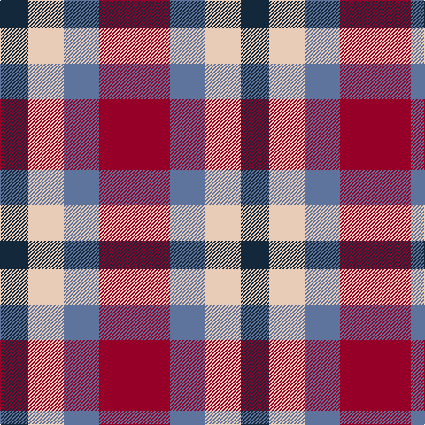

In pattern [BWBR](/patterns/bwbr/).

This was sourced from register-of-tartans.  It is a [4 stripes tartan](/stripes/stripes4/).

Original link https://www.tartanregister.gov.uk/tartanDetails.aspx?ref=11035

## Thread count
DN/32 LR40 B40 DR/80

## Palette
Each colour and its ΔE from the base-6 reference it is a variant of.

| Colour | Shade | Base | ΔE (OKLab) |
|---|---|---|---|
| B | <code style="background-color:#5F749C;">#5F749C</code> `#5F749C` | B <code style="background-color:#2C4084;">#2C4084</code> | 0.17 |
| DN | <code style="background-color:#14283C;">#14283C</code> `#14283C` | B <code style="background-color:#2C4084;">#2C4084</code> | 0.14 |
| DR | <code style="background-color:#960028;">#960028</code> `#960028` | R <code style="background-color:#C80000;">#C80000</code> | 0.11 |
| LR | <code style="background-color:#E8CCB8;">#E8CCB8</code> `#E8CCB8` | W <code style="background-color:#F4F4F0;">#F4F4F0</code> | 0.11 |

# Sample pattern

## Nearest tartans

The nearest existing variants by ΔTartan distance.

1. [Wilson's, No 113](/setts/s4/r4g12b12w4-b800080-g008000-rc00000-we0e0e0/) — ΔT 1.12
1. [Bloomer-Alexander (Personal)](/setts/s4/r32b42ra64w32-b5d1b36-r6c2012-ra8e1818-wffffff/) — ΔT 1.17
1. [Thomas Newcomen's Combustion Engine](/setts/s4/k28r20w12b8-b0000cd-k101010-rff0000-wffffff/) — ΔT 1.35
1. [Thomas Newcomen's Combustion Engine](/setts/s4/k28r20w12b8-b202060-k101010-rc80000-wfcfcfc/) — ΔT 1.40
1. [Gold Country (California)](/setts/s4/b36ba36y56bb26-b000080-ba5f749c-bb3f4441-yef8f06/) — ΔT 1.41
1. [Kucher, Gregory (Personal)](/setts/s4/b20r10k10y10-b506878-k101010-r880000-ya0a0a0/) — ΔT 1.41
1. [Fiddes (Corrected)](/setts/s7/g24r22b24ra6b16g16b16-b780078-g289c18-rc80000-racc4438/) — ΔT 1.54
1. [Doohan (New South Wales), Andrew](/setts/s5/b20y10r40b40w20-b5f749c-rca2625-wf9f5ef-ye0a126/) — ΔT 1.56
1. [SAL Grindrande Stiernan (Corporate)](/setts/s4/r60g20k60w20-g006818-k101010-rc80000-wfcfcfc/) — ΔT 1.56
1. [Austin / Wilson's No 137](/setts/s5/b6k6b6g12r4-b800080-g008000-k000000-rc00000/) — ΔT 1.61

## Neighbour map

Every grey dot is one of 15726 variants placed by the first two principal components of the ΔTartan feature space (44% of its variance). Red is this tartan; blue dots are its nearest — click one to open its page.

<svg viewBox="0 0 640 380" role="img" style="max-width:100%;height:auto;border:1px solid #e0e0e0;border-radius:4px;display:block" xmlns="http://www.w3.org/2000/svg"><image href="/nn/cloud.v1.png" width="640" height="380"/><a href="/setts/s4/r4g12b12w4-b800080-g008000-rc00000-we0e0e0/"><circle cx="120.1" cy="286.6" r="4" fill="#3465a4"><title>Wilson's, No 113</title></circle></a><a href="/setts/s4/r32b42ra64w32-b5d1b36-r6c2012-ra8e1818-wffffff/"><circle cx="75.0" cy="323.1" r="4" fill="#3465a4"><title>Bloomer-Alexander (Personal)</title></circle></a><a href="/setts/s4/k28r20w12b8-b0000cd-k101010-rff0000-wffffff/"><circle cx="105.8" cy="275.3" r="4" fill="#3465a4"><title>Thomas Newcomen's Combustion Engine</title></circle></a><a href="/setts/s4/k28r20w12b8-b202060-k101010-rc80000-wfcfcfc/"><circle cx="111.5" cy="280.1" r="4" fill="#3465a4"><title>Thomas Newcomen's Combustion Engine</title></circle></a><a href="/setts/s4/b36ba36y56bb26-b000080-ba5f749c-bb3f4441-yef8f06/"><circle cx="55.6" cy="331.2" r="4" fill="#3465a4"><title>Gold Country (California)</title></circle></a><a href="/setts/s4/b20r10k10y10-b506878-k101010-r880000-ya0a0a0/"><circle cx="105.3" cy="338.1" r="4" fill="#3465a4"><title>Kucher, Gregory (Personal)</title></circle></a><a href="/setts/s7/g24r22b24ra6b16g16b16-b780078-g289c18-rc80000-racc4438/"><circle cx="151.3" cy="282.0" r="4" fill="#3465a4"><title>Fiddes (Corrected)</title></circle></a><a href="/setts/s5/b20y10r40b40w20-b5f749c-rca2625-wf9f5ef-ye0a126/"><circle cx="177.3" cy="273.8" r="4" fill="#3465a4"><title>Doohan (New South Wales), Andrew</title></circle></a><a href="/setts/s4/r60g20k60w20-g006818-k101010-rc80000-wfcfcfc/"><circle cx="110.8" cy="280.9" r="4" fill="#3465a4"><title>SAL Grindrande Stiernan (Corporate)</title></circle></a><a href="/setts/s5/b6k6b6g12r4-b800080-g008000-k000000-rc00000/"><circle cx="85.1" cy="294.8" r="4" fill="#3465a4"><title>Austin / Wilson's No 137</title></circle></a><circle cx="114.7" cy="306.5" r="5" fill="#c00000"/></svg>

ID: /setts/s4/r80b40w40ba32-b5f749c-ba14283c-r960028-we8ccb8/
