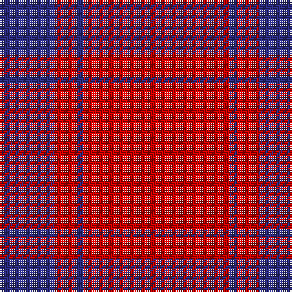

In pattern [BRBR](/patterns/brbr/).

This was sourced from tartans-authority.  It is a [4 stripes tartan](/stripes/stripes4/).

Original link http://www.tartansauthority.com/tartan-ferret/display/7281/

## Thread count
DB/30 R12 DB4 R/80

## Palette
Each colour and its ΔE from the base-6 reference it is a variant of.

| Colour | Shade | Base | ΔE (OKLab) |
|---|---|---|---|
| DB | <code style="background-color:#2C2C80;">#2C2C80</code> `#2C2C80` | B <code style="background-color:#2A418A;">#2A418A</code> | 0.06 |
| R | <code style="background-color:#C80000;">#C80000</code> `#C80000` | R <code style="background-color:#CC0000;">#CC0000</code> | 0.01 |

# Sample pattern

## Nearest tartans

The nearest existing variants by ΔTartan distance.

1. [Masai Shuka 12 (Artefact)](/setts/s4/r100k20r4k20-k101010-rc80000/) — ΔT 1.27
1. [Masai Shuka 07 (Artefact)](/setts/s5/r150k30r8k30r8-k101010-rc80000/) — ΔT 1.40
1. [MacDonald Lord of the Isles](/setts/s4/r38g2r5g16-g004c00-rc80000/) — ΔT 1.45
1. [MacDonald of Sleat - 1810 (Clan)](/setts/s4/r72g4r10g32-g285800-rc80000/) — ΔT 1.64
1. [MacDonald of Sleat](/setts/s4/r72g4r10g32-g006818-rc80000/) — ΔT 1.66
1. [Martin, Robert N (Personal)](/setts/s5/r108w12r24w8g12-g003820-r901c38-we0e0e0/) — ΔT 1.78
1. [MacDonald Lord of the Isles](/setts/s4/r76g4r10g32-g11450d-raa0000/) — ΔT 1.81
1. [MacDonald Lord of the Isles](/setts/s4/r38g2r5g16-g11450d-raa0000/) — ΔT 1.81
1. [Kyle (Blue)](/setts/s8/r108b12r10b12r20b6r4b36-b440044-rc80000/) — ΔT 1.87
1. [MacDonald of Sleat](/setts/s4/r72g4r10g32-g008000-rc00000/) — ΔT 1.89

## Neighbour map

Every grey dot is one of 15726 variants placed by the first two principal components of the ΔTartan feature space (44% of its variance). Red is this tartan; blue dots are its nearest — click one to open its page.

<svg viewBox="0 0 640 380" role="img" style="max-width:100%;height:auto;border:1px solid #e0e0e0;border-radius:4px;display:block" xmlns="http://www.w3.org/2000/svg"><image href="/nn/cloud.v1.png" width="640" height="380"/><a href="/setts/s4/r100k20r4k20-k101010-rc80000/"><circle cx="540.3" cy="203.8" r="4" fill="#3465a4"><title>Masai Shuka 12 (Artefact)</title></circle></a><a href="/setts/s5/r150k30r8k30r8-k101010-rc80000/"><circle cx="543.2" cy="196.2" r="4" fill="#3465a4"><title>Masai Shuka 07 (Artefact)</title></circle></a><a href="/setts/s4/r38g2r5g16-g004c00-rc80000/"><circle cx="531.8" cy="232.5" r="4" fill="#3465a4"><title>MacDonald Lord of the Isles</title></circle></a><a href="/setts/s4/r72g4r10g32-g285800-rc80000/"><circle cx="535.5" cy="241.2" r="4" fill="#3465a4"><title>MacDonald of Sleat - 1810 (Clan)</title></circle></a><a href="/setts/s4/r72g4r10g32-g006818-rc80000/"><circle cx="526.0" cy="238.1" r="4" fill="#3465a4"><title>MacDonald of Sleat</title></circle></a><a href="/setts/s5/r108w12r24w8g12-g003820-r901c38-we0e0e0/"><circle cx="552.4" cy="197.9" r="4" fill="#3465a4"><title>Martin, Robert N (Personal)</title></circle></a><a href="/setts/s4/r76g4r10g32-g11450d-raa0000/"><circle cx="559.4" cy="248.9" r="4" fill="#3465a4"><title>MacDonald Lord of the Isles</title></circle></a><a href="/setts/s4/r38g2r5g16-g11450d-raa0000/"><circle cx="559.4" cy="248.9" r="4" fill="#3465a4"><title>MacDonald Lord of the Isles</title></circle></a><a href="/setts/s8/r108b12r10b12r20b6r4b36-b440044-rc80000/"><circle cx="548.3" cy="168.3" r="4" fill="#3465a4"><title>Kyle (Blue)</title></circle></a><a href="/setts/s4/r72g4r10g32-g008000-rc00000/"><circle cx="519.7" cy="236.6" r="4" fill="#3465a4"><title>MacDonald of Sleat</title></circle></a><circle cx="551.6" cy="226.8" r="5" fill="#c00000"/></svg>

ID: /setts/s4/r80b4r12b30-b2c2c80-rc80000/
