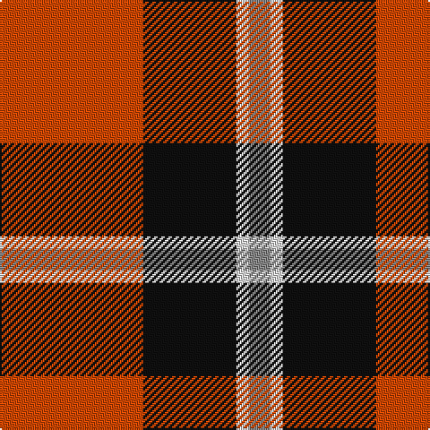

In pattern [RKWR](/patterns/rkwr/).

This was sourced from tartans-authority.  It is a [4 stripes tartan](/stripes/stripes4/).

Original link http://www.tartansauthority.com/tartan-ferret/display/7851/

## Attestations

This cloth appears in 2 source records; the oldest owns this page.

- Dec. 2008 — Oklahoma State University (Corporate (tartans-authority, [record](http://www.tartansauthority.com/tartan-ferret/display/7851/))
- undated — Oklahoma State University American Corporate Tartan Tartan Number: 7851. Earliest known date: Dec. 2008 The official Oklahoma State University Tartan is now a part of the university's tradition. Oklahoma City design, housing and merchandising junior, Stephanie Michalko's weave of orange, black, gray and white threads received the most votes for her original tartan plaid design in on-line balloting In September OSU students who had completed a course in textiles were eligible for the competition to design an original plaid that reflects the OSU spirit. Four finalists were selected and voting began in October. Michalko said she was excited to have her design chosen. 'I am an interior design major, but I am very interested in textiles and their use in interior design,. This was a great experience to be able to apply what I have learned.' Stadium blankets and scarves were woven by Pendleton Woolen Mills of Portland, Oregon. Woven sample. See products available Copyright © Blair Urquhart, Comrie, 2015 (house-of-tartan, [record](http://www.house-of-tartan.scotland.net/house/TartanViewjs.asp?colr=Def&tnam=7851))

## Thread count
DO/80 K52 LN7 N/12

## Palette
Each colour and its ΔE from the base-6 reference it is a variant of.

| Colour | Shade | Base | ΔE (OKLab) |
|---|---|---|---|
| DO | <code style="background-color:#D04804;">#D04804</code> `#D04804` | R <code style="background-color:#C80000;">#C80000</code> | 0.08 |
| K | <code style="background-color:#101010;">#101010</code> `#101010` | K <code style="background-color:#000000;">#000000</code> | 0.17 |
| LN | <code style="background-color:#E0E0E0;">#E0E0E0</code> `#E0E0E0` | W <code style="background-color:#F4F4F0;">#F4F4F0</code> | 0.06 |
| N | <code style="background-color:#888888;">#888888</code> `#888888` | R <code style="background-color:#C80000;">#C80000</code> | 0.24 |

# Sample pattern

## Nearest tartans

The nearest existing variants by ΔTartan distance.

1. [Billy Apple® Red](/setts/s4/g6r78k48y6-g006818-k101010-rdc0000-yffe600/) — ΔT 0.97
1. [Oklahoma State University](/setts/s4/r80k52w7ra12-k000000-rdd7500-ra888888-we0e0e0/) — ΔT 0.99
1. [Connel Clan Tartan Tartan Number: 1854. Earliest known date: c. 1890 Whether the Wallace, which is known to date from at least 1842, and the Connel tartan are related is uncertain, although the close similarity leads one to suspect that the later 'Connel' is based on the Wallace. The Connels and MacConnels are both claimed as septs of Clan Donald. (P.E. MacDonald) See products available Copyright © Blair Urquhart, Comrie, 2015](/setts/s4/w2r16k16y2-k101010-rc80000-we0e0e0-ye8c000/) — ΔT 1.03
1. [Connel (Clan)](/setts/s4/w4r32k32y4-k101010-rc80000-wfcfcfc-ye8c000/) — ΔT 1.03
1. [MacKintosh #4](/setts/s6/r10w4r56k24g32r6-g005020-k101010-rdc0000-we0e0e0/) — ΔT 1.04
1. [MacKintosh 6](/setts/s6/r10w4r56k24g32r6-g008000-k000000-rc00000-we0e0e0/) — ΔT 1.07
1. [Nisbet Family Tartan Tartan Number: 2115. Earliest known date: 1842 This is the sett that appears in the Vestiarium Scoticum as Mackintosh. There is no connection between the names, historically, to explain the position and it is interesting to note the similarity with the Dunbar tartan which also originates in the Vestiarium. The Nisbets came from the old barony of Nisbet in the parish of Edrom, Berwickshire, as early as 1160. See products available Copyright © Blair Urquhart, Comrie, 2015](/setts/s6/r10w4r56k24g32r6-g006818-k101010-rc80000-we0e0e0/) — ΔT 1.09
1. [Fraser VS](/setts/s6/r1b6r1g6r12w1-b000064-g004c00-rc80000-wd0d0d0/) — ΔT 1.17
1. [Dunbar #2](/setts/s6/k8r52k8w4k26y8-k101010-rdc0000-we0e0e0-ye8c000/) — ΔT 1.21
1. [Templar Grand Priory USA](/setts/s4/b6k64r54w4-b2c2c80-k101010-rc80000-we0e0e0/) — ΔT 1.24

## Neighbour map

Every grey dot is one of 15726 variants placed by the first two principal components of the ΔTartan feature space (44% of its variance). Red is this tartan; blue dots are its nearest — click one to open its page.

<svg viewBox="0 0 640 380" role="img" style="max-width:100%;height:auto;border:1px solid #e0e0e0;border-radius:4px;display:block" xmlns="http://www.w3.org/2000/svg"><image href="/nn/cloud.v1.png" width="640" height="380"/><a href="/setts/s4/g6r78k48y6-g006818-k101010-rdc0000-yffe600/"><circle cx="331.7" cy="194.6" r="4" fill="#3465a4"><title>Billy Apple® Red</title></circle></a><a href="/setts/s4/r80k52w7ra12-k000000-rdd7500-ra888888-we0e0e0/"><circle cx="265.1" cy="202.8" r="4" fill="#3465a4"><title>Oklahoma State University</title></circle></a><a href="/setts/s4/w2r16k16y2-k101010-rc80000-we0e0e0-ye8c000/"><circle cx="243.2" cy="222.1" r="4" fill="#3465a4"><title>Connel Clan Tartan Tartan Number: 1854. Earliest known date: c. 1890 Whether the Wallace, which is known to date from at least 1842, and the Connel tartan are related is uncertain, although the close similarity leads one to suspect that the later 'Connel' is based on the Wallace. The Connels and MacConnels are both claimed as septs of Clan Donald. (P.E. MacDonald) See products available Copyright © Blair Urquhart, Comrie, 2015</title></circle></a><a href="/setts/s4/w4r32k32y4-k101010-rc80000-wfcfcfc-ye8c000/"><circle cx="240.3" cy="220.7" r="4" fill="#3465a4"><title>Connel (Clan)</title></circle></a><a href="/setts/s6/r10w4r56k24g32r6-g005020-k101010-rdc0000-we0e0e0/"><circle cx="301.9" cy="183.1" r="4" fill="#3465a4"><title>MacKintosh #4</title></circle></a><a href="/setts/s6/r10w4r56k24g32r6-g008000-k000000-rc00000-we0e0e0/"><circle cx="284.2" cy="180.2" r="4" fill="#3465a4"><title>MacKintosh 6</title></circle></a><a href="/setts/s6/r10w4r56k24g32r6-g006818-k101010-rc80000-we0e0e0/"><circle cx="305.9" cy="187.2" r="4" fill="#3465a4"><title>Nisbet Family Tartan Tartan Number: 2115. Earliest known date: 1842 This is the sett that appears in the Vestiarium Scoticum as Mackintosh. There is no connection between the names, historically, to explain the position and it is interesting to note the similarity with the Dunbar tartan which also originates in the Vestiarium. The Nisbets came from the old barony of Nisbet in the parish of Edrom, Berwickshire, as early as 1160. See products available Copyright © Blair Urquhart, Comrie, 2015</title></circle></a><a href="/setts/s6/r1b6r1g6r12w1-b000064-g004c00-rc80000-wd0d0d0/"><circle cx="280.9" cy="185.6" r="4" fill="#3465a4"><title>Fraser VS</title></circle></a><a href="/setts/s6/k8r52k8w4k26y8-k101010-rdc0000-we0e0e0-ye8c000/"><circle cx="281.7" cy="168.7" r="4" fill="#3465a4"><title>Dunbar #2</title></circle></a><a href="/setts/s4/b6k64r54w4-b2c2c80-k101010-rc80000-we0e0e0/"><circle cx="315.5" cy="200.9" r="4" fill="#3465a4"><title>Templar Grand Priory USA</title></circle></a><circle cx="290.5" cy="208.4" r="5" fill="#c00000"/></svg>

ID: /setts/s4/r80k52w7ra12-k101010-rd04804-ra888888-we0e0e0/
