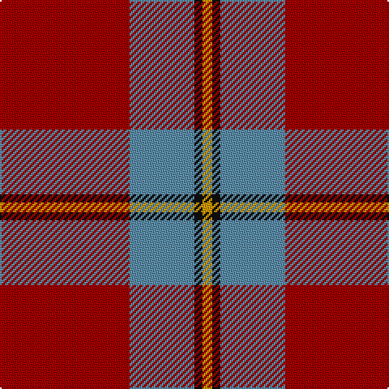

In pattern [RBKY](/stripes/rbky/).

This was sourced from tartans-authority.  It is a [4 stripe tartan](/stripes/stripes4/).

Original link http://www.tartansauthority.com/tartan-ferret/display/10979/

## Thread count
DR/80 B40 K5 DY/6

## Palette
Each colour and the base-6 reference it is a variant of.

| Colour | Shade | Base |
|---|---|---|
| B | <code style="background-color:#5C8CA8;">#5C8CA8</code> `oklch(61.7% 0.067 235.0)` <small>#5C8CA8</small> | B <code style="background-color:#2A418A;">#2A418A</code> |
| DR | <code style="background-color:#A00000;">#A00000</code> `oklch(44.3% 0.182 29.2)` <small>#A00000</small> | R <code style="background-color:#CC0000;">#CC0000</code> |
| DY | <code style="background-color:#D09800;">#D09800</code> `oklch(71.4% 0.147 82.1)` <small>#D09800</small> | Y <code style="background-color:#F2BF00;">#F2BF00</code> |
| K | <code style="background-color:#101010;">#101010</code> `oklch(17.3% 0.000 89.9)` <small>#101010</small> | K <code style="background-color:#000000;">#000000</code> |

# Sample pattern

## Nearest tartans

The nearest existing variants by ΔTartan distance.

1. [MacGregor of Cardney](/setts/s6/m18g9m2g3k1w1~x4/) — ΔT 1.16
1. [MacGregor Hunting Glengyle Clan Tartan Tartan Number: 1285. Earliest known date: 1960 This is the usual MacGregor sett but with a darker crimson background colour. The story goes that Alasdair MacGregor of Cardney wanted to make tartan from the wool of his own sheep. His initial dyeing attempt produced a shocking pink colour, so he dyed the wool a second time to get this dark crimson colour. He liked the result so much that he had a bolt of cloth woven and the Cardney MacGregors have worn it ever since. The addition of the term 'Hunting' to the name is, apparently a commercial attribution. Notes from the STA, quoting Sir Malcolm MacGregor of MacGregor (2006) See products available Copyright © Blair Urquhart, Comrie, 2015](/setts/s6/m96g42m16g17k4lb6/) — ΔT 1.19
1. [Unidentified Locket](/setts/s4/db4r50dg25w2~x2/) — ΔT 1.20
1. [Bacon, Red (Fashion)](/setts/s4/r14k3dg3w1~x2/) — ΔT 1.22
1. [MacKintosh, Plaid](/setts/s6/r16db6r2g6r2db1~x2/) — ΔT 1.24
1. [Unidentified, Locket](/setts/s4/db4r50g25w2~x2/) — ΔT 1.28
1. [MacKintosh Plaid](/setts/s6/r16db6r2dg6r2db1~x2/) — ΔT 1.29
1. [Monica](/setts/s6/r3o10r3o4r20lb1~x4/) — ΔT 1.38
1. [Espy (Fashion?)](/setts/s5/r10g3k1g3b1~x16/) — ΔT 1.40
1. [Grant of Lurg](/setts/s6/db2r25g10r2db10r2~x2/) — ΔT 1.41

## Neighbour map

Every grey dot is one of 14299 variants placed by the first two principal components of the ΔTartan feature space (44% of its variance). Red is this tartan; blue dots are its nearest — click one to open its page.

<svg viewBox="0 0 640 380" role="img" style="max-width:100%;height:auto;border:1px solid #e0e0e0;border-radius:4px;display:block" xmlns="http://www.w3.org/2000/svg"><image href="/nn/cloud.v1.png" width="640" height="380"/><a href="/setts/s6/m18g9m2g3k1w1~x4/"><circle cx="396.4" cy="173.1" r="4" fill="#3465a4"><title>MacGregor of Cardney</title></circle></a><a href="/setts/s6/m96g42m16g17k4lb6/"><circle cx="429.7" cy="167.8" r="4" fill="#3465a4"><title>MacGregor Hunting Glengyle Clan Tartan Tartan Number: 1285. Earliest known date: 1960 This is the usual MacGregor sett but with a darker crimson background colour. The story goes that Alasdair MacGregor of Cardney wanted to make tartan from the wool of his own sheep. His initial dyeing attempt produced a shocking pink colour, so he dyed the wool a second time to get this dark crimson colour. He liked the result so much that he had a bolt of cloth woven and the Cardney MacGregors have worn it ever since. The addition of the term 'Hunting' to the name is, apparently a commercial attribution. Notes from the STA, quoting Sir Malcolm MacGregor of MacGregor (2006) See products available Copyright © Blair Urquhart, Comrie, 2015</title></circle></a><a href="/setts/s4/db4r50dg25w2~x2/"><circle cx="414.8" cy="174.9" r="4" fill="#3465a4"><title>Unidentified Locket</title></circle></a><a href="/setts/s4/r14k3dg3w1~x2/"><circle cx="430.3" cy="212.6" r="4" fill="#3465a4"><title>Bacon, Red (Fashion)</title></circle></a><a href="/setts/s6/r16db6r2g6r2db1~x2/"><circle cx="402.7" cy="201.7" r="4" fill="#3465a4"><title>MacKintosh, Plaid</title></circle></a><a href="/setts/s4/db4r50g25w2~x2/"><circle cx="419.9" cy="181.7" r="4" fill="#3465a4"><title>Unidentified, Locket</title></circle></a><a href="/setts/s6/r16db6r2dg6r2db1~x2/"><circle cx="402.9" cy="199.9" r="4" fill="#3465a4"><title>MacKintosh Plaid</title></circle></a><a href="/setts/s6/r3o10r3o4r20lb1~x4/"><circle cx="462.0" cy="199.1" r="4" fill="#3465a4"><title>Monica</title></circle></a><a href="/setts/s5/r10g3k1g3b1~x16/"><circle cx="338.3" cy="208.3" r="4" fill="#3465a4"><title>Espy (Fashion?)</title></circle></a><a href="/setts/s6/db2r25g10r2db10r2~x2/"><circle cx="370.3" cy="206.8" r="4" fill="#3465a4"><title>Grant of Lurg</title></circle></a><circle cx="406.5" cy="203.6" r="5" fill="#c00000"/></svg>

ID: /setts/s4/r80t40k5lo6/
