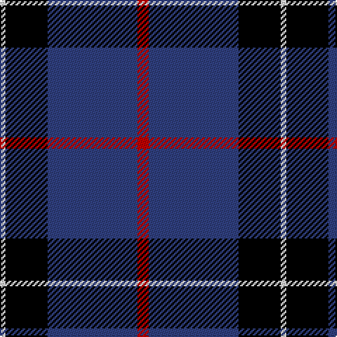

In pattern [RBKW](/patterns/rbkw/).

This was sourced from weddslist.  It is a [4 stripes tartan](/stripes/stripes4/).

Original link http://www.weddslist.com/cgi-bin/tartans/pg.pl?source=sts

## Thread count
LN/4 K30 B64 R/8

## Palette
Each colour and its ΔE from the base-6 reference it is a variant of.

| Colour | Shade | Base | ΔE (OKLab) |
|---|---|---|---|
| B | <code style="background-color:#304080;">#304080</code> `#304080` | B <code style="background-color:#2C4084;">#2C4084</code> | 0.01 |
| K | <code style="background-color:#000000;">#000000</code> `#000000` | K <code style="background-color:#000000;">#000000</code> | 0.00 |
| LN | <code style="background-color:#E0E0E0;">#E0E0E0</code> `#E0E0E0` | W <code style="background-color:#F4F4F0;">#F4F4F0</code> | 0.06 |
| R | <code style="background-color:#C00000;">#C00000</code> `#C00000` | R <code style="background-color:#C80000;">#C80000</code> | 0.02 |

# Sample pattern

## Nearest tartans

The nearest existing variants by ΔTartan distance.

1. [McNiff, Kevin (Personal)](/setts/s4/g40r14b80w4-b1c0070-g006818-ra00000-wfcfcfc/) — ΔT 0.91
1. [Mirror (Corporate)](/setts/s4/r20b104k48w8-b2c2c80-k101010-rc80000-wfcfcfc/) — ΔT 0.99
1. [St. Eloi (Corporate)](/setts/s4/r18y12k60w6-k00002c-r880000-we0e0e0-yd09800/) — ΔT 1.12
1. [Jon's Theme](/setts/s6/b2y4b6ba24b36w2-b010542-ba555b7c-wffffff-y9e8f00/) — ΔT 1.23
1. [Hannah (Personal)](/setts/s6/w4b70k18w6k18y4-b30308c-k101010-we0e0e0-ye8c000/) — ΔT 1.34
1. [Massachusetts](/setts/s6/r4b48k20ra12b20w4-b304080-k000000-rc00020-ra906030-we0e0e0/) — ΔT 1.39
1. [MaleHsuHK (Hong Kong) (Personal)](/setts/s4/b120g32w16y6-b172d60-g052f14-wf7f1e8-yef8f06/) — ΔT 1.41
1. [MacKay](/setts/s6/b4k12b4k12b32r2-b304080-k000000-rc00000/) — ΔT 1.43
1. [Hydro-Electric](/setts/s6/k6b60k16w16k4r6-b304080-k000000-rc00000-we0e0e0/) — ΔT 1.43
1. [Scottish Nuclear (Corporate)](/setts/s4/r4b36k16w4-b2c2c80-k101010-rc80000-wc0c0c0/) — ΔT 1.44

## Neighbour map

Every grey dot is one of 15726 variants placed by the first two principal components of the ΔTartan feature space (44% of its variance). Red is this tartan; blue dots are its nearest — click one to open its page.

<svg viewBox="0 0 640 380" role="img" style="max-width:100%;height:auto;border:1px solid #e0e0e0;border-radius:4px;display:block" xmlns="http://www.w3.org/2000/svg"><image href="/nn/cloud.v1.png" width="640" height="380"/><a href="/setts/s4/g40r14b80w4-b1c0070-g006818-ra00000-wfcfcfc/"><circle cx="343.7" cy="209.4" r="4" fill="#3465a4"><title>McNiff, Kevin (Personal)</title></circle></a><a href="/setts/s4/r20b104k48w8-b2c2c80-k101010-rc80000-wfcfcfc/"><circle cx="328.5" cy="224.8" r="4" fill="#3465a4"><title>Mirror (Corporate)</title></circle></a><a href="/setts/s4/r18y12k60w6-k00002c-r880000-we0e0e0-yd09800/"><circle cx="321.4" cy="219.2" r="4" fill="#3465a4"><title>St. Eloi (Corporate)</title></circle></a><a href="/setts/s6/b2y4b6ba24b36w2-b010542-ba555b7c-wffffff-y9e8f00/"><circle cx="363.0" cy="184.0" r="4" fill="#3465a4"><title>Jon's Theme</title></circle></a><a href="/setts/s6/w4b70k18w6k18y4-b30308c-k101010-we0e0e0-ye8c000/"><circle cx="346.4" cy="169.9" r="4" fill="#3465a4"><title>Hannah (Personal)</title></circle></a><a href="/setts/s6/r4b48k20ra12b20w4-b304080-k000000-rc00020-ra906030-we0e0e0/"><circle cx="314.7" cy="192.3" r="4" fill="#3465a4"><title>Massachusetts</title></circle></a><a href="/setts/s4/b120g32w16y6-b172d60-g052f14-wf7f1e8-yef8f06/"><circle cx="419.6" cy="196.9" r="4" fill="#3465a4"><title>MaleHsuHK (Hong Kong) (Personal)</title></circle></a><a href="/setts/s6/b4k12b4k12b32r2-b304080-k000000-rc00000/"><circle cx="387.2" cy="215.2" r="4" fill="#3465a4"><title>MacKay</title></circle></a><a href="/setts/s6/k6b60k16w16k4r6-b304080-k000000-rc00000-we0e0e0/"><circle cx="288.7" cy="168.1" r="4" fill="#3465a4"><title>Hydro-Electric</title></circle></a><a href="/setts/s4/r4b36k16w4-b2c2c80-k101010-rc80000-wc0c0c0/"><circle cx="345.0" cy="240.9" r="4" fill="#3465a4"><title>Scottish Nuclear (Corporate)</title></circle></a><circle cx="344.4" cy="208.1" r="5" fill="#c00000"/></svg>

ID: /setts/s4/r8b64k30w4-b304080-k000000-rc00000-we0e0e0/
