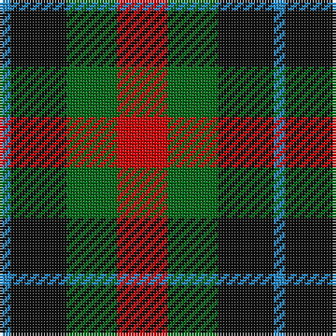

In pattern [BKGR](/patterns/bkgr/).

This was sourced from register-of-tartans.  It is a [4 stripes tartan](/stripes/stripes4/).

Original link https://www.tartanregister.gov.uk/tartanDetails.aspx?ref=4728

## Thread count
B/4 K20 G18 R/18

## Palette
Each colour and its ΔE from the base-6 reference it is a variant of.

| Colour | Shade | Base | ΔE (OKLab) |
|---|---|---|---|
| B | <code style="background-color:#2888C4;">#2888C4</code> `#2888C4` | B <code style="background-color:#2A418A;">#2A418A</code> | 0.21 |
| DG | <code style="background-color:#003820;">#003820</code> `#003820` | G <code style="background-color:#006100;">#006100</code> | 0.15 |
| G | <code style="background-color:#006818;">#006818</code> `#006818` | G <code style="background-color:#006100;">#006100</code> | 0.02 |
| K | <code style="background-color:#101010;">#101010</code> `#101010` | K <code style="background-color:#000000;">#000000</code> | 0.17 |
| LG | <code style="background-color:#789484;">#789484</code> `#789484` | G <code style="background-color:#006100;">#006100</code> | 0.24 |
| R | <code style="background-color:#C80000;">#C80000</code> `#C80000` | R <code style="background-color:#CC0000;">#CC0000</code> | 0.01 |
| Ra | <code style="background-color:#C80000;">#C80000</code> `#C80000` | R <code style="background-color:#CC0000;">#CC0000</code> | 0.01 |

# Sample pattern

## Nearest tartans

The nearest existing variants by ΔTartan distance.

1. [Unidentified No 28](/setts/s4/r6g5k5b1~b3c82af-g005020-k101010-rdc0000~x2/) — ΔT 0.63
1. [Unnamed, No 28](/setts/s4/r6g5k5b1~b5480b0-g008000-k000000-rc00000~x2/) — ΔT 1.03
1. [Norwich Collection No. 60](/setts/s4/b8k11g9r2~b780078-g006818-k101010-rc80000~x2/) — ΔT 1.13
1. [Wilson's No.220](/setts/s4/b5k5g5w1~b740074-g006818-k101010-we0e0e0~x4/) — ΔT 1.13
1. [Chivas Regal](/setts/s5/b6k6b6r14y3~b003c64-k101010-rb03000-ye8c000~x2/) — ΔT 1.15
1. [Tennant](/setts/s4/k18g18b21r4~b401000-g008000-k000000-rc00000~x2/) — ΔT 1.21
1. [Wilson's, No 214](/setts/s5/g4r3b1k1b3~b5480b0-g008000-k000000-rc00000~x4/) — ΔT 1.33
1. [Chivas Regal (Corporate)](/setts/s5/b2k2b2r5y1~b003c64-k101010-rb03000-ye8c000~x12/) — ΔT 1.33
1. [Austin / Wilson's No 137](/setts/s5/b3k3b3g6r2~b800080-g008000-k000000-rc00000~x2/) — ΔT 1.35
1. [Creek Indian Nation](/setts/s5/b2g4y1b1r2~b2c2c80-g006818-rc80000-ye8c000~x12/) — ΔT 1.36

## Neighbour map

Every grey dot is one of 15726 variants placed by the first two principal components of the ΔTartan feature space (44% of its variance). Red is this tartan; blue dots are its nearest — click one to open its page.

<svg viewBox="0 0 640 380" role="img" style="max-width:100%;height:auto;border:1px solid #e0e0e0;border-radius:4px;display:block" xmlns="http://www.w3.org/2000/svg"><image href="/nn/cloud.v1.png" width="640" height="380"/><a href="/setts/s4/r6g5k5b1~b3c82af-g005020-k101010-rdc0000~x2/"><circle cx="142.8" cy="278.6" r="4" fill="#3465a4"><title>Unidentified No 28</title></circle></a><a href="/setts/s4/r6g5k5b1~b5480b0-g008000-k000000-rc00000~x2/"><circle cx="116.3" cy="272.2" r="4" fill="#3465a4"><title>Unnamed, No 28</title></circle></a><a href="/setts/s4/b8k11g9r2~b780078-g006818-k101010-rc80000~x2/"><circle cx="154.9" cy="294.7" r="4" fill="#3465a4"><title>Norwich Collection No. 60</title></circle></a><a href="/setts/s4/b5k5g5w1~b740074-g006818-k101010-we0e0e0~x4/"><circle cx="109.6" cy="291.4" r="4" fill="#3465a4"><title>Wilson's No.220</title></circle></a><a href="/setts/s5/b6k6b6r14y3~b003c64-k101010-rb03000-ye8c000~x2/"><circle cx="159.1" cy="269.3" r="4" fill="#3465a4"><title>Chivas Regal</title></circle></a><a href="/setts/s4/k18g18b21r4~b401000-g008000-k000000-rc00000~x2/"><circle cx="118.4" cy="293.6" r="4" fill="#3465a4"><title>Tennant</title></circle></a><a href="/setts/s5/g4r3b1k1b3~b5480b0-g008000-k000000-rc00000~x4/"><circle cx="106.3" cy="276.0" r="4" fill="#3465a4"><title>Wilson's, No 214</title></circle></a><a href="/setts/s5/b2k2b2r5y1~b003c64-k101010-rb03000-ye8c000~x12/"><circle cx="174.4" cy="262.5" r="4" fill="#3465a4"><title>Chivas Regal (Corporate)</title></circle></a><a href="/setts/s5/b3k3b3g6r2~b800080-g008000-k000000-rc00000~x2/"><circle cx="82.8" cy="295.7" r="4" fill="#3465a4"><title>Austin / Wilson's No 137</title></circle></a><a href="/setts/s5/b2g4y1b1r2~b2c2c80-g006818-rc80000-ye8c000~x12/"><circle cx="142.1" cy="273.4" r="4" fill="#3465a4"><title>Creek Indian Nation</title></circle></a><circle cx="122.4" cy="291.3" r="5" fill="#c00000"/></svg>

ID: /setts/s4/r9g9k10b2~b2888c4-g006818-k101010-rc80000~x2/
