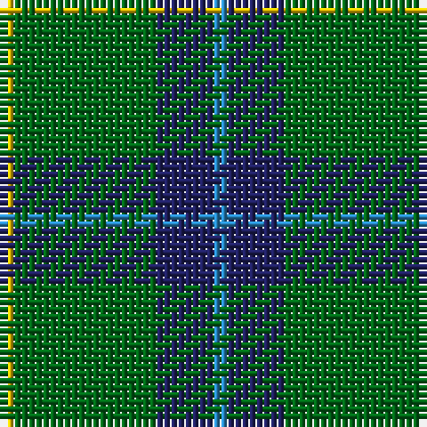

In pattern [BBGY](/stripes/bbgy/).

This was sourced from register-of-tartans.  It is a [4 stripe tartan](/stripes/stripes4/).

Original link https://www.tartanregister.gov.uk/tartanDetails.aspx?ref=4713

## Also known as

This cloth is also recorded under:

- Wilson's, No 174

## Attestations

This cloth appears in 2 source records; the oldest owns this page.

- 01/01/1819 — Wilson's No.174 (register-of-tartans, [record](https://www.tartanregister.gov.uk/tartanDetails.aspx?ref=4713))
- undated — Wilson's, No 174 (weddslist, [record](http://www.weddslist.com/cgi-bin/tartans/pg.pl?source=sts))

## Register references

External register numbers recorded for this tartan.

- Scottish Register of Tartans: [4713](https://www.tartanregister.gov.uk/tartanDetails.aspx?ref=4713)
- Scottish Tartans Authority (ITI): 1899
- Scottish Tartans World Register: 1899

## Thread count
Y/2 G20 DB8 B/2

## Palette
Each colour and the base-6 reference it is a variant of.

| Colour | Shade | Base |
|---|---|---|
| B | <code style="background-color:#2888C4;">#2888C4</code> `oklch(60.1% 0.125 241.5)` <small>#2888C4</small> | B <code style="background-color:#2A418A;">#2A418A</code> |
| DB | <code style="background-color:#202060;">#202060</code> `oklch(28.9% 0.111 276.9)` <small>#202060</small> | B <code style="background-color:#2A418A;">#2A418A</code> |
| DG | <code style="background-color:#003820;">#003820</code> `oklch(30.0% 0.070 158.3)` <small>#003820</small> | G <code style="background-color:#006100;">#006100</code> |
| G | <code style="background-color:#006818;">#006818</code> `oklch(45.0% 0.142 145.0)` <small>#006818</small> | G <code style="background-color:#006100;">#006100</code> |
| Y | <code style="background-color:#E8C000;">#E8C000</code> `oklch(81.9% 0.168 93.7)` <small>#E8C000</small> | Y <code style="background-color:#F2BF00;">#F2BF00</code> |

# Sample pattern

## Nearest tartans

The nearest existing variants by ΔTartan distance.

1. [Wilson's, No 205](/setts/s4/t1db4g10w1~x2/) — ΔT 0.74
1. [Robert Byers Family - Dooballagh, Ireland](/setts/s4/k5g40db20ly3~x2/) — ΔT 0.75
1. [Irving of Bonshaw](/setts/s5/g27db14k2db2ly2~x4/) — ΔT 0.92
1. [Wilson's No.140](/setts/s4/k2ly1g7t1~x2/) — ΔT 1.00
1. [Bacon, Green (Fashion)](/setts/s4/g14k3r3lr2~x2/) — ΔT 1.02
1. [Gracie](/setts/s5/g47r3g6db35ly3~x2/) — ΔT 1.05
1. [Wilson's No.192](/setts/s4/dp4g10r1ly1~x2/) — ΔT 1.06
1. [Wilson's No.189](/setts/s4/dp4g10r1w1~x2/) — ΔT 1.25
1. [Irvine](/setts/s5/g18db9k1db1w1~x4/) — ΔT 1.26
1. [Scottish Scouts (1957) (Corporate)](/setts/s7/r3g22db16g14r2g6lo2~x2/) — ΔT 1.32

## Neighbour map

Every grey dot is one of 14299 variants placed by the first two principal components of the ΔTartan feature space (44% of its variance). Red is this tartan; blue dots are its nearest — click one to open its page.

<svg viewBox="0 0 640 380" role="img" style="max-width:100%;height:auto;border:1px solid #e0e0e0;border-radius:4px;display:block" xmlns="http://www.w3.org/2000/svg"><image href="/nn/cloud.v1.png" width="640" height="380"/><a href="/setts/s4/t1db4g10w1~x2/"><circle cx="360.2" cy="240.0" r="4" fill="#3465a4"><title>Wilson's, No 205</title></circle></a><a href="/setts/s4/k5g40db20ly3~x2/"><circle cx="353.5" cy="237.3" r="4" fill="#3465a4"><title>Robert Byers Family - Dooballagh, Ireland</title></circle></a><a href="/setts/s5/g27db14k2db2ly2~x4/"><circle cx="353.5" cy="209.1" r="4" fill="#3465a4"><title>Irving of Bonshaw</title></circle></a><a href="/setts/s4/k2ly1g7t1~x2/"><circle cx="337.4" cy="247.7" r="4" fill="#3465a4"><title>Wilson's No.140</title></circle></a><a href="/setts/s4/g14k3r3lr2~x2/"><circle cx="347.5" cy="250.5" r="4" fill="#3465a4"><title>Bacon, Green (Fashion)</title></circle></a><a href="/setts/s5/g47r3g6db35ly3~x2/"><circle cx="364.4" cy="212.4" r="4" fill="#3465a4"><title>Gracie</title></circle></a><a href="/setts/s4/dp4g10r1ly1~x2/"><circle cx="357.4" cy="230.6" r="4" fill="#3465a4"><title>Wilson's No.192</title></circle></a><a href="/setts/s4/dp4g10r1w1~x2/"><circle cx="343.3" cy="223.6" r="4" fill="#3465a4"><title>Wilson's No.189</title></circle></a><a href="/setts/s5/g18db9k1db1w1~x4/"><circle cx="379.9" cy="193.3" r="4" fill="#3465a4"><title>Irvine</title></circle></a><a href="/setts/s7/r3g22db16g14r2g6lo2~x2/"><circle cx="365.8" cy="226.6" r="4" fill="#3465a4"><title>Scottish Scouts (1957) (Corporate)</title></circle></a><circle cx="362.6" cy="241.7" r="5" fill="#c00000"/></svg>

ID: /setts/s4/t1db4g10ly1~x2/
