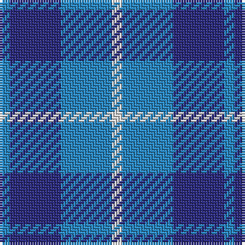

In pattern [BBBW](/stripes/bbbw/).

This was sourced from tartans-authority.  It is a [4 stripe tartan](/stripes/stripes4/).

Original link http://www.tartansauthority.com/tartan-ferret/display/44/

## Thread count
B/4 DB20 B20 LN/4

## Palette
Each colour and its ΔE from the base-6 reference it is a variant of.

| Colour | Shade | Base | ΔE (OKLab) |
|---|---|---|---|
| B | <code style="background-color:#2888C4;">#2888C4</code> `#2888C4` | B <code style="background-color:#2A418A;">#2A418A</code> | 0.21 |
| DB | <code style="background-color:#2C2C80;">#2C2C80</code> `#2C2C80` | B <code style="background-color:#2A418A;">#2A418A</code> | 0.06 |
| LN | <code style="background-color:#E0E0E0;">#E0E0E0</code> `#E0E0E0` | W <code style="background-color:#F7F7F7;">#F7F7F7</code> | 0.07 |

# Sample pattern

## Nearest tartans

The nearest existing variants by ΔTartan distance.

1. [Manx, Cornaa](/setts/s4/b1db5b5w1~x4/) — ΔT 0.97
1. [Manx Cornaa (Personal)](/setts/s6/db5t5w1t5db5t1~x4/) — ΔT 1.21
1. [Langdons](/setts/s7/db2t4w1t4db6t2db2~x4/) — ΔT 1.51
1. [Murray Taylor](/setts/s6/db3t3db16t16db16w3~x2/) — ΔT 1.75
1. [Cathro (Name)](/setts/s5/p9b6w1g4p2~x8/) — ΔT 1.87
1. [Brazell (Personal)](/setts/s5/db7ly1db7t11r2~x6/) — ΔT 2.02
1. [Unidentified No 78](/setts/s4/db2dg7db7w1~x2/) — ΔT 2.04
1. [Omega Delta Sigma, National Veterans](/setts/s4/k15db40k9o10~x2/) — ΔT 2.04
1. [Falconer](/setts/s5/b3k4b4g9k2~x4/) — ΔT 2.06
1. [Langdons (Corporate)](/setts/s7/t2lb4w1lb4t6lb2t2~x4/) — ΔT 2.06

## Neighbour map

Every grey dot is one of 14299 variants placed by the first two principal components of the ΔTartan feature space (44% of its variance). Red is this tartan; blue dots are its nearest — click one to open its page.

<svg viewBox="0 0 640 380" role="img" style="max-width:100%;height:auto;border:1px solid #e0e0e0;border-radius:4px;display:block" xmlns="http://www.w3.org/2000/svg"><image href="/nn/cloud.v1.png" width="640" height="380"/><a href="/setts/s4/b1db5b5w1~x4/"><circle cx="294.9" cy="295.0" r="4" fill="#3465a4"><title>Manx, Cornaa</title></circle></a><a href="/setts/s6/db5t5w1t5db5t1~x4/"><circle cx="277.7" cy="304.2" r="4" fill="#3465a4"><title>Manx Cornaa (Personal)</title></circle></a><a href="/setts/s7/db2t4w1t4db6t2db2~x4/"><circle cx="271.2" cy="289.7" r="4" fill="#3465a4"><title>Langdons</title></circle></a><a href="/setts/s6/db3t3db16t16db16w3~x2/"><circle cx="323.6" cy="271.7" r="4" fill="#3465a4"><title>Murray Taylor</title></circle></a><a href="/setts/s5/p9b6w1g4p2~x8/"><circle cx="270.6" cy="250.8" r="4" fill="#3465a4"><title>Cathro (Name)</title></circle></a><a href="/setts/s5/db7ly1db7t11r2~x6/"><circle cx="265.5" cy="235.7" r="4" fill="#3465a4"><title>Brazell (Personal)</title></circle></a><a href="/setts/s4/db2dg7db7w1~x2/"><circle cx="333.1" cy="303.9" r="4" fill="#3465a4"><title>Unidentified No 78</title></circle></a><a href="/setts/s4/k15db40k9o10~x2/"><circle cx="311.0" cy="312.0" r="4" fill="#3465a4"><title>Omega Delta Sigma, National Veterans</title></circle></a><a href="/setts/s5/b3k4b4g9k2~x4/"><circle cx="180.6" cy="295.5" r="4" fill="#3465a4"><title>Falconer</title></circle></a><a href="/setts/s7/t2lb4w1lb4t6lb2t2~x4/"><circle cx="259.5" cy="274.9" r="4" fill="#3465a4"><title>Langdons (Corporate)</title></circle></a><circle cx="278.3" cy="295.1" r="5" fill="#c00000"/></svg>

ID: /setts/s4/t1db5t5w1~x4/
