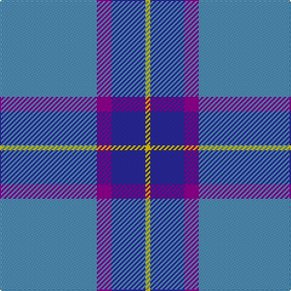

**Bands:** [BBBY](/stripes/bbby/) · **Stripes:** [T DP DB LY](/stripes/stripes4/) T DP DB LY

This was sourced from register-of-tartans.  It is a [4 band tartan](/bands/bands4/).

Original link https://www.tartanregister.gov.uk/tartanDetails.aspx?ref=3309

## Attestations

This cloth appears in 2 source records; the oldest owns this page.

- 14/02/2000 — Peacock (Samantha) (register-of-tartans, [record](https://www.tartanregister.gov.uk/tartanDetails.aspx?ref=3309))
- Feb. 2000 — Peacock (Name) (tartans-authority, [record](http://www.tartansauthority.com/tartan-ferret/display/2655/))

## Register references

External register numbers recorded for this tartan.

- Scottish Register of Tartans: [3309](https://www.tartanregister.gov.uk/tartanDetails.aspx?ref=3309)
- Scottish Tartans Authority (ITI): 2655
- Scottish Tartans World Register: 2655

## Thread count
B/80 P12 DB28 Y/4

## Palette
Each colour and its ΔE from the base-6 reference it is a variant of.

| Colour | Shade | Base | ΔE (OKLab) |
|---|---|---|---|
| B | <code style="background-color:#5C8CA8;">#5C8CA8</code> `#5C8CA8` | B <code style="background-color:#2A418A;">#2A418A</code> | 0.23 |
| DB | <code style="background-color:#2C2C80;">#2C2C80</code> `#2C2C80` | B <code style="background-color:#2A418A;">#2A418A</code> | 0.06 |
| P | <code style="background-color:#780078;">#780078</code> `#780078` | B <code style="background-color:#2A418A;">#2A418A</code> | 0.17 |
| Y | <code style="background-color:#E8C000;">#E8C000</code> `#E8C000` | Y <code style="background-color:#F2BF00;">#F2BF00</code> | 0.02 |

# Sample pattern

## Nearest tartans

The nearest existing variants by ΔTartan distance.

1. [Peacock](/setts/s4/t20p3db7ly1~x4/) — ΔT 0.73
1. [MacKerral Family Tartan Tartan Number: 1757. Earliest known date: 1975 A sample was presented to the Scottish Tartans Society by John Drummond Bowman. This version of the tartan has the unusual feature of exchanging red for yellow in the weft. It is larger than the sett recorded in the Lyon Court Books in 1982. The name, MacKerral or MacKerrell, is recorded in Ayrshire in the 12th century. See products available Copyright © Blair Urquhart, Comrie, 2015](/setts/s4/w4t34db60ly3~x2/) — ΔT 1.16
1. [Loch Lomond Trade Tartan Tartan Number: 628. Earliest known date: pre 1984 Sent to the Scottish Tartans Society in Comrie by Lumsden of Toronto. See products available Copyright © Blair Urquhart, Comrie, 2015](/setts/s5/t37b9t3db9w3~x2/) — ΔT 1.25
1. [Lauder Primary School (Corporate)](/setts/s6/r2t21r2db6ly1r1~x4/) — ΔT 1.30
1. [Thunderlord (Corporate)](/setts/s4/n62w11k4lg17~x2/) — ΔT 1.41
1. [Port Authority of NY & NJ](/setts/s6/t9db2t39dt33lo2dt5~x2/) — ΔT 1.45
1. [World Fed. of Bldg Contractors (Corp](/setts/s5/lb2b44n6db19r2~x2/) — ΔT 1.48
1. [Connecticut State Police PB (Cor.)](/setts/s6/n42db2n2db17lo8db4~x2/) — ΔT 1.52
1. [Thomas, Jean Marc (Personal)](/setts/s5/t72r16k5ly2dt16~x2/) — ΔT 1.57
1. [Corries](/setts/s6/t28dt15r2dt2w1dt6~x2/) — ΔT 1.58

## Neighbour map

Every grey dot is one of 14313 variants placed by the first two principal components of the ΔTartan feature space (44% of its variance). Red is this tartan; blue dots are its nearest — click one to open its page.

<svg viewBox="0 0 640 380" role="img" style="max-width:100%;height:auto;border:1px solid #e0e0e0;border-radius:4px;display:block" xmlns="http://www.w3.org/2000/svg"><image href="/nn/cloud.v1.png" width="640" height="380"/><a href="/setts/s4/t20p3db7ly1~x4/"><circle cx="430.2" cy="221.5" r="4" fill="#3465a4"><title>Peacock</title></circle></a><a href="/setts/s4/w4t34db60ly3~x2/"><circle cx="380.9" cy="207.4" r="4" fill="#3465a4"><title>MacKerral Family Tartan Tartan Number: 1757. Earliest known date: 1975 A sample was presented to the Scottish Tartans Society by John Drummond Bowman. This version of the tartan has the unusual feature of exchanging red for yellow in the weft. It is larger than the sett recorded in the Lyon Court Books in 1982. The name, MacKerral or MacKerrell, is recorded in Ayrshire in the 12th century. See products available Copyright © Blair Urquhart, Comrie, 2015</title></circle></a><a href="/setts/s5/t37b9t3db9w3~x2/"><circle cx="418.0" cy="224.2" r="4" fill="#3465a4"><title>Loch Lomond Trade Tartan Tartan Number: 628. Earliest known date: pre 1984 Sent to the Scottish Tartans Society in Comrie by Lumsden of Toronto. See products available Copyright © Blair Urquhart, Comrie, 2015</title></circle></a><a href="/setts/s6/r2t21r2db6ly1r1~x4/"><circle cx="414.6" cy="165.2" r="4" fill="#3465a4"><title>Lauder Primary School (Corporate)</title></circle></a><a href="/setts/s4/n62w11k4lg17~x2/"><circle cx="404.2" cy="211.0" r="4" fill="#3465a4"><title>Thunderlord (Corporate)</title></circle></a><a href="/setts/s6/t9db2t39dt33lo2dt5~x2/"><circle cx="381.8" cy="202.8" r="4" fill="#3465a4"><title>Port Authority of NY &amp; NJ</title></circle></a><a href="/setts/s5/lb2b44n6db19r2~x2/"><circle cx="371.0" cy="170.4" r="4" fill="#3465a4"><title>World Fed. of Bldg Contractors (Corp</title></circle></a><a href="/setts/s6/n42db2n2db17lo8db4~x2/"><circle cx="381.5" cy="179.4" r="4" fill="#3465a4"><title>Connecticut State Police PB (Cor.)</title></circle></a><a href="/setts/s5/t72r16k5ly2dt16~x2/"><circle cx="411.7" cy="146.1" r="4" fill="#3465a4"><title>Thomas, Jean Marc (Personal)</title></circle></a><a href="/setts/s6/t28dt15r2dt2w1dt6~x2/"><circle cx="382.0" cy="178.6" r="4" fill="#3465a4"><title>Corries</title></circle></a><circle cx="421.9" cy="212.8" r="5" fill="#c00000"/></svg>

ID: /setts/s4/t20dp3db7ly1~x4/
