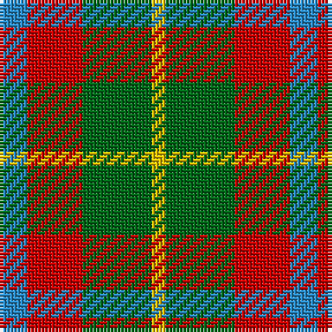

This page is one **sett** — a single exact thread-count. It belongs to the [tartan](/tartans/t2r4g5ly1/)
(the same proportion at any scale), whose colour order is pattern [BRGY](/stripes/brgy/).

Sourced from register-of-tartans.  It is a [4 stripe tartan](/stripes/stripes4/).

Original link https://www.tartanregister.gov.uk/tartanDetails.aspx?ref=4735

## Also known as

This cloth is also recorded under:

- Wilson's, No 203

2 attestations — the source records this cloth was collapsed from (oldest owns this page)

<ul>
<li>01/01/1819 — Wilson's No.203 (register-of-tartans, <a href="https://www.tartanregister.gov.uk/tartanDetails.aspx?ref=4735">record</a>)</li>
<li>undated — Wilson's, No 203 (weddslist, <a href="http://www.weddslist.com/cgi-bin/tartans/pg.pl?source=sts">record</a>)</li>
</ul>

## Register references

External register numbers recorded for this tartan.

- Scottish Register of Tartans: [4735](https://www.tartanregister.gov.uk/tartanDetails.aspx?ref=4735)
- Scottish Tartans Authority (ITI): 2010
- Scottish Tartans World Register: 2010

## Thread count
B/8 R16 G20 Y/4

## Palette

Palette: <strong>Tartan Register</strong>
<table><thead><tr><th>Colour</th><th>Threads</th><th>Shade</th><th>Base</th><th>OKLCh</th></tr></thead><tbody><tr><td>B/</td><td style="text-align:right;font-variant-numeric:tabular-nums">8</td><td><code style="background-color:#2888C4;">#2888C4</code> <small style="color:#888">#2888C4</small></td><td>B <code style="background-color:#2A418A;">#2A418A</code></td><td><small style="color:#888">oklch(60.1% 0.125 241.5)</small></td></tr><tr><td>R</td><td style="text-align:right;font-variant-numeric:tabular-nums">16</td><td><code style="background-color:#C80000;">#C80000</code> <small style="color:#888">#C80000</small></td><td>R <code style="background-color:#CC0000;">#CC0000</code></td><td><small style="color:#888">oklch(52.3% 0.215 29.2)</small></td></tr><tr><td>G</td><td style="text-align:right;font-variant-numeric:tabular-nums">20</td><td><code style="background-color:#006818;">#006818</code> <small style="color:#888">#006818</small></td><td>G <code style="background-color:#006100;">#006100</code></td><td><small style="color:#888">oklch(45.0% 0.142 145.0)</small></td></tr><tr><td>Y/</td><td style="text-align:right;font-variant-numeric:tabular-nums">4</td><td><code style="background-color:#E8C000;">#E8C000</code> <small style="color:#888">#E8C000</small></td><td>Y <code style="background-color:#F2BF00;">#F2BF00</code></td><td><small style="color:#888">oklch(81.9% 0.168 93.7)</small></td></tr></tbody></table>

# Sample pattern

## Nearest tartans

The nearest existing variants by ΔTartan distance, with this tartan at the top so the swatches line up against it.

ΔTartan

Tartan

Sett

—

<a href="/ttd/edit/#slug=t2r4g5ly1~x4">Wilson's No.203</a> <a class="nn-out" href="/setts/s4/t2r4g5ly1~x4/" title="open its dictionary page">↗</a>

0.87

<a href="/ttd/edit/#slug=db3g6ly1r3~x10">Delroeux (Personal)</a> <a class="nn-out" href="/setts/s4/db3g6ly1r3~x10/" title="open its dictionary page">↗</a>

1.11

<a href="/ttd/edit/#slug=r5g7k2t1~x4">Wilson's No.195</a> <a class="nn-out" href="/setts/s4/r5g7k2t1~x4/" title="open its dictionary page">↗</a>

1.14

<a href="/ttd/edit/#slug=db2g4ly1db1r2~x12">Creek Indian Nation</a> <a class="nn-out" href="/setts/s5/db2g4ly1db1r2~x12/" title="open its dictionary page">↗</a>

1.29

<a href="/ttd/edit/#slug=g4r3t1k1t3~x4">Wilson's, No 214</a> <a class="nn-out" href="/setts/s5/g4r3t1k1t3~x4/" title="open its dictionary page">↗</a>

1.33

<a href="/ttd/edit/#slug=db21g34r14w6~x2">Harbison (2015)</a> <a class="nn-out" href="/setts/s4/db21g34r14w6~x2/" title="open its dictionary page">↗</a>

1.43

<a href="/ttd/edit/#slug=r14k3r14g13db8g13~x2">Tulsa</a> <a class="nn-out" href="/setts/s6/r14k3r14g13db8g13~x2/" title="open its dictionary page">↗</a>

1.44

<a href="/ttd/edit/#slug=g2r4g2t1~x4">Wilson's No.188</a> <a class="nn-out" href="/setts/s4/g2r4g2t1~x4/" title="open its dictionary page">↗</a>

1.45

<a href="/ttd/edit/#slug=dy2y10o15dy10y2~x4">Harmony 8</a> <a class="nn-out" href="/setts/s5/dy2y10o15dy10y2~x4/" title="open its dictionary page">↗</a>

1.47

<a href="/setts/s4/g7t2r4~x2/">Wilson's No.208</a>

1.47

<a href="/ttd/edit/#slug=db7o8dg15ly6lo3~x10">Unidentified Silk Plaid</a> <a class="nn-out" href="/setts/s5/db7o8dg15ly6lo3~x10/" title="open its dictionary page">↗</a>

## Neighbour map

Every grey dot is one of 14299 variants placed by the first two principal components of the ΔTartan feature space (44% of its variance). Red is this tartan; blue dots are its nearest — click one to open its page.

<svg viewBox="0 0 640 380" role="img" style="max-width:100%;height:auto;border:1px solid #e0e0e0;border-radius:4px;display:block" xmlns="http://www.w3.org/2000/svg"><image href="/nn/cloud.v1.png" width="640" height="380"/><a href="/setts/s4/db3g6ly1r3~x10/"><circle cx="194.8" cy="269.2" r="4" fill="#3465a4"><title>Delroeux (Personal)</title></circle></a><a href="/setts/s4/r5g7k2t1~x4/"><circle cx="232.8" cy="258.8" r="4" fill="#3465a4"><title>Wilson's No.195</title></circle></a><a href="/setts/s5/db2g4ly1db1r2~x12/"><circle cx="144.5" cy="273.3" r="4" fill="#3465a4"><title>Creek Indian Nation</title></circle></a><a href="/setts/s5/g4r3t1k1t3~x4/"><circle cx="108.9" cy="276.0" r="4" fill="#3465a4"><title>Wilson's, No 214</title></circle></a><a href="/setts/s4/db21g34r14w6~x2/"><circle cx="178.6" cy="268.0" r="4" fill="#3465a4"><title>Harbison (2015)</title></circle></a><a href="/setts/s6/r14k3r14g13db8g13~x2/"><circle cx="165.2" cy="281.6" r="4" fill="#3465a4"><title>Tulsa</title></circle></a><a href="/setts/s4/g2r4g2t1~x4/"><circle cx="240.3" cy="313.7" r="4" fill="#3465a4"><title>Wilson's No.188</title></circle></a><a href="/setts/s5/dy2y10o15dy10y2~x4/"><circle cx="229.1" cy="262.0" r="4" fill="#3465a4"><title>Harmony 8</title></circle></a><a href="/setts/s4/g7t2r4~x2/"><circle cx="225.9" cy="316.4" r="4" fill="#3465a4"><title>Wilson's No.208</title></circle></a><a href="/setts/s5/db7o8dg15ly6lo3~x10/"><circle cx="92.0" cy="242.2" r="4" fill="#3465a4"><title>Unidentified Silk Plaid</title></circle></a><circle cx="177.5" cy="277.0" r="5" fill="#c00000"/></svg>

ID: /setts/s4/t2r4g5ly1~x4/
