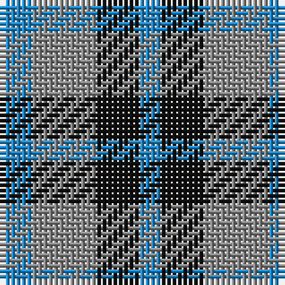

In pattern [BKRB](/stripes/bkrb/).

This was sourced from register-of-tartans.  It is a [4 stripe tartan](/stripes/stripes4/).

Original link https://www.tartanregister.gov.uk/tartanDetails.aspx?ref=240

## Also known as

This cloth is also recorded under:

- Bedford Check Weavers

## Attestations

This cloth appears in 3 source records; the oldest owns this page.

- 01/01/2003 — Bedford Check (register-of-tartans, [record](https://www.tartanregister.gov.uk/tartanDetails.aspx?ref=240))
- pre 2003 — Bedford Check (Fashion) (tartans-authority, [record](http://www.tartansauthority.com/tartan-ferret/display/6007/))
- undated — Bedford Check Weavers Tartan Tartan Number: 6007. Earliest known date: pre 2003 Count from woven sample. See products available Copyright © Blair Urquhart, Comrie, 2015 (house-of-tartan, [record](http://www.house-of-tartan.scotland.net/house/TartanViewjs.asp?colr=Def&tnam=6007))

## Register references

External register numbers recorded for this tartan.

- Scottish Register of Tartans: [240](https://www.tartanregister.gov.uk/tartanDetails.aspx?ref=240)
- Scottish Tartans Authority (ITI): 6007

## Thread count
B/6 Na12 K8 B/4

## Palette
Each colour and its ΔE from the base-6 reference it is a variant of.

| Colour | Shade | Base | ΔE (OKLab) |
|---|---|---|---|
| B | <code style="background-color:#2888C4;">#2888C4</code> `#2888C4` | B <code style="background-color:#2A418A;">#2A418A</code> | 0.21 |
| K | <code style="background-color:#101010;">#101010</code> `#101010` | K <code style="background-color:#000000;">#000000</code> | 0.17 |
| N | <code style="background-color:#5C5C5C;">#5C5C5C</code> `#5C5C5C` | B <code style="background-color:#2A418A;">#2A418A</code> | 0.15 |
| Na | <code style="background-color:#888888;">#888888</code> `#888888` | R <code style="background-color:#CC0000;">#CC0000</code> | 0.24 |

# Sample pattern

## Nearest tartans

The nearest existing variants by ΔTartan distance.

1. [Falconer](/setts/s5/b3k4b4g9k2~x4/) — ΔT 1.32
1. [Wilson's, No 209](/setts/s3/p5g4t2~x2/) — ΔT 1.32
1. [Coleman, Sarah-Louise (Personal)](/setts/s4/dp3o1g2~x10/) — ΔT 1.41
1. [Shepherd, Derek (Wandering)](/setts/s5/lb2k2g2lb1k1~x20/) — ΔT 1.54
1. [Austin (Wilson's No 173)](/setts/s5/dp3k3dp3dg6ly2~x2/) — ΔT 1.65
1. [Agnew](/setts/s3/db53g42r14~x2/) — ΔT 1.66
1. [Gold Country (District)](/setts/s4/db18b18lo28n13~x2/) — ΔT 1.68
1. [Agnew](/setts/s3/db53g42r14/) — ΔT 1.70
1. [Pride of the Glen](/setts/s4/g3db3dp4w1~x4/) — ΔT 1.74
1. [Kucher, Gregory (Personal)](/setts/s4/n2r1k1lr1~x10/) — ΔT 1.78

## Neighbour map

Every grey dot is one of 14299 variants placed by the first two principal components of the ΔTartan feature space (44% of its variance). Red is this tartan; blue dots are its nearest — click one to open its page.

<svg viewBox="0 0 640 380" role="img" style="max-width:100%;height:auto;border:1px solid #e0e0e0;border-radius:4px;display:block" xmlns="http://www.w3.org/2000/svg"><image href="/nn/cloud.v1.png" width="640" height="380"/><a href="/setts/s5/b3k4b4g9k2~x4/"><circle cx="180.6" cy="295.5" r="4" fill="#3465a4"><title>Falconer</title></circle></a><a href="/setts/s3/p5g4t2~x2/"><circle cx="185.7" cy="361.2" r="4" fill="#3465a4"><title>Wilson's, No 209</title></circle></a><a href="/setts/s4/dp3o1g2~x10/"><circle cx="195.5" cy="324.5" r="4" fill="#3465a4"><title>Coleman, Sarah-Louise (Personal)</title></circle></a><a href="/setts/s5/lb2k2g2lb1k1~x20/"><circle cx="81.5" cy="342.4" r="4" fill="#3465a4"><title>Shepherd, Derek (Wandering)</title></circle></a><a href="/setts/s5/dp3k3dp3dg6ly2~x2/"><circle cx="93.6" cy="304.0" r="4" fill="#3465a4"><title>Austin (Wilson's No 173)</title></circle></a><a href="/setts/s3/db53g42r14~x2/"><circle cx="252.2" cy="348.1" r="4" fill="#3465a4"><title>Agnew</title></circle></a><a href="/setts/s4/db18b18lo28n13~x2/"><circle cx="78.5" cy="346.9" r="4" fill="#3465a4"><title>Gold Country (District)</title></circle></a><a href="/setts/s3/db53g42r14/"><circle cx="248.0" cy="346.2" r="4" fill="#3465a4"><title>Agnew</title></circle></a><a href="/setts/s4/g3db3dp4w1~x4/"><circle cx="99.8" cy="296.3" r="4" fill="#3465a4"><title>Pride of the Glen</title></circle></a><a href="/setts/s4/n2r1k1lr1~x10/"><circle cx="104.8" cy="338.8" r="4" fill="#3465a4"><title>Kucher, Gregory (Personal)</title></circle></a><circle cx="149.4" cy="333.8" r="5" fill="#c00000"/></svg>

ID: /setts/s4/t3o6k4t2~x2/
