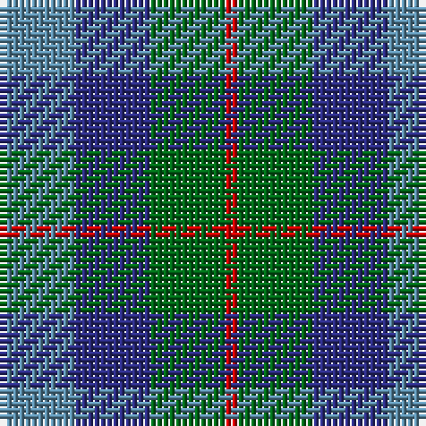

This page is one **sett** — a single exact thread-count. It belongs to the [tartan](/tartans/ba6dba6g6ra1/)
(the same proportion at any scale), whose colour order is pattern [BBGR](/stripes/bbgr/).

Sourced from register-of-tartans.  It is a [4 stripe tartan](/stripes/stripes4/).

Original link https://www.tartanregister.gov.uk/tartanDetails.aspx?ref=3184

## Register references

External register numbers recorded for this tartan.

- Scottish Register of Tartans: [3184](https://www.tartanregister.gov.uk/tartanDetails.aspx?ref=3184)
- Scottish Tartans Authority (ITI): 5563

## Thread count
Ba/12 DBa12 G12 Ra/2

## Palette
Each colour and the base-6 reference it is a variant of.

| Colour | Shade | Base |
|---|---|---|
| B | <code style="background-color:#2888C4;">#2888C4</code> `oklch(60.1% 0.125 241.5)` <small>#2888C4</small> | B <code style="background-color:#2A418A;">#2A418A</code> |
| Ba | <code style="background-color:#5C8CA8;">#5C8CA8</code> `oklch(61.7% 0.067 235.0)` <small>#5C8CA8</small> | B <code style="background-color:#2A418A;">#2A418A</code> |
| DB | <code style="background-color:#000048;">#000048</code> `oklch(18.2% 0.126 264.1)` <small>#000048</small> | B <code style="background-color:#2A418A;">#2A418A</code> |
| DBa | <code style="background-color:#2C2C80;">#2C2C80</code> `oklch(35.0% 0.138 276.6)` <small>#2C2C80</small> | B <code style="background-color:#2A418A;">#2A418A</code> |
| DG | <code style="background-color:#004028;">#004028</code> `oklch(32.8% 0.073 160.8)` <small>#004028</small> | G <code style="background-color:#006100;">#006100</code> |
| G | <code style="background-color:#006818;">#006818</code> `oklch(45.0% 0.142 145.0)` <small>#006818</small> | G <code style="background-color:#006100;">#006100</code> |
| LB | <code style="background-color:#00FCFC;">#00FCFC</code> `oklch(89.7% 0.153 194.8)` <small>#00FCFC</small> | W <code style="background-color:#F7F7F7;">#F7F7F7</code> |
| R | <code style="background-color:#C80000;">#C80000</code> `oklch(52.3% 0.215 29.2)` <small>#C80000</small> | R <code style="background-color:#CC0000;">#CC0000</code> |
| Ra | <code style="background-color:#C80000;">#C80000</code> `oklch(52.3% 0.215 29.2)` <small>#C80000</small> | R <code style="background-color:#CC0000;">#CC0000</code> |

# Sample pattern

## Nearest tartans

The nearest existing variants by ΔTartan distance, with this tartan at the top so the swatches line up against it.

ΔTartan

Tartan

Sett

—

<a href="/ttd/edit/#slug=t6db6g6r1~x2">Norwich No.040</a> <a class="nn-out" href="/setts/s4/t6db6g6r1~x2/" title="open its dictionary page">↗</a>

0.44

<a href="/ttd/edit/#slug=b6db6g6r1~x2">Unnamed No 40</a> <a class="nn-out" href="/setts/s4/b6db6g6r1~x2/" title="open its dictionary page">↗</a>

0.91

<a href="/ttd/edit/#slug=b6db6dg6r1~x2">Unidentified No 40</a> <a class="nn-out" href="/setts/s4/b6db6dg6r1~x2/" title="open its dictionary page">↗</a>

1.40

<a href="/ttd/edit/#slug=db3g11t2db11b6g3~x2">Unnamed, No 29</a> <a class="nn-out" href="/setts/s6/db3g11t2db11b6g3~x2/" title="open its dictionary page">↗</a>

1.47

<a href="/ttd/edit/#slug=b25g25k6dt10r6~x2">Breon (Personal)</a> <a class="nn-out" href="/setts/s5/b25g25k6dt10r6~x2/" title="open its dictionary page">↗</a>

1.51

<a href="/ttd/edit/#slug=db4k5dg4r1~x4">Unidentified pattern #3</a> <a class="nn-out" href="/setts/s4/db4k5dg4r1~x4/" title="open its dictionary page">↗</a>

1.55

<a href="/ttd/edit/#slug=g15dg18dt23w4r8~x2">Friebe (2014)</a> <a class="nn-out" href="/setts/s5/g15dg18dt23w4r8~x2/" title="open its dictionary page">↗</a>

1.64

<a href="/ttd/edit/#slug=dg3b6db11t2dg11db3~x2">Unidentified No 29</a> <a class="nn-out" href="/setts/s6/dg3b6db11t2dg11db3~x2/" title="open its dictionary page">↗</a>

1.64

<a href="/ttd/edit/#slug=r9b6dt13b21o18w4~x2">Fox-Eves Wedding (Personal)</a> <a class="nn-out" href="/setts/s6/r9b6dt13b21o18w4~x2/" title="open its dictionary page">↗</a>

1.69

<a href="/ttd/edit/#slug=r1dr7g7db7g7db7r1~x4">Tennant</a> <a class="nn-out" href="/setts/s7/r1dr7g7db7g7db7r1~x4/" title="open its dictionary page">↗</a>

1.69

<a href="/ttd/edit/#slug=g7k6b7k1b2~x2">Campbell of Glenlyon</a> <a class="nn-out" href="/setts/s5/g7k6b7k1b2~x2/" title="open its dictionary page">↗</a>

## Neighbour map

Every grey dot is one of 14299 variants placed by the first two principal components of the ΔTartan feature space (44% of its variance). Red is this tartan; blue dots are its nearest — click one to open its page.

<svg viewBox="0 0 640 380" role="img" style="max-width:100%;height:auto;border:1px solid #e0e0e0;border-radius:4px;display:block" xmlns="http://www.w3.org/2000/svg"><image href="/nn/cloud.v1.png" width="640" height="380"/><a href="/setts/s4/b6db6g6r1~x2/"><circle cx="147.5" cy="296.3" r="4" fill="#3465a4"><title>Unnamed No 40</title></circle></a><a href="/setts/s4/b6db6dg6r1~x2/"><circle cx="139.6" cy="298.1" r="4" fill="#3465a4"><title>Unidentified No 40</title></circle></a><a href="/setts/s6/db3g11t2db11b6g3~x2/"><circle cx="198.5" cy="273.1" r="4" fill="#3465a4"><title>Unnamed, No 29</title></circle></a><a href="/setts/s5/b25g25k6dt10r6~x2/"><circle cx="137.2" cy="275.4" r="4" fill="#3465a4"><title>Breon (Personal)</title></circle></a><a href="/setts/s4/db4k5dg4r1~x4/"><circle cx="169.3" cy="322.2" r="4" fill="#3465a4"><title>Unidentified pattern #3</title></circle></a><a href="/setts/s5/g15dg18dt23w4r8~x2/"><circle cx="104.3" cy="261.1" r="4" fill="#3465a4"><title>Friebe (2014)</title></circle></a><a href="/setts/s6/dg3b6db11t2dg11db3~x2/"><circle cx="212.7" cy="284.7" r="4" fill="#3465a4"><title>Unidentified No 29</title></circle></a><a href="/setts/s6/r9b6dt13b21o18w4~x2/"><circle cx="131.7" cy="257.1" r="4" fill="#3465a4"><title>Fox-Eves Wedding (Personal)</title></circle></a><a href="/setts/s7/r1dr7g7db7g7db7r1~x4/"><circle cx="180.1" cy="265.0" r="4" fill="#3465a4"><title>Tennant</title></circle></a><a href="/setts/s5/g7k6b7k1b2~x2/"><circle cx="204.4" cy="289.0" r="4" fill="#3465a4"><title>Campbell of Glenlyon</title></circle></a><circle cx="154.4" cy="303.1" r="5" fill="#c00000"/></svg>

ID: /setts/s4/t6db6g6r1~x2/
