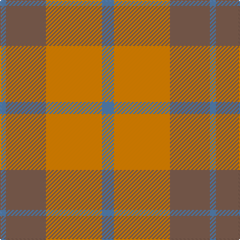

In pattern [BRYB](/stripes/bryb/).

This was sourced from weddslist.  It is a [4 stripe tartan](/stripes/stripes4/).

Original link http://www.weddslist.com/cgi-bin/tartans/pg.pl?source=sts

## Thread count
B/12 O56 LT40 B/6

## Palette
Each colour and the base-6 reference it is a variant of.

| Colour | Shade | Base |
|---|---|---|
| B | <code style="background-color:#5480B0;">#5480B0</code> `oklch(58.8% 0.089 251.5)` <small>#5480B0</small> | B <code style="background-color:#2A418A;">#2A418A</code> |
| LT | <code style="background-color:#806050;">#806050</code> `oklch(51.7% 0.049 47.8)` <small>#806050</small> | R <code style="background-color:#CC0000;">#CC0000</code> |
| O | <code style="background-color:#FF8500;">#FF8500</code> `oklch(74.0% 0.183 55.1)` <small>#FF8500</small> | Y <code style="background-color:#F2BF00;">#F2BF00</code> |

# Sample pattern

## Nearest tartans

The nearest existing variants by ΔTartan distance, with this tartan at the top so the swatches line up against it.

ΔTartan

Tartan

Sett

—

<a href="/ttd/edit/#slug=t6lo28o20t3~x2">Prince of Orange</a> <a class="nn-out" href="/setts/s4/t6lo28o20t3~x2/" title="open its dictionary page">↗</a>

0.86

<a href="/ttd/edit/#slug=t6lo28dy20t3~x2">Prince of Orange Tartan Tartan Number: 389. Earliest known date: pre 2003 Sales help Princess Diana Memorial Trust See products available Copyright © Blair Urquhart, Comrie, 2015</a> <a class="nn-out" href="/setts/s4/t6lo28dy20t3~x2/" title="open its dictionary page">↗</a>

1.54

<a href="/ttd/edit/#slug=g30lo3t8o25~x2">Dohmen Family (Zuid-Nederland)</a> <a class="nn-out" href="/setts/s4/g30lo3t8o25~x2/" title="open its dictionary page">↗</a>

1.70

<a href="/ttd/edit/#slug=o2ly10r15o10ly2~x4">Harmony, 9</a> <a class="nn-out" href="/setts/s5/o2ly10r15o10ly2~x4/" title="open its dictionary page">↗</a>

1.74

<a href="/ttd/edit/#slug=lo36do15lo9r31lo5do4r16~x2">Manhattan Ethnic</a> <a class="nn-out" href="/setts/s7/lo36do15lo9r31lo5do4r16~x2/" title="open its dictionary page">↗</a>

1.76

<a href="/ttd/edit/#slug=w1r5o5ly1~x4">Manx, Mannin Plaid</a> <a class="nn-out" href="/setts/s4/w1r5o5ly1~x4/" title="open its dictionary page">↗</a>

1.81

<a href="/ttd/edit/#slug=r8r1g4r1g1t2~x2">Moray of Abercairney</a> <a class="nn-out" href="/setts/s6/r8r1g4r1g1t2~x2/" title="open its dictionary page">↗</a>

1.82

<a href="/ttd/edit/#slug=o16r2o10r15t5~x2">Mowbray (Moubray) Family Tartan Tartan Number: 565. Earliest known date: 1983 Designed C.1984 by Peter MacDonald for a Mr Mowbray in the USA. Sometimes woven with green in place of gray, and blue in place of azure. See products available Copyright © Blair Urquhart, Comrie, 2015</a> <a class="nn-out" href="/setts/s5/o16r2o10r15t5~x2/" title="open its dictionary page">↗</a>

1.93

<a href="/ttd/edit/#slug=r1r14g7db7r1~x4">Hugh Fraser of Boblainy</a> <a class="nn-out" href="/setts/s5/r1r14g7db7r1~x4/" title="open its dictionary page">↗</a>

1.93

<a href="/ttd/edit/#slug=r1g7r9ly1~x4">Bryce</a> <a class="nn-out" href="/setts/s4/r1g7r9ly1~x4/" title="open its dictionary page">↗</a>

1.97

<a href="/ttd/edit/#slug=r1r7r4g7r1g1~x4">MacNab, Variant</a> <a class="nn-out" href="/setts/s6/r1r7r4g7r1g1~x4/" title="open its dictionary page">↗</a>

## Neighbour map

Every grey dot is one of 14299 variants placed by the first two principal components of the ΔTartan feature space (44% of its variance). Red is this tartan; blue dots are its nearest — click one to open its page.

<svg viewBox="0 0 640 380" role="img" style="max-width:100%;height:auto;border:1px solid #e0e0e0;border-radius:4px;display:block" xmlns="http://www.w3.org/2000/svg"><image href="/nn/cloud.v1.png" width="640" height="380"/><a href="/setts/s4/t6lo28dy20t3~x2/"><circle cx="322.7" cy="261.8" r="4" fill="#3465a4"><title>Prince of Orange Tartan Tartan Number: 389. Earliest known date: pre 2003 Sales help Princess Diana Memorial Trust See products available Copyright © Blair Urquhart, Comrie, 2015</title></circle></a><a href="/setts/s4/g30lo3t8o25~x2/"><circle cx="294.8" cy="258.3" r="4" fill="#3465a4"><title>Dohmen Family (Zuid-Nederland)</title></circle></a><a href="/setts/s5/o2ly10r15o10ly2~x4/"><circle cx="233.6" cy="245.9" r="4" fill="#3465a4"><title>Harmony, 9</title></circle></a><a href="/setts/s7/lo36do15lo9r31lo5do4r16~x2/"><circle cx="245.0" cy="220.1" r="4" fill="#3465a4"><title>Manhattan Ethnic</title></circle></a><a href="/setts/s4/w1r5o5ly1~x4/"><circle cx="242.4" cy="263.1" r="4" fill="#3465a4"><title>Manx, Mannin Plaid</title></circle></a><a href="/setts/s6/r8r1g4r1g1t2~x2/"><circle cx="278.1" cy="214.5" r="4" fill="#3465a4"><title>Moray of Abercairney</title></circle></a><a href="/setts/s5/o16r2o10r15t5~x2/"><circle cx="369.5" cy="294.4" r="4" fill="#3465a4"><title>Mowbray (Moubray) Family Tartan Tartan Number: 565. Earliest known date: 1983 Designed C.1984 by Peter MacDonald for a Mr Mowbray in the USA. Sometimes woven with green in place of gray, and blue in place of azure. See products available Copyright © Blair Urquhart, Comrie, 2015</title></circle></a><a href="/setts/s5/r1r14g7db7r1~x4/"><circle cx="341.5" cy="222.8" r="4" fill="#3465a4"><title>Hugh Fraser of Boblainy</title></circle></a><a href="/setts/s4/r1g7r9ly1~x4/"><circle cx="355.9" cy="245.7" r="4" fill="#3465a4"><title>Bryce</title></circle></a><a href="/setts/s6/r1r7r4g7r1g1~x4/"><circle cx="251.9" cy="248.2" r="4" fill="#3465a4"><title>MacNab, Variant</title></circle></a><circle cx="329.8" cy="259.4" r="5" fill="#c00000"/></svg>

ID: /setts/s4/t6lo28o20t3~x2/
