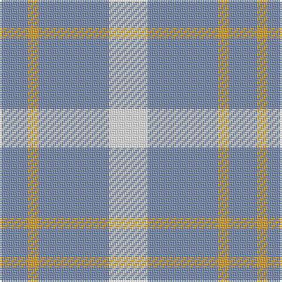

In pattern [BYBW](/stripes/bybw/).

This was sourced from register-of-tartans.  It is a [4 stripe tartan](/stripes/stripes4/).

Original link https://www.tartanregister.gov.uk/tartanDetails.aspx?ref=11149

## Register references

External register numbers recorded for this tartan.

- Scottish Register of Tartans: [11149](https://www.tartanregister.gov.uk/tartanDetails.aspx?ref=11149)

## Thread count
W/22 B40 Y6 B/16

## Palette
Each colour and the base-6 reference it is a variant of.

| Colour | Shade | Base |
|---|---|---|
| B | <code style="background-color:#788CB4;">#788CB4</code> `oklch(63.9% 0.065 264.0)` <small>#788CB4</small> | B <code style="background-color:#2A418A;">#2A418A</code> |
| W | <code style="background-color:#FFFFFF;">#FFFFFF</code> `oklch(100.0% 0.000 89.9)` <small>#FFFFFF</small> | W <code style="background-color:#F7F7F7;">#F7F7F7</code> |
| Y | <code style="background-color:#E0A126;">#E0A126</code> `oklch(75.1% 0.146 78.3)` <small>#E0A126</small> | Y <code style="background-color:#F2BF00;">#F2BF00</code> |

# Sample pattern

## Nearest tartans

The nearest existing variants by ΔTartan distance.

1. [Lucard, Stphane (Personal))](/setts/s6/w11t20ly3t8ly3t10~x2/) — ΔT 1.09
1. [Genesee Community College](/setts/s4/b18w4b3lo12~x2/) — ΔT 1.56
1. [Unidentified, Plaid Barbie's Moss](/setts/s6/w20b20w3b3~x2/) — ΔT 1.79
1. [Justus Dress (Personal)](/setts/s7/b1lr4r1lr1lo1lr4b1~x12/) — ΔT 1.84
1. [Tokharion](/setts/s6/db1lo5db1lo5db2w1~x4/) — ΔT 2.01
1. [Blue Meadow Check (Fashion)](/setts/s4/b4g8b18w3~x2/) — ΔT 2.06
1. [Unidentified (Shirt)](/setts/s6/w7db16w20db3w3ly3~x2/) — ΔT 2.08
1. [Louise Beveridge (Personal)](/setts/s5/lb40w25dt16lb8dt4~x2/) — ΔT 2.18
1. [Justus dress](/setts/s7/db1w4r1w1ly1w4db1~x12/) — ΔT 2.21
1. [Carlisle, Ancient](/setts/s5/t11ly2r1ly2r1~x4/) — ΔT 2.32

## Neighbour map

Every grey dot is one of 14299 variants placed by the first two principal components of the ΔTartan feature space (44% of its variance). Red is this tartan; blue dots are its nearest — click one to open its page.

<svg viewBox="0 0 640 380" role="img" style="max-width:100%;height:auto;border:1px solid #e0e0e0;border-radius:4px;display:block" xmlns="http://www.w3.org/2000/svg"><image href="/nn/cloud.v1.png" width="640" height="380"/><a href="/setts/s6/w11t20ly3t8ly3t10~x2/"><circle cx="364.9" cy="257.3" r="4" fill="#3465a4"><title>Lucard, Stphane (Personal))</title></circle></a><a href="/setts/s4/b18w4b3lo12~x2/"><circle cx="288.8" cy="267.5" r="4" fill="#3465a4"><title>Genesee Community College</title></circle></a><a href="/setts/s6/w20b20w3b3~x2/"><circle cx="400.2" cy="269.9" r="4" fill="#3465a4"><title>Unidentified, Plaid Barbie's Moss</title></circle></a><a href="/setts/s7/b1lr4r1lr1lo1lr4b1~x12/"><circle cx="343.4" cy="242.3" r="4" fill="#3465a4"><title>Justus Dress (Personal)</title></circle></a><a href="/setts/s6/db1lo5db1lo5db2w1~x4/"><circle cx="360.6" cy="259.5" r="4" fill="#3465a4"><title>Tokharion</title></circle></a><a href="/setts/s4/b4g8b18w3~x2/"><circle cx="366.3" cy="285.1" r="4" fill="#3465a4"><title>Blue Meadow Check (Fashion)</title></circle></a><a href="/setts/s6/w7db16w20db3w3ly3~x2/"><circle cx="286.1" cy="218.6" r="4" fill="#3465a4"><title>Unidentified (Shirt)</title></circle></a><a href="/setts/s5/lb40w25dt16lb8dt4~x2/"><circle cx="262.0" cy="232.3" r="4" fill="#3465a4"><title>Louise Beveridge (Personal)</title></circle></a><a href="/setts/s7/db1w4r1w1ly1w4db1~x12/"><circle cx="309.2" cy="220.2" r="4" fill="#3465a4"><title>Justus dress</title></circle></a><a href="/setts/s5/t11ly2r1ly2r1~x4/"><circle cx="408.1" cy="208.3" r="4" fill="#3465a4"><title>Carlisle, Ancient</title></circle></a><circle cx="364.1" cy="276.7" r="5" fill="#c00000"/></svg>

ID: /setts/s4/w11t20lo3t8~x2/
