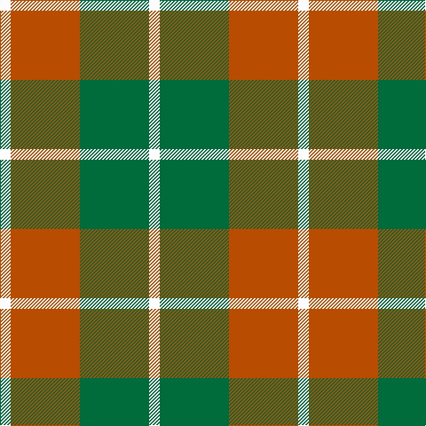

In pattern [WGRW](/patterns/wgrw/).

This was sourced from tartans-authority.  It is a [4 stripes tartan](/stripes/stripes4/).

Original link http://www.tartansauthority.com/tartan-ferret/display/1802/

## Thread count
W/12 DO78 G78 W/12

## Palette
Each colour and its ΔE from the base-6 reference it is a variant of.

| Colour | Shade | Base | ΔE (OKLab) |
|---|---|---|---|
| DO | <code style="background-color:#B84C00;">#B84C00</code> `#B84C00` | R <code style="background-color:#CC0000;">#CC0000</code> | 0.08 |
| G | <code style="background-color:#006C3C;">#006C3C</code> `#006C3C` | G <code style="background-color:#006100;">#006100</code> | 0.06 |
| W | <code style="background-color:#FCFCFC;">#FCFCFC</code> `#FCFCFC` | W <code style="background-color:#F7F7F7;">#F7F7F7</code> | 0.01 |

# Sample pattern

## Nearest tartans

The nearest existing variants by ΔTartan distance.

1. [Dunoon Irish Corporate Tartan Tartan Number: 1802. Earliest known date: 1935 Glasgow Irish Pipe Band See products available Copyright © Blair Urquhart, Comrie, 2015](/setts/s4/w12g78y78w12-g006818-we0e0e0-yd87c00/) — ΔT 0.79
1. [Dunoon Irish](/setts/s4/w12g78r78w12-g003820-rb84c00-wfcfcfc/) — ΔT 1.03
1. [Dunoon](/setts/s4/w12g78y78w12-g008000-we0e0e0-yff8500/) — ΔT 1.26
1. [Gleneagles USA (Dalgleish)](/setts/s6/g8w62g14r28g22r6-g006818-r880000-wc0c0c0/) — ΔT 1.34
1. [Harmony 8](/setts/s5/g8ga40r60g40ga8-g2a2303-ga808080-rbe7832/) — ΔT 1.35
1. [Prince of Orange](/setts/s4/b12ba56y40b6-b5c8ca8-ba441800-yd87c00/) — ΔT 1.48
1. [Unidentfied (Ligioner Highland Games](/setts/s6/b8g50y20g6y36r8-b441800-g006818-rc80000-yfcb464/) — ΔT 1.50
1. [Wilson's, No 179](/setts/s5/g24y4r4b8r8-b5480b0-g008000-rc00000-yf0c000/) — ΔT 1.50
1. [Barclay Dress](/setts/s4/w10y64b64y10-b1c1c1c-we0e0e0-ye8c000/) — ΔT 1.51
1. [Wilson's No.195](/setts/s4/r20g28k8b4-b2888c4-g006818-k101010-rc80000/) — ΔT 1.51

## Neighbour map

Every grey dot is one of 15726 variants placed by the first two principal components of the ΔTartan feature space (44% of its variance). Red is this tartan; blue dots are its nearest — click one to open its page.

<svg viewBox="0 0 640 380" role="img" style="max-width:100%;height:auto;border:1px solid #e0e0e0;border-radius:4px;display:block" xmlns="http://www.w3.org/2000/svg"><image href="/nn/cloud.v1.png" width="640" height="380"/><a href="/setts/s4/w12g78y78w12-g006818-we0e0e0-yd87c00/"><circle cx="253.9" cy="260.6" r="4" fill="#3465a4"><title>Dunoon Irish Corporate Tartan Tartan Number: 1802. Earliest known date: 1935 Glasgow Irish Pipe Band See products available Copyright © Blair Urquhart, Comrie, 2015</title></circle></a><a href="/setts/s4/w12g78r78w12-g003820-rb84c00-wfcfcfc/"><circle cx="233.9" cy="251.6" r="4" fill="#3465a4"><title>Dunoon Irish</title></circle></a><a href="/setts/s4/w12g78y78w12-g008000-we0e0e0-yff8500/"><circle cx="251.8" cy="256.0" r="4" fill="#3465a4"><title>Dunoon</title></circle></a><a href="/setts/s6/g8w62g14r28g22r6-g006818-r880000-wc0c0c0/"><circle cx="239.5" cy="211.3" r="4" fill="#3465a4"><title>Gleneagles USA (Dalgleish)</title></circle></a><a href="/setts/s5/g8ga40r60g40ga8-g2a2303-ga808080-rbe7832/"><circle cx="228.9" cy="260.8" r="4" fill="#3465a4"><title>Harmony 8</title></circle></a><a href="/setts/s4/b12ba56y40b6-b5c8ca8-ba441800-yd87c00/"><circle cx="284.0" cy="245.8" r="4" fill="#3465a4"><title>Prince of Orange</title></circle></a><a href="/setts/s6/b8g50y20g6y36r8-b441800-g006818-rc80000-yfcb464/"><circle cx="222.0" cy="206.8" r="4" fill="#3465a4"><title>Unidentfied (Ligioner Highland Games</title></circle></a><a href="/setts/s5/g24y4r4b8r8-b5480b0-g008000-rc00000-yf0c000/"><circle cx="244.6" cy="241.9" r="4" fill="#3465a4"><title>Wilson's, No 179</title></circle></a><a href="/setts/s4/w10y64b64y10-b1c1c1c-we0e0e0-ye8c000/"><circle cx="250.5" cy="245.3" r="4" fill="#3465a4"><title>Barclay Dress</title></circle></a><a href="/setts/s4/r20g28k8b4-b2888c4-g006818-k101010-rc80000/"><circle cx="232.7" cy="258.3" r="4" fill="#3465a4"><title>Wilson's No.195</title></circle></a><circle cx="249.7" cy="258.0" r="5" fill="#c00000"/></svg>

ID: /setts/s4/w12g78r78w12-g006c3c-rb84c00-wfcfcfc/
