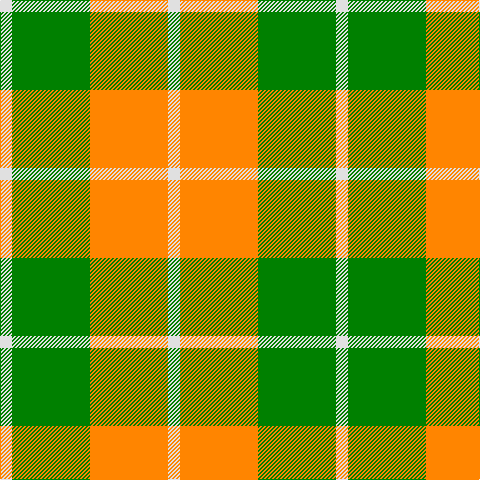

In pattern [WGYW](/patterns/wgyw/).

This was sourced from weddslist.  It is a [4 stripes tartan](/stripes/stripes4/).

Original link http://www.weddslist.com/cgi-bin/tartans/pg.pl?source=sts

## Thread count
LN/12 G78 O78 LN/12

## Palette
Each colour and its ΔE from the base-6 reference it is a variant of.

| Colour | Shade | Base | ΔE (OKLab) |
|---|---|---|---|
| G | <code style="background-color:#008000;">#008000</code> `#008000` | G <code style="background-color:#006100;">#006100</code> | 0.10 |
| LN | <code style="background-color:#E0E0E0;">#E0E0E0</code> `#E0E0E0` | W <code style="background-color:#F7F7F7;">#F7F7F7</code> | 0.07 |
| O | <code style="background-color:#FF8500;">#FF8500</code> `#FF8500` | Y <code style="background-color:#F2BF00;">#F2BF00</code> | 0.14 |

# Sample pattern

## Nearest tartans

The nearest existing variants by ΔTartan distance.

1. [Dunoon Irish Corporate Tartan Tartan Number: 1802. Earliest known date: 1935 Glasgow Irish Pipe Band See products available Copyright © Blair Urquhart, Comrie, 2015](/setts/s4/w12g78y78w12-g006818-we0e0e0-yd87c00/) — ΔT 0.62
1. [Dunoon Irish (Corporate)](/setts/s4/w12g78r78w12-g006c3c-rb84c00-wfcfcfc/) — ΔT 1.26
1. [Unidentfied (Ligioner Highland Games](/setts/s6/b8g50y20g6y36r8-b441800-g006818-rc80000-yfcb464/) — ΔT 1.51
1. [Wilson's, No 195](/setts/s4/y20g28k4b4-b5480b0-g008000-k000000-yff8500/) — ΔT 1.55
1. [Wilson's, No 179](/setts/s5/g24y4r4b8r8-b5480b0-g008000-rc00000-yf0c000/) — ΔT 1.72
1. [Spirit of Riverside (Corporate)](/setts/s4/r40w26y48k6-k101010-r888888-we0e0e0-ye8c000/) — ΔT 1.88
1. [Wilson's, No 203](/setts/s4/b8r16g20y4-b5480b0-g008000-rc00000-yf0c000/) — ΔT 1.92
1. [Buchele Check (Fashion?)](/setts/s6/r16y4r12ya4y32ya8-r901c38-ydcc08c-yad0c830/) — ΔT 1.93
1. [Fraser, Yellow](/setts/s6/w4y32g12y4b12y4-b304080-g008000-we0e0e0-yf0c000/) — ΔT 1.95
1. [Barclay Dress](/setts/s4/w10y64b64y10-b1c1c1c-we0e0e0-ye8c000/) — ΔT 1.97

## Neighbour map

Every grey dot is one of 15726 variants placed by the first two principal components of the ΔTartan feature space (44% of its variance). Red is this tartan; blue dots are its nearest — click one to open its page.

<svg viewBox="0 0 640 380" role="img" style="max-width:100%;height:auto;border:1px solid #e0e0e0;border-radius:4px;display:block" xmlns="http://www.w3.org/2000/svg"><image href="/nn/cloud.v1.png" width="640" height="380"/><a href="/setts/s4/w12g78y78w12-g006818-we0e0e0-yd87c00/"><circle cx="253.9" cy="260.6" r="4" fill="#3465a4"><title>Dunoon Irish Corporate Tartan Tartan Number: 1802. Earliest known date: 1935 Glasgow Irish Pipe Band See products available Copyright © Blair Urquhart, Comrie, 2015</title></circle></a><a href="/setts/s4/w12g78r78w12-g006c3c-rb84c00-wfcfcfc/"><circle cx="249.7" cy="258.0" r="4" fill="#3465a4"><title>Dunoon Irish (Corporate)</title></circle></a><a href="/setts/s6/b8g50y20g6y36r8-b441800-g006818-rc80000-yfcb464/"><circle cx="222.0" cy="206.8" r="4" fill="#3465a4"><title>Unidentfied (Ligioner Highland Games</title></circle></a><a href="/setts/s4/y20g28k4b4-b5480b0-g008000-k000000-yff8500/"><circle cx="237.1" cy="236.4" r="4" fill="#3465a4"><title>Wilson's, No 195</title></circle></a><a href="/setts/s5/g24y4r4b8r8-b5480b0-g008000-rc00000-yf0c000/"><circle cx="244.6" cy="241.9" r="4" fill="#3465a4"><title>Wilson's, No 179</title></circle></a><a href="/setts/s4/r40w26y48k6-k101010-r888888-we0e0e0-ye8c000/"><circle cx="183.7" cy="250.4" r="4" fill="#3465a4"><title>Spirit of Riverside (Corporate)</title></circle></a><a href="/setts/s4/b8r16g20y4-b5480b0-g008000-rc00000-yf0c000/"><circle cx="181.4" cy="278.1" r="4" fill="#3465a4"><title>Wilson's, No 203</title></circle></a><a href="/setts/s6/r16y4r12ya4y32ya8-r901c38-ydcc08c-yad0c830/"><circle cx="261.8" cy="218.5" r="4" fill="#3465a4"><title>Buchele Check (Fashion?)</title></circle></a><a href="/setts/s6/w4y32g12y4b12y4-b304080-g008000-we0e0e0-yf0c000/"><circle cx="279.8" cy="196.0" r="4" fill="#3465a4"><title>Fraser, Yellow</title></circle></a><a href="/setts/s4/w10y64b64y10-b1c1c1c-we0e0e0-ye8c000/"><circle cx="250.5" cy="245.3" r="4" fill="#3465a4"><title>Barclay Dress</title></circle></a><circle cx="251.8" cy="256.0" r="5" fill="#c00000"/></svg>

ID: /setts/s4/w12g78y78w12-g008000-we0e0e0-yff8500/
