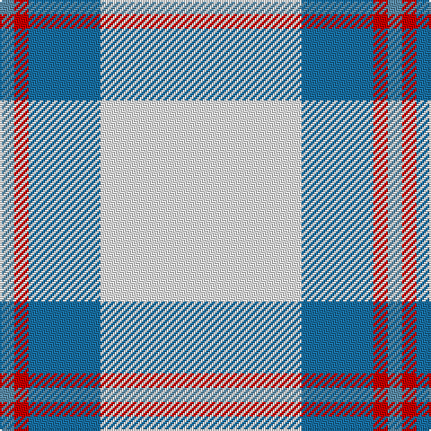

In pattern [BRBW](/patterns/brbw/).

This was sourced from tartans-authority.  It is a [4 stripes tartan](/stripes/stripes4/).

Original link http://www.tartansauthority.com/tartan-ferret/display/10565/

## Thread count
B/8 R8 Ba40 W/112

## Palette
Each colour and its ΔE from the base-6 reference it is a variant of.

| Colour | Shade | Base | ΔE (OKLab) |
|---|---|---|---|
| B | <code style="background-color:#5C8CA8;">#5C8CA8</code> `#5C8CA8` | B <code style="background-color:#2A418A;">#2A418A</code> | 0.23 |
| Ba | <code style="background-color:#1870A4;">#1870A4</code> `#1870A4` | B <code style="background-color:#2A418A;">#2A418A</code> | 0.13 |
| R | <code style="background-color:#C80000;">#C80000</code> `#C80000` | R <code style="background-color:#CC0000;">#CC0000</code> | 0.01 |
| W | <code style="background-color:#FCFCFC;">#FCFCFC</code> `#FCFCFC` | W <code style="background-color:#F7F7F7;">#F7F7F7</code> | 0.01 |

# Sample pattern

## Nearest tartans

The nearest existing variants by ΔTartan distance.

1. [Tarbh Deargh (Red Bull)](/setts/s4/w80b30y5ya4x2~b202060-we0e0e0-yd87c00-yae8c000/) — ΔT 1.17
1. [Triplett, Jack Arnold](/setts/s4/w35b12r2ba2x2~b335280-ba666666-rff0000-wf8eeb7/) — ΔT 1.29
1. [Butties](/setts/s6/w93y6w13b35w12y6~b3850c8-wffffff-yb0b0b0/) — ΔT 1.47
1. [Butties](/setts/s6/w93r6w13b35w12r6~b202060-r888888-wfcfcfc/) — ΔT 1.55
1. [Clackson Arisaid (Name?)](/setts/s7/w24g2w8b5y4b5y4x2~b2c2c80-g006818-we0e0e0-ye8c000/) — ΔT 1.60
1. [WaterAid](/setts/s6/b23w8wa2k5w44b4x2~b00008c-k101010-wffffff-wa98c8e8/) — ΔT 2.04
1. [Alaska Highlanders P & D (Corporate)](/setts/s8/b9w27b2y4b2w10b2wa3x2~b2c2c80-w98c8e8-wafcfcfc-yfccc00/) — ΔT 2.05
1. [Milne, Green (Dance)](/setts/s8/w12r2w12g17w12r2w5b2x4~b9058d8-g009468-rc80000-wf8f8f8/) — ΔT 2.08
1. [Legary (Name)](/setts/s6/y5b15w5b5w40y3x2~b1c1c50-w98c8e8-ye8c000/) — ΔT 2.09
1. [Legary](/setts/s6/y5b15w5b5w40y3x2~b00006b-wabcdd9-yeff265/) — ΔT 2.10

## Neighbour map

Every grey dot is one of 15726 variants placed by the first two principal components of the ΔTartan feature space (44% of its variance). Red is this tartan; blue dots are its nearest — click one to open its page.

<svg viewBox="0 0 640 380" role="img" style="max-width:100%;height:auto;border:1px solid #e0e0e0;border-radius:4px;display:block" xmlns="http://www.w3.org/2000/svg"><image href="/nn/cloud.v1.png" width="640" height="380"/><a href="/setts/s4/w80b30y5ya4x2~b202060-we0e0e0-yd87c00-yae8c000/"><circle cx="379.2" cy="167.4" r="4" fill="#3465a4"><title>Tarbh Deargh (Red Bull)</title></circle></a><a href="/setts/s4/w35b12r2ba2x2~b335280-ba666666-rff0000-wf8eeb7/"><circle cx="392.9" cy="171.2" r="4" fill="#3465a4"><title>Triplett, Jack Arnold</title></circle></a><a href="/setts/s6/w93y6w13b35w12y6~b3850c8-wffffff-yb0b0b0/"><circle cx="422.4" cy="170.2" r="4" fill="#3465a4"><title>Butties</title></circle></a><a href="/setts/s6/w93r6w13b35w12r6~b202060-r888888-wfcfcfc/"><circle cx="406.2" cy="165.8" r="4" fill="#3465a4"><title>Butties</title></circle></a><a href="/setts/s7/w24g2w8b5y4b5y4x2~b2c2c80-g006818-we0e0e0-ye8c000/"><circle cx="303.1" cy="167.1" r="4" fill="#3465a4"><title>Clackson Arisaid (Name?)</title></circle></a><a href="/setts/s6/b23w8wa2k5w44b4x2~b00008c-k101010-wffffff-wa98c8e8/"><circle cx="317.5" cy="142.0" r="4" fill="#3465a4"><title>WaterAid</title></circle></a><a href="/setts/s8/b9w27b2y4b2w10b2wa3x2~b2c2c80-w98c8e8-wafcfcfc-yfccc00/"><circle cx="331.3" cy="157.1" r="4" fill="#3465a4"><title>Alaska Highlanders P &amp; D (Corporate)</title></circle></a><a href="/setts/s8/w12r2w12g17w12r2w5b2x4~b9058d8-g009468-rc80000-wf8f8f8/"><circle cx="298.1" cy="197.5" r="4" fill="#3465a4"><title>Milne, Green (Dance)</title></circle></a><a href="/setts/s6/y5b15w5b5w40y3x2~b1c1c50-w98c8e8-ye8c000/"><circle cx="340.9" cy="184.6" r="4" fill="#3465a4"><title>Legary (Name)</title></circle></a><a href="/setts/s6/y5b15w5b5w40y3x2~b00006b-wabcdd9-yeff265/"><circle cx="331.4" cy="181.9" r="4" fill="#3465a4"><title>Legary</title></circle></a><circle cx="366.2" cy="181.6" r="5" fill="#c00000"/></svg>

ID: /setts/s4/w14b5r1ba1x8~b1870a4-ba5c8ca8-rc80000-wfcfcfc/
