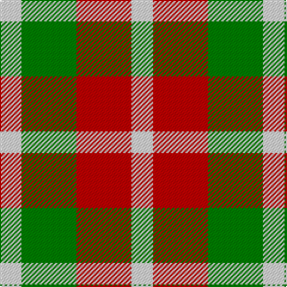

In pattern [WGRW](/patterns/wgrw/).

This was sourced from weddslist.  It is a [4 stripes tartan](/stripes/stripes4/).

Original link http://www.weddslist.com/cgi-bin/tartans/pg.pl?source=sts

## Thread count
LN/18 G46 R46 LN/18

## Palette
Each colour and its ΔE from the base-6 reference it is a variant of.

| Colour | Shade | Base | ΔE (OKLab) |
|---|---|---|---|
| G | <code style="background-color:#008000;">#008000</code> `#008000` | G <code style="background-color:#006400;">#006400</code> | 0.09 |
| LN | <code style="background-color:#E0E0E0;">#E0E0E0</code> `#E0E0E0` | W <code style="background-color:#F4F4F0;">#F4F4F0</code> | 0.06 |
| R | <code style="background-color:#C00000;">#C00000</code> `#C00000` | R <code style="background-color:#C80000;">#C80000</code> | 0.02 |

# Sample pattern

## Nearest tartans

The nearest existing variants by ΔTartan distance.

1. [Quaboos Pipers Plaid](/setts/s4/w18g46r46w18-g006818-rc80000-we0e0e0/) — ΔT 0.34
1. [Omani Regiment 2nd Pipe Sqn. (Mil.)](/setts/s4/w18g46r46w18-g289c18-rc80000-wf8f8f8/) — ΔT 0.53
1. [Omani Regiment 2nd Pipe Sqn.](/setts/s6/g46r46w18r46g46w18-g289c18-rc80000-wf8f8f8/) — ΔT 1.17
1. [Wilson's, No 113](/setts/s4/r4g12b12w4-b800080-g008000-rc00000-we0e0e0/) — ΔT 1.80
1. [Angle Dress (Fashion)](/setts/s5/k20g32y20g12y20-g408060-k101010-ybc8c00/) — ΔT 1.82
1. [Havel](/setts/s5/r42k42w20k20w42-k101010-rff0000-wffffff/) — ΔT 1.87
1. [Wild Mustard Dreams](/setts/s5/y34ya34y34g52b10-b2c2c80-g006818-ydc943c-yafccc00/) — ΔT 1.88
1. [Wilson's No.203](/setts/s4/b8r16g20y4-b2888c4-g006818-rc80000-ye8c000/) — ΔT 1.88
1. [Havel (Fashion)](/setts/s5/r42k42w20k20w42-k101010-rc80000-we0e0e0/) — ΔT 1.89
1. [Wilson's, No 203](/setts/s4/b8r16g20y4-b5480b0-g008000-rc00000-yf0c000/) — ΔT 1.90

## Neighbour map

Every grey dot is one of 15726 variants placed by the first two principal components of the ΔTartan feature space (44% of its variance). Red is this tartan; blue dots are its nearest — click one to open its page.

<svg viewBox="0 0 640 380" role="img" style="max-width:100%;height:auto;border:1px solid #e0e0e0;border-radius:4px;display:block" xmlns="http://www.w3.org/2000/svg"><image href="/nn/cloud.v1.png" width="640" height="380"/><a href="/setts/s4/w18g46r46w18-g006818-rc80000-we0e0e0/"><circle cx="123.3" cy="310.2" r="4" fill="#3465a4"><title>Quaboos Pipers Plaid</title></circle></a><a href="/setts/s4/w18g46r46w18-g289c18-rc80000-wf8f8f8/"><circle cx="115.9" cy="305.4" r="4" fill="#3465a4"><title>Omani Regiment 2nd Pipe Sqn. (Mil.)</title></circle></a><a href="/setts/s6/g46r46w18r46g46w18-g289c18-rc80000-wf8f8f8/"><circle cx="140.1" cy="306.2" r="4" fill="#3465a4"><title>Omani Regiment 2nd Pipe Sqn.</title></circle></a><a href="/setts/s4/r4g12b12w4-b800080-g008000-rc00000-we0e0e0/"><circle cx="120.1" cy="286.6" r="4" fill="#3465a4"><title>Wilson's, No 113</title></circle></a><a href="/setts/s5/k20g32y20g12y20-g408060-k101010-ybc8c00/"><circle cx="151.0" cy="341.3" r="4" fill="#3465a4"><title>Angle Dress (Fashion)</title></circle></a><a href="/setts/s5/r42k42w20k20w42-k101010-rff0000-wffffff/"><circle cx="78.3" cy="311.5" r="4" fill="#3465a4"><title>Havel</title></circle></a><a href="/setts/s5/y34ya34y34g52b10-b2c2c80-g006818-ydc943c-yafccc00/"><circle cx="146.9" cy="274.1" r="4" fill="#3465a4"><title>Wild Mustard Dreams</title></circle></a><a href="/setts/s4/b8r16g20y4-b2888c4-g006818-rc80000-ye8c000/"><circle cx="177.8" cy="277.0" r="4" fill="#3465a4"><title>Wilson's No.203</title></circle></a><a href="/setts/s5/r42k42w20k20w42-k101010-rc80000-we0e0e0/"><circle cx="83.8" cy="318.1" r="4" fill="#3465a4"><title>Havel (Fashion)</title></circle></a><a href="/setts/s4/b8r16g20y4-b5480b0-g008000-rc00000-yf0c000/"><circle cx="181.4" cy="278.1" r="4" fill="#3465a4"><title>Wilson's, No 203</title></circle></a><circle cx="123.8" cy="311.1" r="5" fill="#c00000"/></svg>

ID: /setts/s4/w18g46r46w18-g008000-rc00000-we0e0e0/
