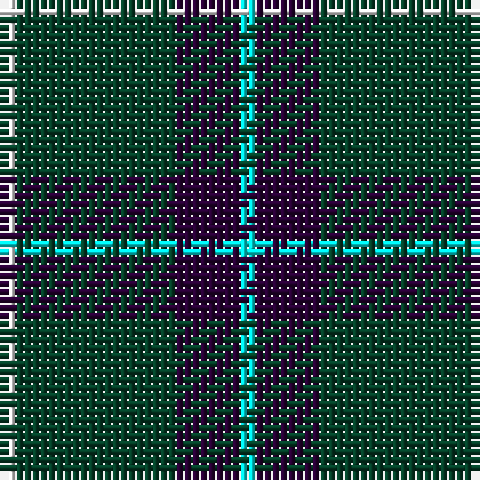

In pattern [WBGW](/stripes/wbgw/).

This was sourced from register-of-tartans.  It is a [4 stripe tartan](/stripes/stripes4/).

Original link https://www.tartanregister.gov.uk/tartanDetails.aspx?ref=4737

## Register references

External register numbers recorded for this tartan.

- Scottish Register of Tartans: [4737](https://www.tartanregister.gov.uk/tartanDetails.aspx?ref=4737)
- Scottish Tartans Authority (ITI): 1898
- Scottish Tartans World Register: 1898

## Thread count
W/2 DG20 DP8 LB/2

## Palette
Each colour and the base-6 reference it is a variant of.

| Colour | Shade | Base |
|---|---|---|
| DG | <code style="background-color:#044028;">#044028</code> `oklch(32.9% 0.072 160.0)` <small>#044028</small> | G <code style="background-color:#006100;">#006100</code> |
| DP | <code style="background-color:#280034;">#280034</code> `oklch(20.5% 0.100 316.9)` <small>#280034</small> | B <code style="background-color:#2A418A;">#2A418A</code> |
| LB | <code style="background-color:#00FCFC;">#00FCFC</code> `oklch(89.7% 0.153 194.8)` <small>#00FCFC</small> | W <code style="background-color:#F7F7F7;">#F7F7F7</code> |
| W | <code style="background-color:#FCFCFC;">#FCFCFC</code> `oklch(99.1% 0.000 89.9)` <small>#FCFCFC</small> | W <code style="background-color:#F7F7F7;">#F7F7F7</code> |

# Sample pattern

## Nearest tartans

The nearest existing variants by ΔTartan distance.

1. [Perry, Alex (Personal)](/setts/s4/k62n24lo5w8~x2/) — ΔT 0.92
1. [Wesley Owen 2010 (Personal)](/setts/s4/k61g10g20w4~x2/) — ΔT 1.14
1. [Wilson's No.189](/setts/s4/dp4g10r1w1~x2/) — ΔT 1.16
1. [Thunderlord (Celtic Group, USA)](/setts/s4/dt62w11k4t17~x2/) — ΔT 1.33
1. [MacIntyre L](/setts/s6/dg4db12r3db12dg32lb4/) — ΔT 1.36
1. [MacIntyre Hunting (VS)](/setts/s6/g4db12r3db12g32w4~x2/) — ΔT 1.38
1. [Bumbee #1 (Fashion)](/setts/s4/g10k2dp5g1~x8/) — ΔT 1.40
1. [Glen Coe Trade Tartan Tartan Number: 1243. Earliest known date: Modern Many new designs have been given district names to promote their Scottish connections. However, these names should not be confused with the District tartans which have earned their title through 'use and wont' and not a little history. See products available Copyright © Blair Urquhart, Comrie, 2015](/setts/s5/k37w9k3dg9w3~x2/) — ΔT 1.41
1. [Callaway (Corporate)](/setts/s6/r1k10n2lb5k5r1~x4/) — ΔT 1.42
1. [Wild Highlanders (Corporate)](/setts/s7/k36w3k10w3g28r6k18~x2/) — ΔT 1.45

## Neighbour map

Every grey dot is one of 14299 variants placed by the first two principal components of the ΔTartan feature space (44% of its variance). Red is this tartan; blue dots are its nearest — click one to open its page.

<svg viewBox="0 0 640 380" role="img" style="max-width:100%;height:auto;border:1px solid #e0e0e0;border-radius:4px;display:block" xmlns="http://www.w3.org/2000/svg"><image href="/nn/cloud.v1.png" width="640" height="380"/><a href="/setts/s4/k62n24lo5w8~x2/"><circle cx="342.7" cy="212.0" r="4" fill="#3465a4"><title>Perry, Alex (Personal)</title></circle></a><a href="/setts/s4/k61g10g20w4~x2/"><circle cx="361.0" cy="211.2" r="4" fill="#3465a4"><title>Wesley Owen 2010 (Personal)</title></circle></a><a href="/setts/s4/dp4g10r1w1~x2/"><circle cx="343.3" cy="223.6" r="4" fill="#3465a4"><title>Wilson's No.189</title></circle></a><a href="/setts/s4/dt62w11k4t17~x2/"><circle cx="388.1" cy="205.7" r="4" fill="#3465a4"><title>Thunderlord (Celtic Group, USA)</title></circle></a><a href="/setts/s6/dg4db12r3db12dg32lb4/"><circle cx="301.3" cy="218.4" r="4" fill="#3465a4"><title>MacIntyre L</title></circle></a><a href="/setts/s6/g4db12r3db12g32w4~x2/"><circle cx="295.2" cy="210.9" r="4" fill="#3465a4"><title>MacIntyre Hunting (VS)</title></circle></a><a href="/setts/s4/g10k2dp5g1~x8/"><circle cx="355.8" cy="263.8" r="4" fill="#3465a4"><title>Bumbee #1 (Fashion)</title></circle></a><a href="/setts/s5/k37w9k3dg9w3~x2/"><circle cx="373.3" cy="207.1" r="4" fill="#3465a4"><title>Glen Coe Trade Tartan Tartan Number: 1243. Earliest known date: Modern Many new designs have been given district names to promote their Scottish connections. However, these names should not be confused with the District tartans which have earned their title through 'use and wont' and not a little history. See products available Copyright © Blair Urquhart, Comrie, 2015</title></circle></a><a href="/setts/s6/r1k10n2lb5k5r1~x4/"><circle cx="309.4" cy="208.8" r="4" fill="#3465a4"><title>Callaway (Corporate)</title></circle></a><a href="/setts/s7/k36w3k10w3g28r6k18~x2/"><circle cx="329.2" cy="209.0" r="4" fill="#3465a4"><title>Wild Highlanders (Corporate)</title></circle></a><circle cx="334.6" cy="224.9" r="5" fill="#c00000"/></svg>

ID: /setts/s4/w1dg10dp4lt1~x2/
