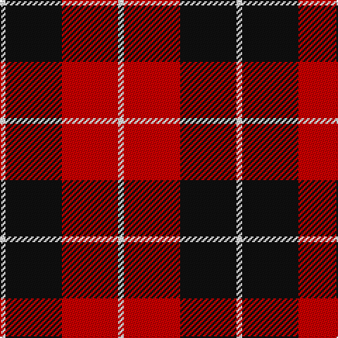

In pattern [WKRW](/patterns/wkrw/).

This was sourced from tartans-authority.  It is a [4 stripes tartan](/stripes/stripes4/).

Original link http://www.tartansauthority.com/tartan-ferret/display/7188/

## Thread count
W/4 K40 R40 W/4

## Palette
Each colour and its ΔE from the base-6 reference it is a variant of.

| Colour | Shade | Base | ΔE (OKLab) |
|---|---|---|---|
| K | <code style="background-color:#101010;">#101010</code> `#101010` | K <code style="background-color:#000000;">#000000</code> | 0.17 |
| R | <code style="background-color:#C80000;">#C80000</code> `#C80000` | R <code style="background-color:#CC0000;">#CC0000</code> | 0.01 |
| W | <code style="background-color:#F8F8F8;">#F8F8F8</code> `#F8F8F8` | W <code style="background-color:#F7F7F7;">#F7F7F7</code> | 0.00 |

# Sample pattern

## Nearest tartans

The nearest existing variants by ΔTartan distance.

1. [Wallace](/setts/s4/k1r8k8y1x6~k101010-rc80000-ye8c000/) — ΔT 0.81
1. [Wallace (Clan)](/setts/s4/k1r8k8y1x4~k101010-rc80000-ye8c000/) — ΔT 0.81
1. [Munro (Black and Red)](/setts/s5/k18r4k18r32w3x2~k101010-rc80000-wfcfcfc/) — ΔT 0.85
1. [Munro Black & Red Clan Tartan Tartan Number: 1204. Earliest known date: 1842 The design comes from the Vestiarium Scoticum (1842). The authors, the Sobieski Stuart brothers, enjoyed a popular following among the Scottish gentry in the early Victorian era, and in the spirit of the times, added mystery, romance and some spurious historical documentation to the subject of tartan. Of the better known tartans, the book offers some minor variation, but in other cases it provides the only recorded version of many tartans in use today. See products available Copyright © Blair Urquhart, Comrie, 2015](/setts/s5/k18r4k18r32w3x2~k101010-rc80000-we0e0e0/) — ΔT 0.91
1. [Connel (Clan)](/setts/s4/w1r8k8y1x4~k101010-rc80000-wfcfcfc-ye8c000/) — ΔT 0.96
1. [Connel Clan Tartan Tartan Number: 1854. Earliest known date: c. 1890 Whether the Wallace, which is known to date from at least 1842, and the Connel tartan are related is uncertain, although the close similarity leads one to suspect that the later 'Connel' is based on the Wallace. The Connels and MacConnels are both claimed as septs of Clan Donald. (P.E. MacDonald) See products available Copyright © Blair Urquhart, Comrie, 2015](/setts/s4/w1r8k8y1x2~k101010-rc80000-we0e0e0-ye8c000/) — ΔT 0.96
1. [Brodie (Clan)](/setts/s6/k3r15k11y2k4r3x2~k101010-rc80000-ye8c000/) — ΔT 1.15
1. [Bodog.com](/setts/s5/r3k25r25k10w3x2~k101010-rc80000-wc0c0c0/) — ΔT 1.15
1. [Skinner (Name)](/setts/s4/b1r8k8y1x4~b2c2c80-k101010-rc80000-yd09800/) — ΔT 1.17
1. [Unidentified Plaid #3](/setts/s5/g24r3g16r33w4~g002814-rc82828-we0e0e0/) — ΔT 1.20

## Neighbour map

Every grey dot is one of 15726 variants placed by the first two principal components of the ΔTartan feature space (44% of its variance). Red is this tartan; blue dots are its nearest — click one to open its page.

<svg viewBox="0 0 640 380" role="img" style="max-width:100%;height:auto;border:1px solid #e0e0e0;border-radius:4px;display:block" xmlns="http://www.w3.org/2000/svg"><image href="/nn/cloud.v1.png" width="640" height="380"/><a href="/setts/s4/k1r8k8y1x6~k101010-rc80000-ye8c000/"><circle cx="305.1" cy="249.2" r="4" fill="#3465a4"><title>Wallace</title></circle></a><a href="/setts/s4/k1r8k8y1x4~k101010-rc80000-ye8c000/"><circle cx="305.1" cy="249.2" r="4" fill="#3465a4"><title>Wallace (Clan)</title></circle></a><a href="/setts/s5/k18r4k18r32w3x2~k101010-rc80000-wfcfcfc/"><circle cx="301.0" cy="233.8" r="4" fill="#3465a4"><title>Munro (Black and Red)</title></circle></a><a href="/setts/s5/k18r4k18r32w3x2~k101010-rc80000-we0e0e0/"><circle cx="304.1" cy="235.1" r="4" fill="#3465a4"><title>Munro Black &amp; Red Clan Tartan Tartan Number: 1204. Earliest known date: 1842 The design comes from the Vestiarium Scoticum (1842). The authors, the Sobieski Stuart brothers, enjoyed a popular following among the Scottish gentry in the early Victorian era, and in the spirit of the times, added mystery, romance and some spurious historical documentation to the subject of tartan. Of the better known tartans, the book offers some minor variation, but in other cases it provides the only recorded version of many tartans in use today. See products available Copyright © Blair Urquhart, Comrie, 2015</title></circle></a><a href="/setts/s4/w1r8k8y1x4~k101010-rc80000-wfcfcfc-ye8c000/"><circle cx="238.7" cy="224.0" r="4" fill="#3465a4"><title>Connel (Clan)</title></circle></a><a href="/setts/s4/w1r8k8y1x2~k101010-rc80000-we0e0e0-ye8c000/"><circle cx="241.6" cy="225.3" r="4" fill="#3465a4"><title>Connel Clan Tartan Tartan Number: 1854. Earliest known date: c. 1890 Whether the Wallace, which is known to date from at least 1842, and the Connel tartan are related is uncertain, although the close similarity leads one to suspect that the later 'Connel' is based on the Wallace. The Connels and MacConnels are both claimed as septs of Clan Donald. (P.E. MacDonald) See products available Copyright © Blair Urquhart, Comrie, 2015</title></circle></a><a href="/setts/s6/k3r15k11y2k4r3x2~k101010-rc80000-ye8c000/"><circle cx="287.2" cy="233.7" r="4" fill="#3465a4"><title>Brodie (Clan)</title></circle></a><a href="/setts/s5/r3k25r25k10w3x2~k101010-rc80000-wc0c0c0/"><circle cx="316.6" cy="243.3" r="4" fill="#3465a4"><title>Bodog.com</title></circle></a><a href="/setts/s4/b1r8k8y1x4~b2c2c80-k101010-rc80000-yd09800/"><circle cx="257.7" cy="233.0" r="4" fill="#3465a4"><title>Skinner (Name)</title></circle></a><a href="/setts/s5/g24r3g16r33w4~g002814-rc82828-we0e0e0/"><circle cx="307.3" cy="236.3" r="4" fill="#3465a4"><title>Unidentified Plaid #3</title></circle></a><circle cx="277.6" cy="229.4" r="5" fill="#c00000"/></svg>

ID: /setts/s4/w1k10r10w1x4~k101010-rc80000-wf8f8f8/
