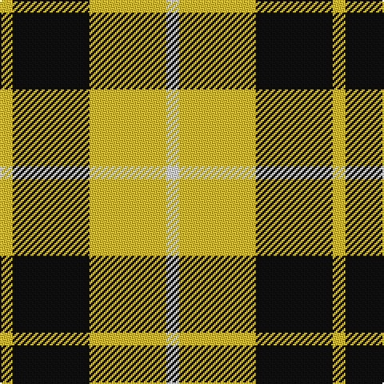

This page is one **sett** — a single exact thread-count. It belongs to the [tartan](/tartans/w1ly6k6ly1/)
(the same proportion at any scale), whose colour order is pattern [WYKY](/stripes/wyky/).

Sourced from house-of-tartan.  It is a [4 stripe tartan](/stripes/stripes4/).

Original link http://www.house-of-tartan.scotland.net/house/TartanViewjs.asp?colr=Def&tnam=1879

## Also known as

This cloth is also recorded under:

- Barclay, dress

## Thread count
Y/8 K48 Y48 LN/8

## Palette

Palette: <strong>Tartan Register</strong>
<table><thead><tr><th>Colour</th><th>Threads</th><th>Shade</th><th>Base</th><th>OKLCh</th></tr></thead><tbody><tr><td>Y/</td><td style="text-align:right;font-variant-numeric:tabular-nums">8</td><td><code style="background-color:#E8C000;">#E8C000</code> <small style="color:#888">#E8C000</small></td><td>Y <code style="background-color:#F2BF00;">#F2BF00</code></td><td><small style="color:#888">oklch(81.9% 0.168 93.7)</small></td></tr><tr><td>K</td><td style="text-align:right;font-variant-numeric:tabular-nums">48</td><td><code style="background-color:#101010;">#101010</code> <small style="color:#888">#101010</small></td><td>K <code style="background-color:#000000;">#000000</code></td><td><small style="color:#888">oklch(17.3% 0.000 89.9)</small></td></tr><tr><td>Y</td><td style="text-align:right;font-variant-numeric:tabular-nums">48</td><td><code style="background-color:#E8C000;">#E8C000</code> <small style="color:#888">#E8C000</small></td><td>Y <code style="background-color:#F2BF00;">#F2BF00</code></td><td><small style="color:#888">oklch(81.9% 0.168 93.7)</small></td></tr><tr><td>LN/</td><td style="text-align:right;font-variant-numeric:tabular-nums">8</td><td><code style="background-color:#E0E0E0;">#E0E0E0</code> <small style="color:#888">#E0E0E0</small></td><td>W <code style="background-color:#F7F7F7;">#F7F7F7</code></td><td><small style="color:#888">oklch(90.7% 0.000 89.9)</small></td></tr></tbody></table>

# Sample pattern

## Nearest tartans

The nearest existing variants by ΔTartan distance, with this tartan at the top so the swatches line up against it.

ΔTartan

Tartan

Sett

—

<a href="/ttd/edit/#slug=w1ly6k6ly1~x8">Barclay Dress Clan Tartan Tartan Number: 1879. Earliest known date: 1906 Based on the earlier hunting sett which appeared in the Vestiarium Scoticum in 1842. Barclay's appear to have no 'regular' tartan. The dress version assumes this role and is the sett most commonly associated with the name. The Aberdeenshire Barclays of Tolly held lands for over 600 years, and their descendant, Michael Andreas Barclay, was made Prince Barclay de Tolly for his part in the defeat of Napoleon. There is also a green hunting version of the same pattern. See products available Copyright © Blair Urquhart, Comrie, 2015</a> <a class="nn-out" href="/setts/s4/w1ly6k6ly1~x8/" title="open its dictionary page">↗</a>

0.24

<a href="/ttd/edit/#slug=w5ly32dt32ly5~x2">Barclay Dress</a> <a class="nn-out" href="/setts/s4/w5ly32dt32ly5~x2/" title="open its dictionary page">↗</a>

0.85

<a href="/ttd/edit/#slug=w1ly6k6ly1~x2">Barclay Dress</a> <a class="nn-out" href="/setts/s4/w1ly6k6ly1~x2/" title="open its dictionary page">↗</a>

0.92

<a href="/ttd/edit/#slug=k4ly1k4ly6r1~x4">MacLeod Dress Clan Tartan Tartan Number: 1272. Earliest known date: 1829 See illustration in Bain where red is 4 threads. Sir Thomas Dick Lauder in a letter to Sir Walter Scott in 1829 wrote, MacLeod has got a sketch of this splendid tartan, &quot;three black stryps upon ain yellow fylde,&quot; See products available Copyright © Blair Urquhart, Comrie, 2015</a> <a class="nn-out" href="/setts/s5/k4ly1k4ly6r1~x4/" title="open its dictionary page">↗</a>

0.93

<a href="/ttd/edit/#slug=k15ly20w3~x2">Silvicola (Corporate)</a> <a class="nn-out" href="/setts/s3/k15ly20w3~x2/" title="open its dictionary page">↗</a>

1.17

<a href="/ttd/edit/#slug=k6ly1k6ly9r1ly2~x2">MacLeod #3</a> <a class="nn-out" href="/setts/s6/k6ly1k6ly9r1ly2~x2/" title="open its dictionary page">↗</a>

1.19

<a href="/ttd/edit/#slug=r4k25ly25w4~x2">Bonhill Primary School</a> <a class="nn-out" href="/setts/s4/r4k25ly25w4~x2/" title="open its dictionary page">↗</a>

1.28

<a href="/ttd/edit/#slug=lr1ly6k6ly1~x2">Barclay Dress</a> <a class="nn-out" href="/setts/s4/lr1ly6k6ly1~x2/" title="open its dictionary page">↗</a>

1.28

<a href="/ttd/edit/#slug=lr1ly6k6ly1">Barclay Dress</a> <a class="nn-out" href="/setts/s4/lr1ly6k6ly1/" title="open its dictionary page">↗</a>

1.29

<a href="/ttd/edit/#slug=w2dg13o13w2~x6">Dunoon Irish</a> <a class="nn-out" href="/setts/s4/w2dg13o13w2~x6/" title="open its dictionary page">↗</a>

1.30

<a href="/ttd/edit/#slug=ly20db10k3~x2">Masai Shuka 04 (Artefact)</a> <a class="nn-out" href="/setts/s3/ly20db10k3~x2/" title="open its dictionary page">↗</a>

## Neighbour map

Every grey dot is one of 14359 variants placed by the first two principal components of the ΔTartan feature space (44% of its variance). Red is this tartan; blue dots are its nearest — click one to open its page.

<svg viewBox="0 0 640 380" role="img" style="max-width:100%;height:auto;border:1px solid #e0e0e0;border-radius:4px;display:block" xmlns="http://www.w3.org/2000/svg"><image href="/nn/cloud.v1.png" width="640" height="380"/><a href="/setts/s4/w5ly32dt32ly5~x2/"><circle cx="248.2" cy="242.5" r="4" fill="#3465a4"><title>Barclay Dress</title></circle></a><a href="/setts/s4/w1ly6k6ly1~x2/"><circle cx="233.8" cy="250.6" r="4" fill="#3465a4"><title>Barclay Dress</title></circle></a><a href="/setts/s5/k4ly1k4ly6r1~x4/"><circle cx="233.8" cy="251.8" r="4" fill="#3465a4"><title>MacLeod Dress Clan Tartan Tartan Number: 1272. Earliest known date: 1829 See illustration in Bain where red is 4 threads. Sir Thomas Dick Lauder in a letter to Sir Walter Scott in 1829 wrote, MacLeod has got a sketch of this splendid tartan, &quot;three black stryps upon ain yellow fylde,&quot; See products available Copyright © Blair Urquhart, Comrie, 2015</title></circle></a><a href="/setts/s3/k15ly20w3~x2/"><circle cx="242.7" cy="268.7" r="4" fill="#3465a4"><title>Silvicola (Corporate)</title></circle></a><a href="/setts/s6/k6ly1k6ly9r1ly2~x2/"><circle cx="255.3" cy="217.8" r="4" fill="#3465a4"><title>MacLeod #3</title></circle></a><a href="/setts/s4/r4k25ly25w4~x2/"><circle cx="184.8" cy="225.6" r="4" fill="#3465a4"><title>Bonhill Primary School</title></circle></a><a href="/setts/s4/lr1ly6k6ly1~x2/"><circle cx="241.0" cy="256.6" r="4" fill="#3465a4"><title>Barclay Dress</title></circle></a><a href="/setts/s4/lr1ly6k6ly1/"><circle cx="241.0" cy="256.6" r="4" fill="#3465a4"><title>Barclay Dress</title></circle></a><a href="/setts/s4/w2dg13o13w2~x6/"><circle cx="232.6" cy="250.6" r="4" fill="#3465a4"><title>Dunoon Irish</title></circle></a><a href="/setts/s3/ly20db10k3~x2/"><circle cx="286.9" cy="261.2" r="4" fill="#3465a4"><title>Masai Shuka 04 (Artefact)</title></circle></a><circle cx="240.7" cy="245.8" r="5" fill="#c00000"/></svg>

ID: /setts/s4/w1ly6k6ly1~x8/
