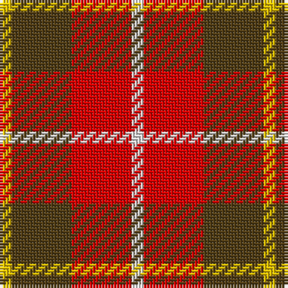

**Bands:** [YGRW](/stripes/ygrw/) · **Stripes:** [LY DY R W](/stripes/stripes4/) LY DY R W

This was sourced from register-of-tartans.  It is a [4 band tartan](/bands/bands4/).

Original link https://www.tartanregister.gov.uk/tartanDetails.aspx?ref=2821

## Register references

External register numbers recorded for this tartan.

- Scottish Register of Tartans: [2821](https://www.tartanregister.gov.uk/tartanDetails.aspx?ref=2821)
- Scottish Tartans World Register: 1863

## Thread count
Y/4 T20 R20 LN/4

## Palette
Each colour and its ΔE from the base-6 reference it is a variant of.

| Colour | Shade | Base | ΔE (OKLab) |
|---|---|---|---|
| LN | <code style="background-color:#E0E0E0;">#E0E0E0</code> `#E0E0E0` | W <code style="background-color:#F7F7F7;">#F7F7F7</code> | 0.07 |
| R | <code style="background-color:#DC0000;">#DC0000</code> `#DC0000` | R <code style="background-color:#CC0000;">#CC0000</code> | 0.03 |
| T | <code style="background-color:#503C14;">#503C14</code> `#503C14` | G <code style="background-color:#006100;">#006100</code> | 0.14 |
| Y | <code style="background-color:#E8C000;">#E8C000</code> `#E8C000` | Y <code style="background-color:#F2BF00;">#F2BF00</code> | 0.02 |

# Sample pattern

## Nearest tartans

The nearest existing variants by ΔTartan distance.

1. [Manx, Mannin Plaid](/setts/s4/w1r5o5ly1~x4/) — ΔT 1.33
1. [Buckeye](/setts/s4/y25k4w8r16~x4/) — ΔT 1.37
1. [Harmony 9](/setts/s5/dy2ly10r15dy10ly2~x4/) — ΔT 1.40
1. [MacKintosh-Geddes (Personal?)](/setts/s7/dp2r4g12r3dp6r10w2~x2/) — ΔT 1.46
1. [Benedict (Personal)](/setts/s5/g4lb4k2r15ly4~x4/) — ΔT 1.53
1. [Benedict (Personal)](/setts/s5/dg4lb4k2r15ly4~x4/) — ΔT 1.54
1. [Bonhill Primary School](/setts/s4/r4k25o25w4~x2/) — ΔT 1.58
1. [Banff](/setts/s7/o6ly3o20o20o3o3lb6~x2/) — ΔT 1.58
1. [Harmony, 9](/setts/s5/o2ly10r15o10ly2~x4/) — ΔT 1.59
1. [Moray of Abercairney #2](/setts/s5/r8r1dg4r1db4~x2/) — ΔT 1.63

## Neighbour map

Every grey dot is one of 14299 variants placed by the first two principal components of the ΔTartan feature space (44% of its variance). Red is this tartan; blue dots are its nearest — click one to open its page.

<svg viewBox="0 0 640 380" role="img" style="max-width:100%;height:auto;border:1px solid #e0e0e0;border-radius:4px;display:block" xmlns="http://www.w3.org/2000/svg"><image href="/nn/cloud.v1.png" width="640" height="380"/><a href="/setts/s4/w1r5o5ly1~x4/"><circle cx="242.4" cy="263.1" r="4" fill="#3465a4"><title>Manx, Mannin Plaid</title></circle></a><a href="/setts/s4/y25k4w8r16~x4/"><circle cx="209.3" cy="243.2" r="4" fill="#3465a4"><title>Buckeye</title></circle></a><a href="/setts/s5/dy2ly10r15dy10ly2~x4/"><circle cx="211.7" cy="235.2" r="4" fill="#3465a4"><title>Harmony 9</title></circle></a><a href="/setts/s7/dp2r4g12r3dp6r10w2~x2/"><circle cx="201.3" cy="222.3" r="4" fill="#3465a4"><title>MacKintosh-Geddes (Personal?)</title></circle></a><a href="/setts/s5/g4lb4k2r15ly4~x4/"><circle cx="232.1" cy="191.8" r="4" fill="#3465a4"><title>Benedict (Personal)</title></circle></a><a href="/setts/s5/dg4lb4k2r15ly4~x4/"><circle cx="226.7" cy="189.1" r="4" fill="#3465a4"><title>Benedict (Personal)</title></circle></a><a href="/setts/s4/r4k25o25w4~x2/"><circle cx="214.6" cy="234.9" r="4" fill="#3465a4"><title>Bonhill Primary School</title></circle></a><a href="/setts/s7/o6ly3o20o20o3o3lb6~x2/"><circle cx="248.2" cy="199.2" r="4" fill="#3465a4"><title>Banff</title></circle></a><a href="/setts/s5/o2ly10r15o10ly2~x4/"><circle cx="233.6" cy="245.9" r="4" fill="#3465a4"><title>Harmony, 9</title></circle></a><a href="/setts/s5/r8r1dg4r1db4~x2/"><circle cx="239.8" cy="231.3" r="4" fill="#3465a4"><title>Moray of Abercairney #2</title></circle></a><circle cx="210.4" cy="246.9" r="5" fill="#c00000"/></svg>

ID: /setts/s4/w1r5dy5ly1~x4/
