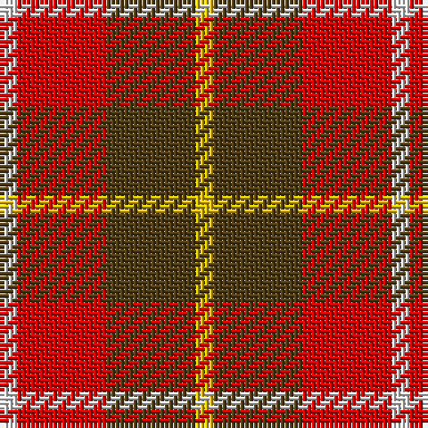

In pattern [WRGY](/patterns/wrgy/).

This was sourced from register-of-tartans.  It is a [4 stripes tartan](/stripes/stripes4/).

Original link https://www.tartanregister.gov.uk/tartanDetails.aspx?ref=2821

## Thread count
LN/4 R20 T20 Y/4

## Palette
Each colour and its ΔE from the base-6 reference it is a variant of.

| Colour | Shade | Base | ΔE (OKLab) |
|---|---|---|---|
| LN | <code style="background-color:#E0E0E0;">#E0E0E0</code> `#E0E0E0` | W <code style="background-color:#F7F7F7;">#F7F7F7</code> | 0.07 |
| R | <code style="background-color:#DC0000;">#DC0000</code> `#DC0000` | R <code style="background-color:#CC0000;">#CC0000</code> | 0.03 |
| T | <code style="background-color:#503C14;">#503C14</code> `#503C14` | G <code style="background-color:#006100;">#006100</code> | 0.14 |
| Y | <code style="background-color:#E8C000;">#E8C000</code> `#E8C000` | Y <code style="background-color:#F2BF00;">#F2BF00</code> | 0.02 |

# Sample pattern

## Nearest tartans

The nearest existing variants by ΔTartan distance.

1. [Manx, Mannin Plaid](/setts/s4/w1r5ra5y1x4~rc00000-ra806050-we0e0e0-yf0c000/) — ΔT 1.34
1. [Buckeye](/setts/s4/g25k4w8r16x4~g75786c-k120a01-rdd1212-wf7f1e8/) — ΔT 1.37
1. [Harmony 9](/setts/s5/g2y10r15g10y2x4~g503c14-rdc0000-ye8c000/) — ΔT 1.39
1. [MacKintosh-Geddes (Personal?)](/setts/s7/b2r4g12r3b6r10w2x2~b780078-g006818-rc80000-wfcfcfc/) — ΔT 1.46
1. [Benedict (Personal)](/setts/s5/g4w4k2r15y4x4~g006438-k101010-rc80000-wc0c0c0-yd8b000/) — ΔT 1.53
1. [Benedict (Personal)](/setts/s5/g4w4k2r15y4x4~g003820-k101010-rc80000-wc0c0c0-yd8b000/) — ΔT 1.54
1. [Bonhill Primary School](/setts/s4/r4k25ra25w4x2~k101010-rc80000-rab84c00-wffffff/) — ΔT 1.57
1. [Banff](/setts/s7/r6y3r20ra20r3ra3w6x2~r70000c-rac07468-wc4c4c4-yfcfc00/) — ΔT 1.58
1. [Harmony, 9](/setts/s5/r2y10ra15r10y2x4~r806050-rac00000-yf0c000/) — ΔT 1.59
1. [Moray of Abercairney #2](/setts/s5/r8ra1g4ra1b4x2~b2c4084-g005020-rdc0000-rac82828/) — ΔT 1.63

## Neighbour map

Every grey dot is one of 15726 variants placed by the first two principal components of the ΔTartan feature space (44% of its variance). Red is this tartan; blue dots are its nearest — click one to open its page.

<svg viewBox="0 0 640 380" role="img" style="max-width:100%;height:auto;border:1px solid #e0e0e0;border-radius:4px;display:block" xmlns="http://www.w3.org/2000/svg"><image href="/nn/cloud.v1.png" width="640" height="380"/><a href="/setts/s4/w1r5ra5y1x4~rc00000-ra806050-we0e0e0-yf0c000/"><circle cx="242.8" cy="263.1" r="4" fill="#3465a4"><title>Manx, Mannin Plaid</title></circle></a><a href="/setts/s4/g25k4w8r16x4~g75786c-k120a01-rdd1212-wf7f1e8/"><circle cx="208.6" cy="247.1" r="4" fill="#3465a4"><title>Buckeye</title></circle></a><a href="/setts/s5/g2y10r15g10y2x4~g503c14-rdc0000-ye8c000/"><circle cx="211.8" cy="239.7" r="4" fill="#3465a4"><title>Harmony 9</title></circle></a><a href="/setts/s7/b2r4g12r3b6r10w2x2~b780078-g006818-rc80000-wfcfcfc/"><circle cx="200.7" cy="224.3" r="4" fill="#3465a4"><title>MacKintosh-Geddes (Personal?)</title></circle></a><a href="/setts/s5/g4w4k2r15y4x4~g006438-k101010-rc80000-wc0c0c0-yd8b000/"><circle cx="232.1" cy="195.4" r="4" fill="#3465a4"><title>Benedict (Personal)</title></circle></a><a href="/setts/s5/g4w4k2r15y4x4~g003820-k101010-rc80000-wc0c0c0-yd8b000/"><circle cx="226.6" cy="193.4" r="4" fill="#3465a4"><title>Benedict (Personal)</title></circle></a><a href="/setts/s4/r4k25ra25w4x2~k101010-rc80000-rab84c00-wffffff/"><circle cx="213.3" cy="240.1" r="4" fill="#3465a4"><title>Bonhill Primary School</title></circle></a><a href="/setts/s7/r6y3r20ra20r3ra3w6x2~r70000c-rac07468-wc4c4c4-yfcfc00/"><circle cx="247.9" cy="202.8" r="4" fill="#3465a4"><title>Banff</title></circle></a><a href="/setts/s5/r2y10ra15r10y2x4~r806050-rac00000-yf0c000/"><circle cx="234.0" cy="247.8" r="4" fill="#3465a4"><title>Harmony, 9</title></circle></a><a href="/setts/s5/r8ra1g4ra1b4x2~b2c4084-g005020-rdc0000-rac82828/"><circle cx="239.5" cy="231.2" r="4" fill="#3465a4"><title>Moray of Abercairney #2</title></circle></a><circle cx="210.3" cy="250.9" r="5" fill="#c00000"/></svg>

ID: /setts/s4/w1r5g5y1x4~g503c14-rdc0000-we0e0e0-ye8c000/
