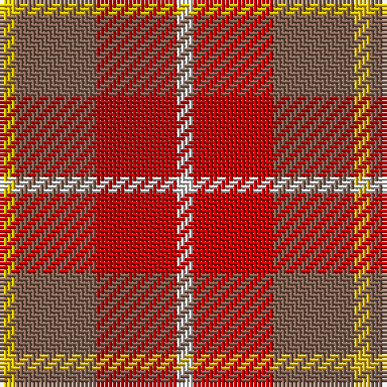

This page is one **sett** — a single exact thread-count. It belongs to the [tartan](/tartans/w1r5o5ly1/)
(the same proportion at any scale), whose colour order is pattern [WRRY](/stripes/wrry/).

Sourced from weddslist.  It is a [4 stripe tartan](/stripes/stripes4/).

Original link http://www.weddslist.com/cgi-bin/tartans/pg.pl?source=sts

## Thread count
Y/4 LT20 R20 LN/4

## Palette

Palette: <strong>Tartan Dictionary</strong> <small style="color:#888">(1 of 4 colours)</small>
<table><thead><tr><th>Colour</th><th>Threads</th><th>Shade</th><th>Base</th><th>OKLCh</th></tr></thead><tbody><tr><td>Y/</td><td style="text-align:right;font-variant-numeric:tabular-nums">4</td><td><code style="background-color:#F0C000;">#F0C000</code> <small style="color:#888">#F0C000</small></td><td>Y <code style="background-color:#F2BF00;">#F2BF00</code></td><td><small style="color:#888">oklch(82.7% 0.169 90.5)</small></td></tr><tr><td>LT</td><td style="text-align:right;font-variant-numeric:tabular-nums">20</td><td><code style="background-color:#806050;">#806050</code> <small style="color:#888">#806050</small></td><td>R <code style="background-color:#CC0000;">#CC0000</code></td><td><small style="color:#888">oklch(51.7% 0.049 47.8)</small></td></tr><tr><td>R</td><td style="text-align:right;font-variant-numeric:tabular-nums">20</td><td><code style="background-color:#C00000;">#C00000</code> <small style="color:#888">#C00000</small></td><td>R <code style="background-color:#CC0000;">#CC0000</code></td><td><small style="color:#888">oklch(50.7% 0.208 29.2)</small></td></tr><tr><td>LN/</td><td style="text-align:right;font-variant-numeric:tabular-nums">4</td><td><code style="background-color:#E0E0E0;">#E0E0E0</code> <small style="color:#888">#E0E0E0</small></td><td>W <code style="background-color:#F7F7F7;">#F7F7F7</code></td><td><small style="color:#888">oklch(90.7% 0.000 89.9)</small></td></tr></tbody></table>

# Sample pattern

## Nearest tartans

The nearest existing variants by ΔTartan distance, with this tartan at the top so the swatches line up against it.

ΔTartan

Tartan

Sett

—

<a href="/ttd/edit/#slug=w1r5o5ly1~x4">Manx, Mannin Plaid</a> <a class="nn-out" href="/setts/s4/w1r5o5ly1~x4/" title="open its dictionary page">↗</a>

1.32

<a href="/ttd/edit/#slug=w1r5dy5ly1~x4">Manx Mannin Plaid</a> <a class="nn-out" href="/setts/s4/w1r5dy5ly1~x4/" title="open its dictionary page">↗</a>

1.36

<a href="/ttd/edit/#slug=ri8r1g4r1db4~x2">Moray of Abercairney</a> <a class="nn-out" href="/setts/s5/ri8r1g4r1db4~x2/" title="open its dictionary page">↗</a>

1.43

<a href="/ttd/edit/#slug=r8ri1dg4ri1db4~x2">Moray of Abercairney #2</a> <a class="nn-out" href="/setts/s5/r8ri1dg4ri1db4~x2/" title="open its dictionary page">↗</a>

1.48

<a href="/ttd/edit/#slug=o2ly10r15o10ly2~x4">Harmony, 9</a> <a class="nn-out" href="/setts/s5/o2ly10r15o10ly2~x4/" title="open its dictionary page">↗</a>

1.59

<a href="/ttd/edit/#slug=r8ri1dg4ri1dg1t2~x2">Moray of Abercairney</a> <a class="nn-out" href="/setts/s6/r8ri1dg4ri1dg1t2~x2/" title="open its dictionary page">↗</a>

1.61

<a href="/ttd/edit/#slug=loi36do15loi9r31lo5do4r16~x2">Manhattan Ethnic</a> <a class="nn-out" href="/setts/s7/loi36do15loi9r31lo5do4r16~x2/" title="open its dictionary page">↗</a>

1.62

<a href="/ttd/edit/#slug=ri8r1g4r1g1t2~x2">Moray of Abercairney</a> <a class="nn-out" href="/setts/s6/ri8r1g4r1g1t2~x2/" title="open its dictionary page">↗</a>

1.68

<a href="/ttd/edit/#slug=g1m1g7m4r7m1~x4">MacNab #2</a> <a class="nn-out" href="/setts/s6/g1m1g7m4r7m1~x4/" title="open its dictionary page">↗</a>

1.68

<a href="/ttd/edit/#slug=k13r40o13oi8~x2">Maryville College</a> <a class="nn-out" href="/setts/s4/k13r40o13oi8~x2/" title="open its dictionary page">↗</a>

1.75

<a href="/ttd/edit/#slug=t6lo28o20t3~x2">Prince of Orange</a> <a class="nn-out" href="/setts/s4/t6lo28o20t3~x2/" title="open its dictionary page">↗</a>

## Neighbour map

Every grey dot is one of 14359 variants placed by the first two principal components of the ΔTartan feature space (44% of its variance). Red is this tartan; blue dots are its nearest — click one to open its page.

<svg viewBox="0 0 640 380" role="img" style="max-width:100%;height:auto;border:1px solid #e0e0e0;border-radius:4px;display:block" xmlns="http://www.w3.org/2000/svg"><image href="/nn/cloud.v1.png" width="640" height="380"/><a href="/setts/s4/w1r5dy5ly1~x4/"><circle cx="209.5" cy="248.2" r="4" fill="#3465a4"><title>Manx Mannin Plaid</title></circle></a><a href="/setts/s5/ri8r1g4r1db4~x2/"><circle cx="241.6" cy="236.2" r="4" fill="#3465a4"><title>Moray of Abercairney</title></circle></a><a href="/setts/s5/r8ri1dg4ri1db4~x2/"><circle cx="239.2" cy="232.4" r="4" fill="#3465a4"><title>Moray of Abercairney #2</title></circle></a><a href="/setts/s5/o2ly10r15o10ly2~x4/"><circle cx="232.7" cy="247.0" r="4" fill="#3465a4"><title>Harmony, 9</title></circle></a><a href="/setts/s6/r8ri1dg4ri1dg1t2~x2/"><circle cx="270.7" cy="209.1" r="4" fill="#3465a4"><title>Moray of Abercairney</title></circle></a><a href="/setts/s7/loi36do15loi9r31lo5do4r16~x2/"><circle cx="244.3" cy="220.9" r="4" fill="#3465a4"><title>Manhattan Ethnic</title></circle></a><a href="/setts/s6/ri8r1g4r1g1t2~x2/"><circle cx="277.4" cy="215.3" r="4" fill="#3465a4"><title>Moray of Abercairney</title></circle></a><a href="/setts/s6/g1m1g7m4r7m1~x4/"><circle cx="261.0" cy="252.4" r="4" fill="#3465a4"><title>MacNab #2</title></circle></a><a href="/setts/s4/k13r40o13oi8~x2/"><circle cx="276.1" cy="262.4" r="4" fill="#3465a4"><title>Maryville College</title></circle></a><a href="/setts/s4/t6lo28o20t3~x2/"><circle cx="328.9" cy="260.2" r="4" fill="#3465a4"><title>Prince of Orange</title></circle></a><circle cx="241.6" cy="264.3" r="5" fill="#c00000"/></svg>

ID: /setts/s4/w1r5o5ly1~x4/
