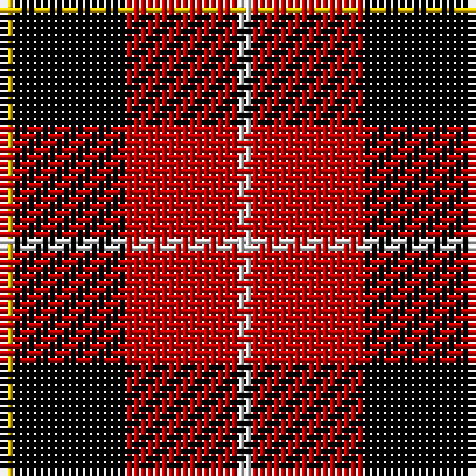

In pattern [WRKY](/stripes/wrky/).

This was sourced from weddslist.  It is a [4 stripe tartan](/stripes/stripes4/).

Original link http://www.weddslist.com/cgi-bin/tartans/pg.pl?source=sts

## Attestations

This cloth appears in 2 source records; the oldest owns this page.

- undated — Connel (weddslist, [record](http://www.weddslist.com/cgi-bin/tartans/pg.pl?source=sts))
- undated — Connel Clan Tartan Tartan Number: 1854. Earliest known date: c. 1890 Whether the Wallace, which is known to date from at least 1842, and the Connel tartan are related is uncertain, although the close similarity leads one to suspect that the later 'Connel' is based on the Wallace. The Connels and MacConnels are both claimed as septs of Clan Donald. (P.E. MacDonald) See products available Copyright © Blair Urquhart, Comrie, 2015 (house-of-tartan, [record](http://www.house-of-tartan.scotland.net/house/TartanViewjs.asp?colr=Def&tnam=1854))

## Thread count
Y/2 K16 R16 LN/2

## Palette
Each colour and the base-6 reference it is a variant of.

| Colour | Shade | Base |
|---|---|---|
| K | <code style="background-color:#000000;">#000000</code> `oklch(0.0% 0.000 0.0)` <small>#000000</small> | K <code style="background-color:#000000;">#000000</code> |
| LN | <code style="background-color:#E0E0E0;">#E0E0E0</code> `oklch(90.7% 0.000 89.9)` <small>#E0E0E0</small> | W <code style="background-color:#F7F7F7;">#F7F7F7</code> |
| R | <code style="background-color:#C00000;">#C00000</code> `oklch(50.7% 0.208 29.2)` <small>#C00000</small> | R <code style="background-color:#CC0000;">#CC0000</code> |
| Y | <code style="background-color:#F0C000;">#F0C000</code> `oklch(82.7% 0.169 90.5)` <small>#F0C000</small> | Y <code style="background-color:#F2BF00;">#F2BF00</code> |

# Sample pattern

## Nearest tartans

The nearest existing variants by ΔTartan distance, with this tartan at the top so the swatches line up against it.

ΔTartan

Tartan

Sett

—

<a href="/ttd/edit/#slug=w1r8k8ly1~x2">Connel</a> <a class="nn-out" href="/setts/s4/w1r8k8ly1~x2/" title="open its dictionary page">↗</a>

0.85

<a href="/ttd/edit/#slug=w1r8k8ly1~x4">Connel (Clan)</a> <a class="nn-out" href="/setts/s4/w1r8k8ly1~x4/" title="open its dictionary page">↗</a>

1.09

<a href="/ttd/edit/#slug=db1r8k8lo1~x4">Skinner (Name)</a> <a class="nn-out" href="/setts/s4/db1r8k8lo1~x4/" title="open its dictionary page">↗</a>

1.12

<a href="/ttd/edit/#slug=k1r8k8ly1">Wallace</a> <a class="nn-out" href="/setts/s4/k1r8k8ly1/" title="open its dictionary page">↗</a>

1.17

<a href="/ttd/edit/#slug=r4k25o25w4~x2">Bonhill Primary School</a> <a class="nn-out" href="/setts/s4/r4k25o25w4~x2/" title="open its dictionary page">↗</a>

1.24

<a href="/ttd/edit/#slug=k3r29k11k29t3~x2">Wallace Red Dress Tartan Tartan Number: 8186. Earliest known date: See products available Copyright © Blair Urquhart, Comrie, 2015</a> <a class="nn-out" href="/setts/s5/k3r29k11k29t3~x2/" title="open its dictionary page">↗</a>

1.25

<a href="/ttd/edit/#slug=w1k10r10w1~x4">Masai Shuka 01 (Artefact)</a> <a class="nn-out" href="/setts/s4/w1k10r10w1~x4/" title="open its dictionary page">↗</a>

1.28

<a href="/ttd/edit/#slug=db1r16k16ly1~x4">Skinner</a> <a class="nn-out" href="/setts/s4/db1r16k16ly1~x4/" title="open its dictionary page">↗</a>

1.31

<a href="/ttd/edit/#slug=k1r8k8ly1~x2">Wallace</a> <a class="nn-out" href="/setts/s4/k1r8k8ly1~x2/" title="open its dictionary page">↗</a>

1.31

<a href="/ttd/edit/#slug=k18r4k18r32lb3">Munro VS</a> <a class="nn-out" href="/setts/s5/k18r4k18r32lb3/" title="open its dictionary page">↗</a>

1.37

<a href="/ttd/edit/#slug=k1r8k8ly1~x6">Wallace</a> <a class="nn-out" href="/setts/s4/k1r8k8ly1~x6/" title="open its dictionary page">↗</a>

## Neighbour map

Every grey dot is one of 14299 variants placed by the first two principal components of the ΔTartan feature space (44% of its variance). Red is this tartan; blue dots are its nearest — click one to open its page.

<svg viewBox="0 0 640 380" role="img" style="max-width:100%;height:auto;border:1px solid #e0e0e0;border-radius:4px;display:block" xmlns="http://www.w3.org/2000/svg"><image href="/nn/cloud.v1.png" width="640" height="380"/><a href="/setts/s4/w1r8k8ly1~x4/"><circle cx="239.7" cy="217.6" r="4" fill="#3465a4"><title>Connel (Clan)</title></circle></a><a href="/setts/s4/db1r8k8lo1~x4/"><circle cx="258.6" cy="228.6" r="4" fill="#3465a4"><title>Skinner (Name)</title></circle></a><a href="/setts/s4/k1r8k8ly1/"><circle cx="289.3" cy="239.1" r="4" fill="#3465a4"><title>Wallace</title></circle></a><a href="/setts/s4/r4k25o25w4~x2/"><circle cx="214.6" cy="234.9" r="4" fill="#3465a4"><title>Bonhill Primary School</title></circle></a><a href="/setts/s5/k3r29k11k29t3~x2/"><circle cx="204.5" cy="211.1" r="4" fill="#3465a4"><title>Wallace Red Dress Tartan Tartan Number: 8186. Earliest known date: See products available Copyright © Blair Urquhart, Comrie, 2015</title></circle></a><a href="/setts/s4/w1k10r10w1~x4/"><circle cx="278.6" cy="222.1" r="4" fill="#3465a4"><title>Masai Shuka 01 (Artefact)</title></circle></a><a href="/setts/s4/db1r16k16ly1~x4/"><circle cx="299.3" cy="192.3" r="4" fill="#3465a4"><title>Skinner</title></circle></a><a href="/setts/s4/k1r8k8ly1~x2/"><circle cx="296.4" cy="245.8" r="4" fill="#3465a4"><title>Wallace</title></circle></a><a href="/setts/s5/k18r4k18r32lb3/"><circle cx="289.3" cy="225.1" r="4" fill="#3465a4"><title>Munro VS</title></circle></a><a href="/setts/s4/k1r8k8ly1~x6/"><circle cx="305.8" cy="242.6" r="4" fill="#3465a4"><title>Wallace</title></circle></a><circle cx="231.3" cy="217.9" r="5" fill="#c00000"/></svg>

ID: /setts/s4/w1r8k8ly1~x2/
