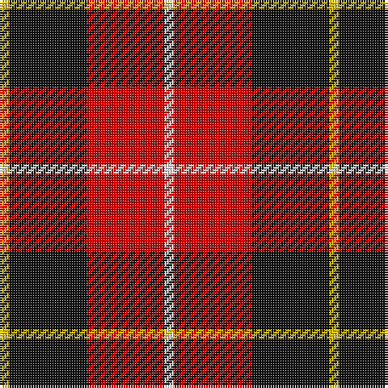

**Bands:** [YKRW](/stripes/ykrw/) · **Stripes:** [LY K R W](/stripes/stripes4/) LY K R W

This was sourced from tartans-authority.  It is a [4 band tartan](/bands/bands4/).

Original link http://www.tartansauthority.com/tartan-ferret/display/1854/

## Variants

Other setts woven to the same stripe pattern.

- [Connel](/setts/s4/w1r8k8ly1~x2/)
- [Masai Shuka 18 (Artefact)](/setts/s4/ly6k3r40w3~x2/)
- [Riddick Furya](/setts/s4/ly2k3r31w1~x4/)

## Thread count
Y/4 K32 R32 W/4

## Palette
Each colour and its ΔE from the base-6 reference it is a variant of.

| Colour | Shade | Base | ΔE (OKLab) |
|---|---|---|---|
| K | <code style="background-color:#101010;">#101010</code> `#101010` | K <code style="background-color:#000000;">#000000</code> | 0.17 |
| R | <code style="background-color:#C80000;">#C80000</code> `#C80000` | R <code style="background-color:#CC0000;">#CC0000</code> | 0.01 |
| W | <code style="background-color:#FCFCFC;">#FCFCFC</code> `#FCFCFC` | W <code style="background-color:#F7F7F7;">#F7F7F7</code> | 0.01 |
| Y | <code style="background-color:#E8C000;">#E8C000</code> `#E8C000` | Y <code style="background-color:#F2BF00;">#F2BF00</code> | 0.02 |

# Sample pattern

## Nearest tartans

The nearest existing variants by ΔTartan distance.

1. [Bonhill Primary School](/setts/s4/r4k25o25w4~x2/) — ΔT 0.70
1. [Skinner (Name)](/setts/s4/db1r8k8lo1~x4/) — ΔT 0.71
1. [Connel](/setts/s4/w1r8k8ly1~x2/) — ΔT 0.85
1. [Masai Shuka 01 (Artefact)](/setts/s4/w1k10r10w1~x4/) — ΔT 0.96
1. [Oklahoma State University (Corporate](/setts/s4/r80k52w7o12/) — ΔT 1.03
1. [Aberdeen University](/setts/s5/ly2r15k7db8ly2~x4/) — ΔT 1.10
1. [Wallace](/setts/s4/k1r8k8ly1~x6/) — ΔT 1.18
1. [Wallace (Clan)](/setts/s4/k1r8k8ly1~x4/) — ΔT 1.18
1. [Wcwm 759-2](/setts/s6/lb5r34k22r4o24r4~x2/) — ΔT 1.22
1. [SAL Cubiska Stenen](/setts/s5/r15g3w2k10w5~x2/) — ΔT 1.27

## Neighbour map

Every grey dot is one of 14299 variants placed by the first two principal components of the ΔTartan feature space (44% of its variance). Red is this tartan; blue dots are its nearest — click one to open its page.

<svg viewBox="0 0 640 380" role="img" style="max-width:100%;height:auto;border:1px solid #e0e0e0;border-radius:4px;display:block" xmlns="http://www.w3.org/2000/svg"><image href="/nn/cloud.v1.png" width="640" height="380"/><a href="/setts/s4/r4k25o25w4~x2/"><circle cx="214.6" cy="234.9" r="4" fill="#3465a4"><title>Bonhill Primary School</title></circle></a><a href="/setts/s4/db1r8k8lo1~x4/"><circle cx="258.6" cy="228.6" r="4" fill="#3465a4"><title>Skinner (Name)</title></circle></a><a href="/setts/s4/w1r8k8ly1~x2/"><circle cx="231.3" cy="217.9" r="4" fill="#3465a4"><title>Connel</title></circle></a><a href="/setts/s4/w1k10r10w1~x4/"><circle cx="278.6" cy="222.1" r="4" fill="#3465a4"><title>Masai Shuka 01 (Artefact)</title></circle></a><a href="/setts/s4/r80k52w7o12/"><circle cx="289.6" cy="205.7" r="4" fill="#3465a4"><title>Oklahoma State University (Corporate</title></circle></a><a href="/setts/s5/ly2r15k7db8ly2~x4/"><circle cx="185.9" cy="213.6" r="4" fill="#3465a4"><title>Aberdeen University</title></circle></a><a href="/setts/s4/k1r8k8ly1~x6/"><circle cx="305.8" cy="242.6" r="4" fill="#3465a4"><title>Wallace</title></circle></a><a href="/setts/s4/k1r8k8ly1~x4/"><circle cx="305.8" cy="242.6" r="4" fill="#3465a4"><title>Wallace (Clan)</title></circle></a><a href="/setts/s6/lb5r34k22r4o24r4~x2/"><circle cx="206.4" cy="202.6" r="4" fill="#3465a4"><title>Wcwm 759-2</title></circle></a><a href="/setts/s5/r15g3w2k10w5~x2/"><circle cx="166.1" cy="205.8" r="4" fill="#3465a4"><title>SAL Cubiska Stenen</title></circle></a><circle cx="239.7" cy="217.6" r="5" fill="#c00000"/></svg>

ID: /setts/s4/w1r8k8ly1~x4/
