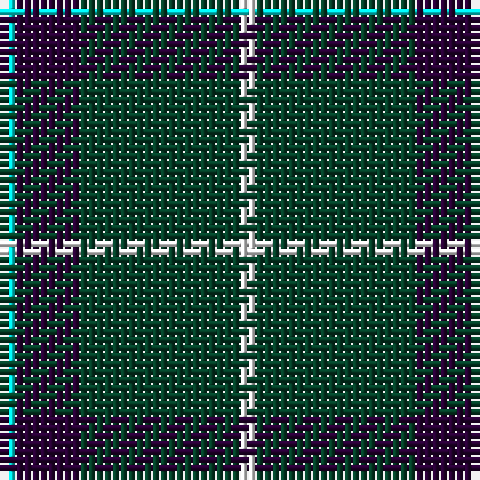

In pattern [WBGW](/patterns/wbgw/).

This was sourced from register-of-tartans.  It is a [4 stripes tartan](/stripes/stripes4/).

Original link https://www.tartanregister.gov.uk/tartanDetails.aspx?ref=4737

## Thread count
LB/2 DP8 DG20 W/2

## Palette
Each colour and its ΔE from the base-6 reference it is a variant of.

| Colour | Shade | Base | ΔE (OKLab) |
|---|---|---|---|
| DG | <code style="background-color:#044028;">#044028</code> `#044028` | G <code style="background-color:#006400;">#006400</code> | 0.14 |
| DP | <code style="background-color:#280034;">#280034</code> `#280034` | B <code style="background-color:#2C4084;">#2C4084</code> | 0.21 |
| LB | <code style="background-color:#00FCFC;">#00FCFC</code> `#00FCFC` | W <code style="background-color:#F4F4F0;">#F4F4F0</code> | 0.17 |
| W | <code style="background-color:#FCFCFC;">#FCFCFC</code> `#FCFCFC` | W <code style="background-color:#F4F4F0;">#F4F4F0</code> | 0.03 |

# Sample pattern

ID: /setts/s4/w2b8g20wa2-b280034-g044028-w00fcfc-wafcfcfc/
