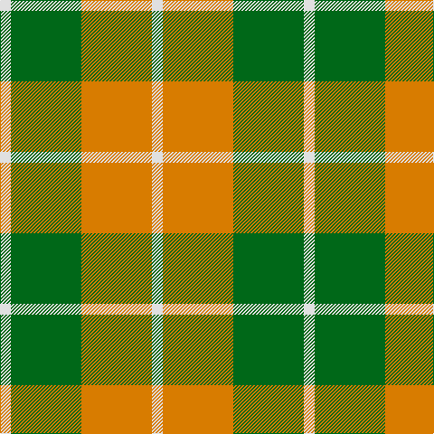

In pattern [WGYW](/patterns/wgyw/).

This was sourced from house-of-tartan.  It is a [4 stripes tartan](/stripes/stripes4/).

Original link http://www.house-of-tartan.scotland.net/house/TartanViewjs.asp?colr=Def&tnam=1802

## Thread count
LN/12 G78 O78 LN/12

## Palette
Each colour and its ΔE from the base-6 reference it is a variant of.

| Colour | Shade | Base | ΔE (OKLab) |
|---|---|---|---|
| G | <code style="background-color:#006818;">#006818</code> `#006818` | G <code style="background-color:#006100;">#006100</code> | 0.02 |
| LN | <code style="background-color:#E0E0E0;">#E0E0E0</code> `#E0E0E0` | W <code style="background-color:#F7F7F7;">#F7F7F7</code> | 0.07 |
| O | <code style="background-color:#D87C00;">#D87C00</code> `#D87C00` | Y <code style="background-color:#F2BF00;">#F2BF00</code> | 0.17 |

# Sample pattern

## Nearest tartans

The nearest existing variants by ΔTartan distance.

1. [Dunoon](/setts/s4/w2g13y13w2~g008000-we0e0e0-yff8500~x6/) — ΔT 0.62
1. [Dunoon Irish (Corporate)](/setts/s4/w2g13r13w2~g006c3c-rb84c00-wfcfcfc~x6/) — ΔT 0.79
1. [Wilson's, No 195](/setts/s4/y5g7k1b1~b5480b0-g008000-k000000-yff8500~x4/) — ΔT 1.35
1. [Wilson's, No 179](/setts/s5/g6y1r1b2r2~b5480b0-g008000-rc00000-yf0c000~x4/) — ΔT 1.37
1. [Unidentfied (Ligioner Highland Games](/setts/s6/b4g25y10g3y18r4~b441800-g006818-rc80000-yfcb464~x2/) — ΔT 1.42
1. [Wilson's, No 203](/setts/s4/b2r4g5y1~b5480b0-g008000-rc00000-yf0c000~x4/) — ΔT 1.62
1. [Gleneagles USA (Dalgleish)](/setts/s6/g4w31g7r14g11r3~g006818-r880000-wc0c0c0~x2/) — ΔT 1.72
1. [Dunoon Irish](/setts/s4/w2g13r13w2~g003820-rb84c00-wfcfcfc~x6/) — ΔT 1.72
1. [Harmony 8](/setts/s5/g2ga10r15g10ga2~g2a2303-ga808080-rbe7832~x4/) — ΔT 1.76
1. [Wilson's, No 193](/setts/s5/g6k1r1b2r2~b5480b0-g008000-k000000-rc00000~x4/) — ΔT 1.76

## Neighbour map

Every grey dot is one of 15726 variants placed by the first two principal components of the ΔTartan feature space (44% of its variance). Red is this tartan; blue dots are its nearest — click one to open its page.

<svg viewBox="0 0 640 380" role="img" style="max-width:100%;height:auto;border:1px solid #e0e0e0;border-radius:4px;display:block" xmlns="http://www.w3.org/2000/svg"><image href="/nn/cloud.v1.png" width="640" height="380"/><a href="/setts/s4/w2g13y13w2~g008000-we0e0e0-yff8500~x6/"><circle cx="249.7" cy="257.6" r="4" fill="#3465a4"><title>Dunoon</title></circle></a><a href="/setts/s4/w2g13r13w2~g006c3c-rb84c00-wfcfcfc~x6/"><circle cx="247.7" cy="260.0" r="4" fill="#3465a4"><title>Dunoon Irish (Corporate)</title></circle></a><a href="/setts/s4/y5g7k1b1~b5480b0-g008000-k000000-yff8500~x4/"><circle cx="235.2" cy="238.5" r="4" fill="#3465a4"><title>Wilson's, No 195</title></circle></a><a href="/setts/s5/g6y1r1b2r2~b5480b0-g008000-rc00000-yf0c000~x4/"><circle cx="243.6" cy="242.5" r="4" fill="#3465a4"><title>Wilson's, No 179</title></circle></a><a href="/setts/s6/b4g25y10g3y18r4~b441800-g006818-rc80000-yfcb464~x2/"><circle cx="220.9" cy="208.4" r="4" fill="#3465a4"><title>Unidentfied (Ligioner Highland Games</title></circle></a><a href="/setts/s4/b2r4g5y1~b5480b0-g008000-rc00000-yf0c000~x4/"><circle cx="179.6" cy="278.4" r="4" fill="#3465a4"><title>Wilson's, No 203</title></circle></a><a href="/setts/s6/g4w31g7r14g11r3~g006818-r880000-wc0c0c0~x2/"><circle cx="238.4" cy="213.2" r="4" fill="#3465a4"><title>Gleneagles USA (Dalgleish)</title></circle></a><a href="/setts/s4/w2g13r13w2~g003820-rb84c00-wfcfcfc~x6/"><circle cx="231.7" cy="254.5" r="4" fill="#3465a4"><title>Dunoon Irish</title></circle></a><a href="/setts/s5/g2ga10r15g10ga2~g2a2303-ga808080-rbe7832~x4/"><circle cx="227.8" cy="261.3" r="4" fill="#3465a4"><title>Harmony 8</title></circle></a><a href="/setts/s5/g6k1r1b2r2~b5480b0-g008000-k000000-rc00000~x4/"><circle cx="222.9" cy="238.0" r="4" fill="#3465a4"><title>Wilson's, No 193</title></circle></a><circle cx="251.9" cy="262.2" r="5" fill="#c00000"/></svg>

ID: /setts/s4/w2g13y13w2~g006818-we0e0e0-yd87c00~x6/
