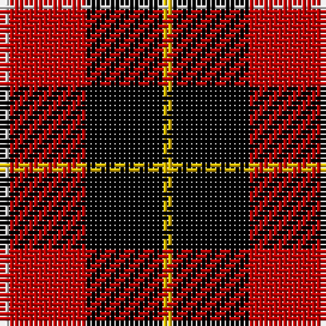

In pattern [WRKY](/patterns/wrky/).

This was sourced from weddslist.  It is a [4 stripes tartan](/stripes/stripes4/).

Original link http://www.weddslist.com/cgi-bin/tartans/pg.pl?source=sts

## Thread count
LN/2 R16 K16 Y/2

## Palette
Each colour and its ΔE from the base-6 reference it is a variant of.

| Colour | Shade | Base | ΔE (OKLab) |
|---|---|---|---|
| K | <code style="background-color:#000000;">#000000</code> `#000000` | K <code style="background-color:#000000;">#000000</code> | 0.00 |
| LN | <code style="background-color:#E0E0E0;">#E0E0E0</code> `#E0E0E0` | W <code style="background-color:#F4F4F0;">#F4F4F0</code> | 0.06 |
| R | <code style="background-color:#C00000;">#C00000</code> `#C00000` | R <code style="background-color:#C80000;">#C80000</code> | 0.02 |
| Y | <code style="background-color:#F0C000;">#F0C000</code> `#F0C000` | Y <code style="background-color:#E8C000;">#E8C000</code> | 0.01 |

# Sample pattern

## Nearest tartans

The nearest existing variants by ΔTartan distance.

1. [Connel (Clan)](/setts/s4/w4r32k32y4-k101010-rc80000-wfcfcfc-ye8c000/) — ΔT 0.85
1. [Connel Clan Tartan Tartan Number: 1854. Earliest known date: c. 1890 Whether the Wallace, which is known to date from at least 1842, and the Connel tartan are related is uncertain, although the close similarity leads one to suspect that the later 'Connel' is based on the Wallace. The Connels and MacConnels are both claimed as septs of Clan Donald. (P.E. MacDonald) See products available Copyright © Blair Urquhart, Comrie, 2015](/setts/s4/w2r16k16y2-k101010-rc80000-we0e0e0-ye8c000/) — ΔT 0.86
1. [Skinner (Name)](/setts/s4/b4r32k32y4-b2c2c80-k101010-rc80000-yd09800/) — ΔT 1.07
1. [Wallace](/setts/s4/k1r8k8y1-k000000-rc80000-yc8c800/) — ΔT 1.12
1. [Wallace](/setts/s4/k4r32k32y4-k000000-rc00000-yf0c000/) — ΔT 1.14
1. [Bonhill Primary School](/setts/s4/r8k50ra50w8-k101010-rc80000-rab84c00-wffffff/) — ΔT 1.17
1. [Wallace Red Dress Tartan Tartan Number: 8186. Earliest known date: See products available Copyright © Blair Urquhart, Comrie, 2015](/setts/s5/b6k58ka22r58ka6-b2888c4-k000000-ka101010-rc80000/) — ΔT 1.24
1. [Masai Shuka 01 (Artefact)](/setts/s4/w4k40r40w4-k101010-rc80000-wf8f8f8/) — ΔT 1.24
1. [Skinner](/setts/s4/b4r64k64y4-b304080-k000000-rc00000-yf0c000/) — ΔT 1.28
1. [MacPherson, Red Cluny](/setts/s7/r12k6r58k46w8k14y6-k000000-rc00000-we0e0e0-yf0c000/) — ΔT 1.29

## Neighbour map

Every grey dot is one of 15726 variants placed by the first two principal components of the ΔTartan feature space (44% of its variance). Red is this tartan; blue dots are its nearest — click one to open its page.

<svg viewBox="0 0 640 380" role="img" style="max-width:100%;height:auto;border:1px solid #e0e0e0;border-radius:4px;display:block" xmlns="http://www.w3.org/2000/svg"><image href="/nn/cloud.v1.png" width="640" height="380"/><a href="/setts/s4/w4r32k32y4-k101010-rc80000-wfcfcfc-ye8c000/"><circle cx="240.3" cy="220.7" r="4" fill="#3465a4"><title>Connel (Clan)</title></circle></a><a href="/setts/s4/w2r16k16y2-k101010-rc80000-we0e0e0-ye8c000/"><circle cx="243.2" cy="222.1" r="4" fill="#3465a4"><title>Connel Clan Tartan Tartan Number: 1854. Earliest known date: c. 1890 Whether the Wallace, which is known to date from at least 1842, and the Connel tartan are related is uncertain, although the close similarity leads one to suspect that the later 'Connel' is based on the Wallace. The Connels and MacConnels are both claimed as septs of Clan Donald. (P.E. MacDonald) See products available Copyright © Blair Urquhart, Comrie, 2015</title></circle></a><a href="/setts/s4/b4r32k32y4-b2c2c80-k101010-rc80000-yd09800/"><circle cx="259.1" cy="230.2" r="4" fill="#3465a4"><title>Skinner (Name)</title></circle></a><a href="/setts/s4/k1r8k8y1-k000000-rc80000-yc8c800/"><circle cx="290.4" cy="242.4" r="4" fill="#3465a4"><title>Wallace</title></circle></a><a href="/setts/s4/k4r32k32y4-k000000-rc00000-yf0c000/"><circle cx="291.7" cy="243.1" r="4" fill="#3465a4"><title>Wallace</title></circle></a><a href="/setts/s4/r8k50ra50w8-k101010-rc80000-rab84c00-wffffff/"><circle cx="215.1" cy="237.4" r="4" fill="#3465a4"><title>Bonhill Primary School</title></circle></a><a href="/setts/s5/b6k58ka22r58ka6-b2888c4-k000000-ka101010-rc80000/"><circle cx="203.2" cy="212.3" r="4" fill="#3465a4"><title>Wallace Red Dress Tartan Tartan Number: 8186. Earliest known date: See products available Copyright © Blair Urquhart, Comrie, 2015</title></circle></a><a href="/setts/s4/w4k40r40w4-k101010-rc80000-wf8f8f8/"><circle cx="279.5" cy="225.3" r="4" fill="#3465a4"><title>Masai Shuka 01 (Artefact)</title></circle></a><a href="/setts/s4/b4r64k64y4-b304080-k000000-rc00000-yf0c000/"><circle cx="299.1" cy="194.7" r="4" fill="#3465a4"><title>Skinner</title></circle></a><a href="/setts/s7/r12k6r58k46w8k14y6-k000000-rc00000-we0e0e0-yf0c000/"><circle cx="252.4" cy="179.7" r="4" fill="#3465a4"><title>MacPherson, Red Cluny</title></circle></a><circle cx="231.6" cy="221.3" r="5" fill="#c00000"/></svg>

ID: /setts/s4/w2r16k16y2-k000000-rc00000-we0e0e0-yf0c000/
