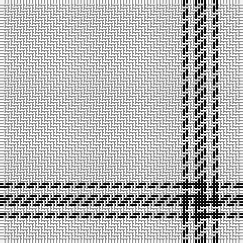

This page is one **sett** — a single exact thread-count. It belongs to the [tartan](/tartans/w30k1w1k2/)
(the same proportion at any scale), whose colour order is pattern [KWKW](/stripes/kwkw/).

Sourced from register-of-tartans.  It is a [4 stripe tartan](/stripes/stripes4/).

Original link https://www.tartanregister.gov.uk/tartanDetails.aspx?ref=779

2 attestations — the source records this cloth was collapsed from (oldest owns this page)

<ul>
<li>01/01/2004 — Covenanter (register-of-tartans, <a href="https://www.tartanregister.gov.uk/tartanDetails.aspx?ref=779">record</a>)</li>
<li>pre 2004 — Covenanter (Fashion) (tartans-authority, <a href="http://www.tartansauthority.com/tartan-ferret/display/6377/">record</a>)</li>
</ul>

## Register references

External register numbers recorded for this tartan.

- Scottish Register of Tartans: [779](https://www.tartanregister.gov.uk/tartanDetails.aspx?ref=779)
- Scottish Tartans Authority (ITI): 6377

## Thread count
W/60 K2 W2 K/4

## Palette

Palette: <strong>Tartan Register</strong> <small style="color:#888">(3 of 4 colours)</small>
<table><thead><tr><th>Colour</th><th>Threads</th><th>Shade</th><th>Base</th><th>OKLCh</th></tr></thead><tbody><tr><td>W/</td><td style="text-align:right;font-variant-numeric:tabular-nums">60</td><td><code style="background-color:#F8F8F8;">#F8F8F8</code> <small style="color:#888">#F8F8F8</small></td><td>W <code style="background-color:#F7F7F7;">#F7F7F7</code></td><td><small style="color:#888">oklch(97.9% 0.000 89.9)</small></td></tr><tr><td>K</td><td style="text-align:right;font-variant-numeric:tabular-nums">2</td><td><code style="background-color:#101010;">#101010</code> <small style="color:#888">#101010</small></td><td>K <code style="background-color:#000000;">#000000</code></td><td><small style="color:#888">oklch(17.3% 0.000 89.9)</small></td></tr><tr><td>W</td><td style="text-align:right;font-variant-numeric:tabular-nums">2</td><td><code style="background-color:#F8F8F8;">#F8F8F8</code> <small style="color:#888">#F8F8F8</small></td><td>W <code style="background-color:#F7F7F7;">#F7F7F7</code></td><td><small style="color:#888">oklch(97.9% 0.000 89.9)</small></td></tr><tr><td>K/</td><td style="text-align:right;font-variant-numeric:tabular-nums">4</td><td><code style="background-color:#101010;">#101010</code> <small style="color:#888">#101010</small></td><td>K <code style="background-color:#000000;">#000000</code></td><td><small style="color:#888">oklch(17.3% 0.000 89.9)</small></td></tr></tbody></table>

# Sample pattern

## Nearest tartans

The nearest existing variants by ΔTartan distance, with this tartan at the top so the swatches line up against it.

ΔTartan

Tartan

Sett

—

<a href="/ttd/edit/#slug=w30k1w1k2~x2">Covenanter</a> <a class="nn-out" href="/setts/s4/w30k1w1k2~x2/" title="open its dictionary page">↗</a>

2.51

<a href="/ttd/edit/#slug=lr20db1lr4db3~x4">Loevenstein Castle #2</a> <a class="nn-out" href="/setts/s4/lr20db1lr4db3~x4/" title="open its dictionary page">↗</a>

2.84

<a href="/ttd/edit/#slug=w81dg6lo8dg8~x2">Young in Australia</a> <a class="nn-out" href="/setts/s4/w81dg6lo8dg8~x2/" title="open its dictionary page">↗</a>

2.85

<a href="/ttd/edit/#slug=w45b2w4b15w7~x2">Asahi (Estimated threadcount)</a> <a class="nn-out" href="/setts/s5/w45b2w4b15w7~x2/" title="open its dictionary page">↗</a>

3.03

<a href="/ttd/edit/#slug=lr10k2w5k4lr50b2~x2">London Fog Safari (Fashion)</a> <a class="nn-out" href="/setts/s6/lr10k2w5k4lr50b2~x2/" title="open its dictionary page">↗</a>

3.18

<a href="/ttd/edit/#slug=w50db7w7t7w18~x2">Sephardim (Corporate)</a> <a class="nn-out" href="/setts/s5/w50db7w7t7w18~x2/" title="open its dictionary page">↗</a>

3.24

<a href="/ttd/edit/#slug=w83k6w3k9r2k5w2ly2~x2">Crane of Cluny Dress (Personal)</a> <a class="nn-out" href="/setts/s8/w83k6w3k9r2k5w2ly2~x2/" title="open its dictionary page">↗</a>

3.45

<a href="/ttd/edit/#slug=w162k10dp10lo9y6dp3">Young, Christina</a> <a class="nn-out" href="/setts/s6/w162k10dp10lo9y6dp3/" title="open its dictionary page">↗</a>

3.51

<a href="/ttd/edit/#slug=w168r2w2lo2w2loi3g26~x2">Whisky Kilt (Fashion)</a> <a class="nn-out" href="/setts/s7/w168r2w2lo2w2loi3g26~x2/" title="open its dictionary page">↗</a>

3.55

<a href="/ttd/edit/#slug=w120k2db4g3w2k2r8w2r3~x2">Unnamed C18th - Blanket Pattern</a> <a class="nn-out" href="/setts/s9/w120k2db4g3w2k2r8w2r3~x2/" title="open its dictionary page">↗</a>

3.57

<a href="/ttd/edit/#slug=w93lr6w13b35w12lr6">Butties</a> <a class="nn-out" href="/setts/s6/w93lr6w13b35w12lr6/" title="open its dictionary page">↗</a>

## Neighbour map

Every grey dot is one of 14359 variants placed by the first two principal components of the ΔTartan feature space (44% of its variance). Red is this tartan; blue dots are its nearest — click one to open its page.

<svg viewBox="0 0 640 380" role="img" style="max-width:100%;height:auto;border:1px solid #e0e0e0;border-radius:4px;display:block" xmlns="http://www.w3.org/2000/svg"><image href="/nn/cloud.v1.png" width="640" height="380"/><a href="/setts/s4/lr20db1lr4db3~x4/"><circle cx="599.3" cy="215.4" r="4" fill="#3465a4"><title>Loevenstein Castle #2</title></circle></a><a href="/setts/s4/w81dg6lo8dg8~x2/"><circle cx="495.6" cy="184.1" r="4" fill="#3465a4"><title>Young in Australia</title></circle></a><a href="/setts/s5/w45b2w4b15w7~x2/"><circle cx="532.9" cy="196.6" r="4" fill="#3465a4"><title>Asahi (Estimated threadcount)</title></circle></a><a href="/setts/s6/lr10k2w5k4lr50b2~x2/"><circle cx="550.4" cy="138.8" r="4" fill="#3465a4"><title>London Fog Safari (Fashion)</title></circle></a><a href="/setts/s5/w50db7w7t7w18~x2/"><circle cx="511.8" cy="228.8" r="4" fill="#3465a4"><title>Sephardim (Corporate)</title></circle></a><a href="/setts/s8/w83k6w3k9r2k5w2ly2~x2/"><circle cx="504.9" cy="59.1" r="4" fill="#3465a4"><title>Crane of Cluny Dress (Personal)</title></circle></a><a href="/setts/s6/w162k10dp10lo9y6dp3/"><circle cx="529.6" cy="63.1" r="4" fill="#3465a4"><title>Young, Christina</title></circle></a><a href="/setts/s7/w168r2w2lo2w2loi3g26~x2/"><circle cx="596.3" cy="64.3" r="4" fill="#3465a4"><title>Whisky Kilt (Fashion)</title></circle></a><a href="/setts/s9/w120k2db4g3w2k2r8w2r3~x2/"><circle cx="585.0" cy="32.1" r="4" fill="#3465a4"><title>Unnamed C18th - Blanket Pattern</title></circle></a><a href="/setts/s6/w93lr6w13b35w12lr6/"><circle cx="421.8" cy="162.7" r="4" fill="#3465a4"><title>Butties</title></circle></a><circle cx="626.0" cy="157.6" r="5" fill="#c00000"/></svg>

ID: /setts/s4/w30k1w1k2~x2/
