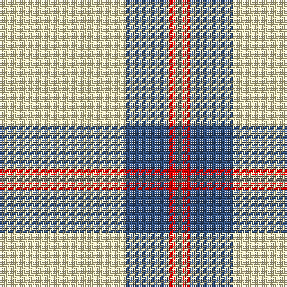

In pattern [BRBW](/patterns/brbw/).

This was sourced from register-of-tartans.  It is a [4 stripes tartan](/stripes/stripes4/).

Original link https://www.tartanregister.gov.uk/tartanDetails.aspx?ref=10565

## Thread count
LY/70 B24 R4 N/4

## Palette
Each colour and its ΔE from the base-6 reference it is a variant of.

| Colour | Shade | Base | ΔE (OKLab) |
|---|---|---|---|
| B | <code style="background-color:#335280;">#335280</code> `#335280` | B <code style="background-color:#2A418A;">#2A418A</code> | 0.06 |
| LY | <code style="background-color:#F8EEB7;">#F8EEB7</code> `#F8EEB7` | W <code style="background-color:#F7F7F7;">#F7F7F7</code> | 0.08 |
| N | <code style="background-color:#666666;">#666666</code> `#666666` | B <code style="background-color:#2A418A;">#2A418A</code> | 0.17 |
| R | <code style="background-color:#FF0000;">#FF0000</code> `#FF0000` | R <code style="background-color:#CC0000;">#CC0000</code> | 0.11 |

# Sample pattern

## Nearest tartans

The nearest existing variants by ΔTartan distance.

1. [Tarbh Deargh (Red Bull)](/setts/s4/w80b30y5ya4x2~b202060-we0e0e0-yd87c00-yae8c000/) — ΔT 1.24
1. [Triplett, Jack Arnold](/setts/s4/w14b5r1ba1x8~b1870a4-ba5c8ca8-rc80000-wfcfcfc/) — ΔT 1.29
1. [Young in Australia](/setts/s4/w81g6y8g8x2~g23321b-we8ddcb-ye0a126/) — ΔT 1.72
1. [Burns (Fashion)](/setts/s6/w15b6w1b3r3w1x4~b3c3c3c-rb0781c-wf8f4d0/) — ΔT 1.74
1. [St. George's Check (Fashion)](/setts/s3/r35w94k6~k101010-rd40000-we0e0e0/) — ΔT 1.75
1. [Clackson Arisaid (Name?)](/setts/s7/w24g2w8b5y4b5y4x2~b2c2c80-g006818-we0e0e0-ye8c000/) — ΔT 1.79
1. [Butties](/setts/s6/w93r6w13b35w12r6~b202060-r888888-wfcfcfc/) — ΔT 1.81
1. [White Stripes (Corporate)](/setts/s7/k7w3k7w45r3w3r3x2~k101010-rc80000-wf0f0d8/) — ΔT 1.87
1. [Summer Spirit (Fashion)](/setts/s8/r2w2k2w28k8w9k1y2x2~k101010-rc80000-wfcfcec-ye8c000/) — ΔT 1.87
1. [St Georges Check](/setts/s3/r35w94k6~k101010-rff0000-wffffff/) — ΔT 1.95

## Neighbour map

Every grey dot is one of 15726 variants placed by the first two principal components of the ΔTartan feature space (44% of its variance). Red is this tartan; blue dots are its nearest — click one to open its page.

<svg viewBox="0 0 640 380" role="img" style="max-width:100%;height:auto;border:1px solid #e0e0e0;border-radius:4px;display:block" xmlns="http://www.w3.org/2000/svg"><image href="/nn/cloud.v1.png" width="640" height="380"/><a href="/setts/s4/w80b30y5ya4x2~b202060-we0e0e0-yd87c00-yae8c000/"><circle cx="379.2" cy="167.4" r="4" fill="#3465a4"><title>Tarbh Deargh (Red Bull)</title></circle></a><a href="/setts/s4/w14b5r1ba1x8~b1870a4-ba5c8ca8-rc80000-wfcfcfc/"><circle cx="366.2" cy="181.6" r="4" fill="#3465a4"><title>Triplett, Jack Arnold</title></circle></a><a href="/setts/s4/w81g6y8g8x2~g23321b-we8ddcb-ye0a126/"><circle cx="497.3" cy="193.5" r="4" fill="#3465a4"><title>Young in Australia</title></circle></a><a href="/setts/s6/w15b6w1b3r3w1x4~b3c3c3c-rb0781c-wf8f4d0/"><circle cx="321.7" cy="173.7" r="4" fill="#3465a4"><title>Burns (Fashion)</title></circle></a><a href="/setts/s3/r35w94k6~k101010-rd40000-we0e0e0/"><circle cx="418.5" cy="219.9" r="4" fill="#3465a4"><title>St. George's Check (Fashion)</title></circle></a><a href="/setts/s7/w24g2w8b5y4b5y4x2~b2c2c80-g006818-we0e0e0-ye8c000/"><circle cx="303.1" cy="167.1" r="4" fill="#3465a4"><title>Clackson Arisaid (Name?)</title></circle></a><a href="/setts/s6/w93r6w13b35w12r6~b202060-r888888-wfcfcfc/"><circle cx="406.2" cy="165.8" r="4" fill="#3465a4"><title>Butties</title></circle></a><a href="/setts/s7/k7w3k7w45r3w3r3x2~k101010-rc80000-wf0f0d8/"><circle cx="419.4" cy="144.0" r="4" fill="#3465a4"><title>White Stripes (Corporate)</title></circle></a><a href="/setts/s8/r2w2k2w28k8w9k1y2x2~k101010-rc80000-wfcfcec-ye8c000/"><circle cx="413.5" cy="106.7" r="4" fill="#3465a4"><title>Summer Spirit (Fashion)</title></circle></a><a href="/setts/s3/r35w94k6~k101010-rff0000-wffffff/"><circle cx="409.0" cy="211.2" r="4" fill="#3465a4"><title>St Georges Check</title></circle></a><circle cx="392.9" cy="171.2" r="5" fill="#c00000"/></svg>

ID: /setts/s4/w35b12r2ba2x2~b335280-ba666666-rff0000-wf8eeb7/
