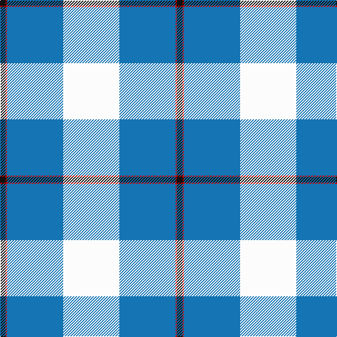

**Bands:** [KRBW](/stripes/krbw/) · **Stripes:** [K R B W](/stripes/stripes4/) K R B W

This was sourced from tartans-authority.  It is a [4 band tartan](/bands/bands4/).

Original link http://www.tartansauthority.com/tartan-ferret/display/10539/

## Thread count
K/8 R2 B80 W/80

## Palette
Each colour and its ΔE from the base-6 reference it is a variant of.

| Colour | Shade | Base | ΔE (OKLab) |
|---|---|---|---|
| B | <code style="background-color:#1474B4;">#1474B4</code> `#1474B4` | B <code style="background-color:#2A418A;">#2A418A</code> | 0.15 |
| K | <code style="background-color:#101010;">#101010</code> `#101010` | K <code style="background-color:#000000;">#000000</code> | 0.17 |
| R | <code style="background-color:#C80000;">#C80000</code> `#C80000` | R <code style="background-color:#CC0000;">#CC0000</code> | 0.01 |
| W | <code style="background-color:#FCFCFC;">#FCFCFC</code> `#FCFCFC` | W <code style="background-color:#F7F7F7;">#F7F7F7</code> | 0.01 |

# Sample pattern

## Nearest tartans

The nearest existing variants by ΔTartan distance.

1. [Kimon Andreou Family (Personal)](/setts/s4/w40t40r1k4~x2/) — ΔT 0.81
1. [Galloway (Dance)](/setts/s6/g3r2b35w35b2r3~x2/) — ΔT 1.73
1. [Mount Vernon Primary School](/setts/s5/lt25db11r5w1k1~x4/) — ΔT 1.79
1. [Gothenburg](/setts/s7/b26w28b14ly3k1ly2k1~x2/) — ΔT 1.81
1. [WaterAid](/setts/s6/db23w8lb2k5w44db4~x2/) — ΔT 1.83
1. [Gothenburg/Goteborg](/setts/s7/db26w28db14ly3k1ly2k1~x2/) — ΔT 1.85
1. [Mount Vernon Primary School (Corp)](/setts/s5/lb25db11r5w1k1~x4/) — ΔT 1.86
1. [Kinloch of Loch Awe (Personal)](/setts/s5/w18o29t2dp3k1~x2/) — ΔT 1.94
1. [Galicia](/setts/s6/t53k2w53k2r4ly7~x2/) — ΔT 1.95
1. [Bonnie Royal](/setts/s6/w5db32g12db2w30k4~x2/) — ΔT 2.12

## Neighbour map

Every grey dot is one of 14313 variants placed by the first two principal components of the ΔTartan feature space (44% of its variance). Red is this tartan; blue dots are its nearest — click one to open its page.

<svg viewBox="0 0 640 380" role="img" style="max-width:100%;height:auto;border:1px solid #e0e0e0;border-radius:4px;display:block" xmlns="http://www.w3.org/2000/svg"><image href="/nn/cloud.v1.png" width="640" height="380"/><a href="/setts/s4/w40t40r1k4~x2/"><circle cx="314.0" cy="150.6" r="4" fill="#3465a4"><title>Kimon Andreou Family (Personal)</title></circle></a><a href="/setts/s6/g3r2b35w35b2r3~x2/"><circle cx="272.0" cy="144.3" r="4" fill="#3465a4"><title>Galloway (Dance)</title></circle></a><a href="/setts/s5/lt25db11r5w1k1~x4/"><circle cx="301.2" cy="133.0" r="4" fill="#3465a4"><title>Mount Vernon Primary School</title></circle></a><a href="/setts/s7/b26w28b14ly3k1ly2k1~x2/"><circle cx="313.7" cy="134.2" r="4" fill="#3465a4"><title>Gothenburg</title></circle></a><a href="/setts/s6/db23w8lb2k5w44db4~x2/"><circle cx="320.3" cy="135.2" r="4" fill="#3465a4"><title>WaterAid</title></circle></a><a href="/setts/s7/db26w28db14ly3k1ly2k1~x2/"><circle cx="309.3" cy="132.6" r="4" fill="#3465a4"><title>Gothenburg/Goteborg</title></circle></a><a href="/setts/s5/lb25db11r5w1k1~x4/"><circle cx="315.5" cy="136.0" r="4" fill="#3465a4"><title>Mount Vernon Primary School (Corp)</title></circle></a><a href="/setts/s5/w18o29t2dp3k1~x2/"><circle cx="324.7" cy="131.6" r="4" fill="#3465a4"><title>Kinloch of Loch Awe (Personal)</title></circle></a><a href="/setts/s6/t53k2w53k2r4ly7~x2/"><circle cx="261.7" cy="110.4" r="4" fill="#3465a4"><title>Galicia</title></circle></a><a href="/setts/s6/w5db32g12db2w30k4~x2/"><circle cx="198.1" cy="162.0" r="4" fill="#3465a4"><title>Bonnie Royal</title></circle></a><circle cx="302.1" cy="150.7" r="5" fill="#c00000"/></svg>

ID: /setts/s4/w40b40r1k4~x2/
