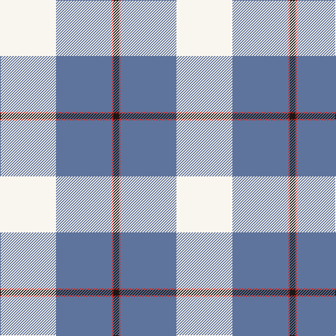

**Bands:** [KRBW](/stripes/krbw/) · **Stripes:** [K R T W](/stripes/stripes4/) K R T W

This was sourced from register-of-tartans.  It is a [4 band tartan](/bands/bands4/).

Original link https://www.tartanregister.gov.uk/tartanDetails.aspx?ref=10539

## Register references

External register numbers recorded for this tartan.

- Scottish Register of Tartans: [10539](https://www.tartanregister.gov.uk/tartanDetails.aspx?ref=10539)

## Thread count
W/80 B80 R2 K/8

## Palette
Each colour and its ΔE from the base-6 reference it is a variant of.

| Colour | Shade | Base | ΔE (OKLab) |
|---|---|---|---|
| B | <code style="background-color:#5F749C;">#5F749C</code> `#5F749C` | B <code style="background-color:#2A418A;">#2A418A</code> | 0.17 |
| K | <code style="background-color:#1C1714;">#1C1714</code> `#1C1714` | K <code style="background-color:#000000;">#000000</code> | 0.21 |
| R | <code style="background-color:#CA2625;">#CA2625</code> `#CA2625` | R <code style="background-color:#CC0000;">#CC0000</code> | 0.02 |
| W | <code style="background-color:#F9F5EF;">#F9F5EF</code> `#F9F5EF` | W <code style="background-color:#F7F7F7;">#F7F7F7</code> | 0.01 |

# Sample pattern

## Nearest tartans

The nearest existing variants by ΔTartan distance.

1. [Kimon Andreou Family (Personal)](/setts/s4/w40b40r1k4~x2/) — ΔT 0.81
1. [Kinloch of Loch Awe (Personal)](/setts/s5/w18o29t2dp3k1~x2/) — ΔT 1.50
1. [Galicia](/setts/s6/t53k2w53k2r4ly7~x2/) — ΔT 1.68
1. [Cornish, National Day](/setts/s5/k5w2ly36b47r3~x2/) — ΔT 1.70
1. [Galloway (Dance)](/setts/s6/r3b2w35b35r2g3~x2/) — ΔT 1.78
1. [Oliver Dress Pink](/setts/s5/k5w2ly36t47r3~x2/) — ΔT 1.83
1. [Mount Vernon Primary School (Corp)](/setts/s5/lb25db11r5w1k1~x4/) — ΔT 1.85
1. [Gothenburg/Goteborg](/setts/s7/db26w28db14ly3k1ly2k1~x2/) — ΔT 1.90
1. [Westfalia Dress (Corporate)](/setts/s6/w44dg18w6dg11dt1o4~x2/) — ΔT 1.93
1. [Mount Vernon Primary School](/setts/s5/lt25db11r5w1k1~x4/) — ΔT 2.00

## Neighbour map

Every grey dot is one of 14299 variants placed by the first two principal components of the ΔTartan feature space (44% of its variance). Red is this tartan; blue dots are its nearest — click one to open its page.

<svg viewBox="0 0 640 380" role="img" style="max-width:100%;height:auto;border:1px solid #e0e0e0;border-radius:4px;display:block" xmlns="http://www.w3.org/2000/svg"><image href="/nn/cloud.v1.png" width="640" height="380"/><a href="/setts/s4/w40b40r1k4~x2/"><circle cx="301.8" cy="150.4" r="4" fill="#3465a4"><title>Kimon Andreou Family (Personal)</title></circle></a><a href="/setts/s5/w18o29t2dp3k1~x2/"><circle cx="324.3" cy="131.4" r="4" fill="#3465a4"><title>Kinloch of Loch Awe (Personal)</title></circle></a><a href="/setts/s6/t53k2w53k2r4ly7~x2/"><circle cx="261.2" cy="110.3" r="4" fill="#3465a4"><title>Galicia</title></circle></a><a href="/setts/s5/k5w2ly36b47r3~x2/"><circle cx="288.3" cy="134.2" r="4" fill="#3465a4"><title>Cornish, National Day</title></circle></a><a href="/setts/s6/r3b2w35b35r2g3~x2/"><circle cx="271.6" cy="144.0" r="4" fill="#3465a4"><title>Galloway (Dance)</title></circle></a><a href="/setts/s5/k5w2ly36t47r3~x2/"><circle cx="290.0" cy="144.0" r="4" fill="#3465a4"><title>Oliver Dress Pink</title></circle></a><a href="/setts/s5/lb25db11r5w1k1~x4/"><circle cx="315.2" cy="135.8" r="4" fill="#3465a4"><title>Mount Vernon Primary School (Corp)</title></circle></a><a href="/setts/s7/db26w28db14ly3k1ly2k1~x2/"><circle cx="309.0" cy="132.3" r="4" fill="#3465a4"><title>Gothenburg/Goteborg</title></circle></a><a href="/setts/s6/w44dg18w6dg11dt1o4~x2/"><circle cx="359.3" cy="115.6" r="4" fill="#3465a4"><title>Westfalia Dress (Corporate)</title></circle></a><a href="/setts/s5/lt25db11r5w1k1~x4/"><circle cx="300.9" cy="132.8" r="4" fill="#3465a4"><title>Mount Vernon Primary School</title></circle></a><circle cx="313.6" cy="150.4" r="5" fill="#c00000"/></svg>

ID: /setts/s4/w40t40r1k4~x2/
