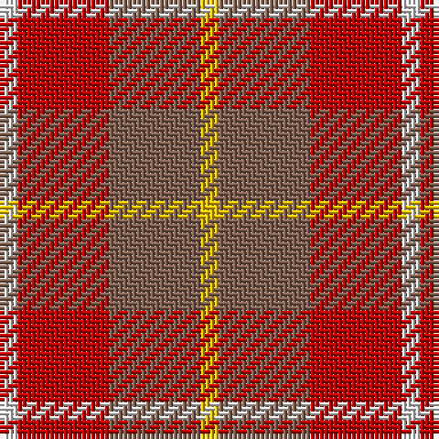

In pattern [WRRY](/patterns/wrry/).

This was sourced from weddslist.  It is a [4 stripes tartan](/stripes/stripes4/).

Original link http://www.weddslist.com/cgi-bin/tartans/pg.pl?source=sts

## Thread count
LN/4 R20 LT20 Y/4

## Palette
Each colour and its ΔE from the base-6 reference it is a variant of.

| Colour | Shade | Base | ΔE (OKLab) |
|---|---|---|---|
| LN | <code style="background-color:#E0E0E0;">#E0E0E0</code> `#E0E0E0` | W <code style="background-color:#F4F4F0;">#F4F4F0</code> | 0.06 |
| LT | <code style="background-color:#806050;">#806050</code> `#806050` | R <code style="background-color:#C80000;">#C80000</code> | 0.17 |
| R | <code style="background-color:#C00000;">#C00000</code> `#C00000` | R <code style="background-color:#C80000;">#C80000</code> | 0.02 |
| Y | <code style="background-color:#F0C000;">#F0C000</code> `#F0C000` | Y <code style="background-color:#E8C000;">#E8C000</code> | 0.01 |

# Sample pattern

## Nearest tartans

The nearest existing variants by ΔTartan distance.

1. [Manx Mannin Plaid](/setts/s4/w4r20g20y4-g503c14-rdc0000-we0e0e0-ye8c000/) — ΔT 1.30
1. [Moray of Abercairney](/setts/s5/r16ra2g8ra2b8-b304080-g008000-rc00000-rad03030/) — ΔT 1.36
1. [Moray of Abercairney #2](/setts/s5/r16ra2g8ra2b8-b2c4084-g005020-rdc0000-rac82828/) — ΔT 1.43
1. [Harmony, 9](/setts/s5/r8y40ra60r40y8-r806050-rac00000-yf0c000/) — ΔT 1.47
1. [Moray of Abercairney](/setts/s6/r16ra2g8ra2g2b4-b3c82af-g005020-rdc0000-rac82828/) — ΔT 1.59
1. [Manhattan Ethnic](/setts/s7/y72b30y18r62ya10b8r32-b441800-re87878-ya08858-yabc8c00/) — ΔT 1.61
1. [Moray of Abercairney](/setts/s6/r16ra2g8ra2g2b4-b5480b0-g008000-rc00000-rad03030/) — ΔT 1.62
1. [MacNab #2](/setts/s6/g4r4g28r16ra28r4-g006818-ra00048-rac80000/) — ΔT 1.67
1. [Maryville College](/setts/s4/k26r80ra26rb16-k101010-r901c38-rae86000-rb888888/) — ΔT 1.68
1. [Prince of Orange](/setts/s4/b12y56r40b6-b5480b0-r806050-yff8500/) — ΔT 1.75

## Neighbour map

Every grey dot is one of 15726 variants placed by the first two principal components of the ΔTartan feature space (44% of its variance). Red is this tartan; blue dots are its nearest — click one to open its page.

<svg viewBox="0 0 640 380" role="img" style="max-width:100%;height:auto;border:1px solid #e0e0e0;border-radius:4px;display:block" xmlns="http://www.w3.org/2000/svg"><image href="/nn/cloud.v1.png" width="640" height="380"/><a href="/setts/s4/w4r20g20y4-g503c14-rdc0000-we0e0e0-ye8c000/"><circle cx="212.2" cy="249.3" r="4" fill="#3465a4"><title>Manx Mannin Plaid</title></circle></a><a href="/setts/s5/r16ra2g8ra2b8-b304080-g008000-rc00000-rad03030/"><circle cx="242.3" cy="233.9" r="4" fill="#3465a4"><title>Moray of Abercairney</title></circle></a><a href="/setts/s5/r16ra2g8ra2b8-b2c4084-g005020-rdc0000-rac82828/"><circle cx="240.0" cy="230.6" r="4" fill="#3465a4"><title>Moray of Abercairney #2</title></circle></a><a href="/setts/s5/r8y40ra60r40y8-r806050-rac00000-yf0c000/"><circle cx="235.4" cy="247.0" r="4" fill="#3465a4"><title>Harmony, 9</title></circle></a><a href="/setts/s6/r16ra2g8ra2g2b4-b3c82af-g005020-rdc0000-rac82828/"><circle cx="271.5" cy="207.6" r="4" fill="#3465a4"><title>Moray of Abercairney</title></circle></a><a href="/setts/s7/y72b30y18r62ya10b8r32-b441800-re87878-ya08858-yabc8c00/"><circle cx="245.0" cy="218.3" r="4" fill="#3465a4"><title>Manhattan Ethnic</title></circle></a><a href="/setts/s6/r16ra2g8ra2g2b4-b5480b0-g008000-rc00000-rad03030/"><circle cx="278.0" cy="212.9" r="4" fill="#3465a4"><title>Moray of Abercairney</title></circle></a><a href="/setts/s6/g4r4g28r16ra28r4-g006818-ra00048-rac80000/"><circle cx="261.7" cy="249.2" r="4" fill="#3465a4"><title>MacNab #2</title></circle></a><a href="/setts/s4/k26r80ra26rb16-k101010-r901c38-rae86000-rb888888/"><circle cx="278.5" cy="261.4" r="4" fill="#3465a4"><title>Maryville College</title></circle></a><a href="/setts/s4/b12y56r40b6-b5480b0-r806050-yff8500/"><circle cx="331.5" cy="258.0" r="4" fill="#3465a4"><title>Prince of Orange</title></circle></a><circle cx="244.0" cy="262.9" r="5" fill="#c00000"/></svg>

ID: /setts/s4/w4r20ra20y4-rc00000-ra806050-we0e0e0-yf0c000/
