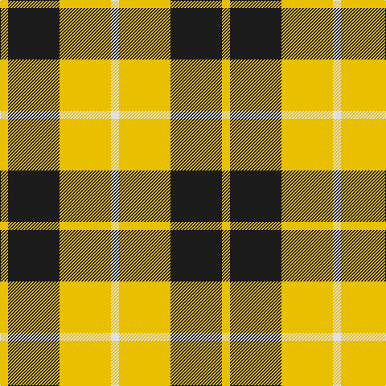

In pattern [WYBY](/stripes/wyby/).

This was sourced from register-of-tartans.  It is a [4 stripe tartan](/stripes/stripes4/).

Original link https://www.tartanregister.gov.uk/tartanDetails.aspx?ref=214

## Attestations

This cloth appears in 2 source records; the oldest owns this page.

- 01/01/1842 — Barclay Dress (register-of-tartans, [record](https://www.tartanregister.gov.uk/tartanDetails.aspx?ref=214))
- 1842 — Barclay Dress (Clan) (tartans-authority, [record](http://www.tartansauthority.com/tartan-ferret/display/1879/))

## Register references

External register numbers recorded for this tartan.

- Scottish Register of Tartans: [214](https://www.tartanregister.gov.uk/tartanDetails.aspx?ref=214)
- Scottish Tartans Authority (ITI): 1879
- Scottish Tartans World Register: 1879

## Thread count
Y/10 K64 Y64 LN/10

## Palette
Each colour and the base-6 reference it is a variant of.

| Colour | Shade | Base |
|---|---|---|
| DY | <code style="background-color:#BC8C00;">#BC8C00</code> `oklch(66.8% 0.137 84.1)` <small>#BC8C00</small> | Y <code style="background-color:#F2BF00;">#F2BF00</code> |
| K | <code style="background-color:#1C1C1C;">#1C1C1C</code> `oklch(22.6% 0.000 89.9)` <small>#1C1C1C</small> | B <code style="background-color:#2A418A;">#2A418A</code> |
| LN | <code style="background-color:#E0E0E0;">#E0E0E0</code> `oklch(90.7% 0.000 89.9)` <small>#E0E0E0</small> | W <code style="background-color:#F7F7F7;">#F7F7F7</code> |
| Y | <code style="background-color:#E8C000;">#E8C000</code> `oklch(81.9% 0.168 93.7)` <small>#E8C000</small> | Y <code style="background-color:#F2BF00;">#F2BF00</code> |

# Sample pattern

## Nearest tartans

The nearest existing variants by ΔTartan distance.

1. [Barclay Dress Clan Tartan Tartan Number: 1879. Earliest known date: 1906 Based on the earlier hunting sett which appeared in the Vestiarium Scoticum in 1842. Barclay's appear to have no 'regular' tartan. The dress version assumes this role and is the sett most commonly associated with the name. The Aberdeenshire Barclays of Tolly held lands for over 600 years, and their descendant, Michael Andreas Barclay, was made Prince Barclay de Tolly for his part in the defeat of Napoleon. There is also a green hunting version of the same pattern. See products available Copyright © Blair Urquhart, Comrie, 2015](/setts/s4/w1ly6k6ly1~x8/) — ΔT 0.24
1. [Silvicola (Corporate)](/setts/s3/k15ly20w3~x2/) — ΔT 0.95
1. [Barclay Dress](/setts/s4/w1ly6k6ly1~x2/) — ΔT 1.03
1. [MacLeod Dress Clan Tartan Tartan Number: 1272. Earliest known date: 1829 See illustration in Bain where red is 4 threads. Sir Thomas Dick Lauder in a letter to Sir Walter Scott in 1829 wrote, MacLeod has got a sketch of this splendid tartan, "three black stryps upon ain yellow fylde," See products available Copyright © Blair Urquhart, Comrie, 2015](/setts/s5/k4ly1k4ly6r1~x4/) — ΔT 1.07
1. [MacLeod #3](/setts/s6/k6ly1k6ly9r1ly2~x2/) — ΔT 1.20
1. [Bonhill Primary School](/setts/s4/r4k25ly25w4~x2/) — ΔT 1.24
1. [Masai Shuka 04 (Artefact)](/setts/s3/ly20db10k3~x2/) — ΔT 1.25
1. [Unnamed C21st - Fashion](/setts/s6/k4ly32k16r3k16ly4~x2/) — ΔT 1.29
1. [Dunoon Irish](/setts/s4/w2dg13o13w2~x6/) — ΔT 1.30
1. [Porter Drinkers', The](/setts/s6/k2ly6k2ly11k9r1~x2/) — ΔT 1.33

## Neighbour map

Every grey dot is one of 14299 variants placed by the first two principal components of the ΔTartan feature space (44% of its variance). Red is this tartan; blue dots are its nearest — click one to open its page.

<svg viewBox="0 0 640 380" role="img" style="max-width:100%;height:auto;border:1px solid #e0e0e0;border-radius:4px;display:block" xmlns="http://www.w3.org/2000/svg"><image href="/nn/cloud.v1.png" width="640" height="380"/><a href="/setts/s4/w1ly6k6ly1~x8/"><circle cx="241.6" cy="244.5" r="4" fill="#3465a4"><title>Barclay Dress Clan Tartan Tartan Number: 1879. Earliest known date: 1906 Based on the earlier hunting sett which appeared in the Vestiarium Scoticum in 1842. Barclay's appear to have no 'regular' tartan. The dress version assumes this role and is the sett most commonly associated with the name. The Aberdeenshire Barclays of Tolly held lands for over 600 years, and their descendant, Michael Andreas Barclay, was made Prince Barclay de Tolly for his part in the defeat of Napoleon. There is also a green hunting version of the same pattern. See products available Copyright © Blair Urquhart, Comrie, 2015</title></circle></a><a href="/setts/s3/k15ly20w3~x2/"><circle cx="243.8" cy="267.3" r="4" fill="#3465a4"><title>Silvicola (Corporate)</title></circle></a><a href="/setts/s4/w1ly6k6ly1~x2/"><circle cx="234.6" cy="249.2" r="4" fill="#3465a4"><title>Barclay Dress</title></circle></a><a href="/setts/s5/k4ly1k4ly6r1~x4/"><circle cx="234.7" cy="250.4" r="4" fill="#3465a4"><title>MacLeod Dress Clan Tartan Tartan Number: 1272. Earliest known date: 1829 See illustration in Bain where red is 4 threads. Sir Thomas Dick Lauder in a letter to Sir Walter Scott in 1829 wrote, MacLeod has got a sketch of this splendid tartan, &quot;three black stryps upon ain yellow fylde,&quot; See products available Copyright © Blair Urquhart, Comrie, 2015</title></circle></a><a href="/setts/s6/k6ly1k6ly9r1ly2~x2/"><circle cx="256.2" cy="216.7" r="4" fill="#3465a4"><title>MacLeod #3</title></circle></a><a href="/setts/s4/r4k25ly25w4~x2/"><circle cx="185.7" cy="224.3" r="4" fill="#3465a4"><title>Bonhill Primary School</title></circle></a><a href="/setts/s3/ly20db10k3~x2/"><circle cx="288.1" cy="259.9" r="4" fill="#3465a4"><title>Masai Shuka 04 (Artefact)</title></circle></a><a href="/setts/s6/k4ly32k16r3k16ly4~x2/"><circle cx="267.6" cy="198.2" r="4" fill="#3465a4"><title>Unnamed C21st - Fashion</title></circle></a><a href="/setts/s4/w2dg13o13w2~x6/"><circle cx="233.4" cy="249.2" r="4" fill="#3465a4"><title>Dunoon Irish</title></circle></a><a href="/setts/s6/k2ly6k2ly11k9r1~x2/"><circle cx="287.7" cy="201.8" r="4" fill="#3465a4"><title>Porter Drinkers', The</title></circle></a><circle cx="249.2" cy="241.2" r="5" fill="#c00000"/></svg>

ID: /setts/s4/w5ly32dt32ly5~x2/
