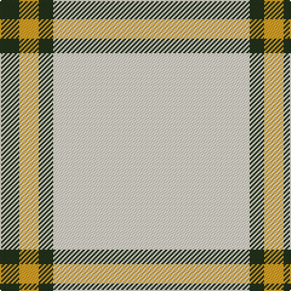

**Bands:** [GYGW](/stripes/gygw/) · **Stripes:** [DG LO DG W](/stripes/stripes4/) DG LO DG W

This was sourced from register-of-tartans.  It is a [4 band tartan](/bands/bands4/).

Original link https://www.tartanregister.gov.uk/tartanDetails.aspx?ref=10241

## Register references

External register numbers recorded for this tartan.

- Scottish Register of Tartans: [10241](https://www.tartanregister.gov.uk/tartanDetails.aspx?ref=10241)

## Thread count
K/16 Y16 K12 W/162

## Palette
Each colour and its ΔE from the base-6 reference it is a variant of.

| Colour | Shade | Base | ΔE (OKLab) |
|---|---|---|---|
| K | <code style="background-color:#23321B;">#23321B</code> `#23321B` | G <code style="background-color:#006100;">#006100</code> | 0.16 |
| W | <code style="background-color:#E8DDCB;">#E8DDCB</code> `#E8DDCB` | W <code style="background-color:#F7F7F7;">#F7F7F7</code> | 0.08 |
| Y | <code style="background-color:#E0A126;">#E0A126</code> `#E0A126` | Y <code style="background-color:#F2BF00;">#F2BF00</code> | 0.08 |

# Sample pattern

## Nearest tartans

The nearest existing variants by ΔTartan distance.

1. [Triplett, Jack Arnold](/setts/s4/w35n12r2n2~x2/) — ΔT 1.72
1. [White Stripes (Corporate)](/setts/s7/k7w3k7w45r3w3r3~x2/) — ΔT 1.89
1. [Guzzo Dress (Personal)](/setts/s8/w20k2w20lo5k3w3lo4k2/) — ΔT 1.89
1. [Butties](/setts/s6/w93o6w13db35w12o6/) — ΔT 1.99
1. [London Fog Safari (Fashion)](/setts/s6/lr10k2w5k4lr50b2~x2/) — ΔT 2.02
1. [Guzzo Dress (Montreal, Canada) (Personal)](/setts/s8/w20k2w20ly5k3w3ly4k2/) — ΔT 2.07
1. [Asahi (Estimated threadcount)](/setts/s5/w45b2w4b15w7~x2/) — ΔT 2.07
1. [Sephardim (Corporate)](/setts/s5/w50db7w7t7w18~x2/) — ΔT 2.10
1. [Butties](/setts/s6/w93lr6w13b35w12lr6/) — ΔT 2.12
1. [Gairloch (Fashion)](/setts/s8/w24w1y9w1w9w2y2k2~x2/) — ΔT 2.20

## Neighbour map

Every grey dot is one of 14313 variants placed by the first two principal components of the ΔTartan feature space (44% of its variance). Red is this tartan; blue dots are its nearest — click one to open its page.

<svg viewBox="0 0 640 380" role="img" style="max-width:100%;height:auto;border:1px solid #e0e0e0;border-radius:4px;display:block" xmlns="http://www.w3.org/2000/svg"><image href="/nn/cloud.v1.png" width="640" height="380"/><a href="/setts/s4/w35n12r2n2~x2/"><circle cx="394.1" cy="163.4" r="4" fill="#3465a4"><title>Triplett, Jack Arnold</title></circle></a><a href="/setts/s7/k7w3k7w45r3w3r3~x2/"><circle cx="420.8" cy="134.2" r="4" fill="#3465a4"><title>White Stripes (Corporate)</title></circle></a><a href="/setts/s8/w20k2w20lo5k3w3lo4k2/"><circle cx="401.5" cy="174.6" r="4" fill="#3465a4"><title>Guzzo Dress (Personal)</title></circle></a><a href="/setts/s6/w93o6w13db35w12o6/"><circle cx="408.0" cy="156.5" r="4" fill="#3465a4"><title>Butties</title></circle></a><a href="/setts/s6/lr10k2w5k4lr50b2~x2/"><circle cx="552.8" cy="139.2" r="4" fill="#3465a4"><title>London Fog Safari (Fashion)</title></circle></a><a href="/setts/s8/w20k2w20ly5k3w3ly4k2/"><circle cx="386.8" cy="165.4" r="4" fill="#3465a4"><title>Guzzo Dress (Montreal, Canada) (Personal)</title></circle></a><a href="/setts/s5/w45b2w4b15w7~x2/"><circle cx="535.2" cy="196.8" r="4" fill="#3465a4"><title>Asahi (Estimated threadcount)</title></circle></a><a href="/setts/s5/w50db7w7t7w18~x2/"><circle cx="514.2" cy="228.8" r="4" fill="#3465a4"><title>Sephardim (Corporate)</title></circle></a><a href="/setts/s6/w93lr6w13b35w12lr6/"><circle cx="424.1" cy="162.8" r="4" fill="#3465a4"><title>Butties</title></circle></a><a href="/setts/s8/w24w1y9w1w9w2y2k2~x2/"><circle cx="464.1" cy="131.4" r="4" fill="#3465a4"><title>Gairloch (Fashion)</title></circle></a><circle cx="498.1" cy="184.3" r="5" fill="#c00000"/></svg>

ID: /setts/s4/w81dg6lo8dg8~x2/
