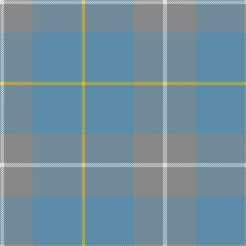

In pattern [WRBY](/patterns/wrby/).

This was sourced from tartans-authority.  It is a [4 stripes tartan](/stripes/stripes4/).

Original link http://www.tartansauthority.com/tartan-ferret/display/6041/

## Attestations

This cloth appears in 2 source records; the oldest owns this page.

- 1996 — McKerrell of Hillhouse Dress (Clan) (tartans-authority, [record](http://www.tartansauthority.com/tartan-ferret/display/6041/))
- undated — MacKerrell of Hillhouse Dress Personal Tartan Tartan Number: 6041. Earliest known date: 1996 This is the dress version of McKerrell of Hillhouse Hunting (#1758) and designed by Madam McKerrell of Hillhouse in 1996 and recorded in the Lyon Court Books (LCB 123) on 20th November 2001. As shown here, red is used in the warp in place of yellow. The McKerrell of Hillhouse Dress can be worn by all those with the name McKerrell and its spelling variations by seeking the permission of McKerrell of Hillhouse See products available Copyright © Blair Urquhart, Comrie, 2015 (house-of-tartan, [record](http://www.house-of-tartan.scotland.net/house/TartanViewjs.asp?colr=Def&tnam=6041))

## Thread count
LN/8 N56 B96 Y/6

## Palette
Each colour and its ΔE from the base-6 reference it is a variant of.

| Colour | Shade | Base | ΔE (OKLab) |
|---|---|---|---|
| B | <code style="background-color:#5C8CA8;">#5C8CA8</code> `#5C8CA8` | B <code style="background-color:#2A418A;">#2A418A</code> | 0.23 |
| K | <code style="background-color:#000000;">#000000</code> `#000000` | K <code style="background-color:#000000;">#000000</code> | 0.00 |
| LN | <code style="background-color:#E0E0E0;">#E0E0E0</code> `#E0E0E0` | W <code style="background-color:#F7F7F7;">#F7F7F7</code> | 0.07 |
| N | <code style="background-color:#888888;">#888888</code> `#888888` | R <code style="background-color:#CC0000;">#CC0000</code> | 0.24 |
| Y | <code style="background-color:#E8C000;">#E8C000</code> `#E8C000` | Y <code style="background-color:#F2BF00;">#F2BF00</code> | 0.02 |

# Sample pattern

## Nearest tartans

The nearest existing variants by ΔTartan distance.

1. [London Regiment (Military)](/setts/s6/g68b54r6b54g68w6-b687488-g747c60-rc80000-wfcfcfc/) — ΔT 1.95
1. [Outlander #1](/setts/s6/g104y4b48r6ya52b8-b5c5c5c-g808080-r960000-ye8c000-yaa08858/) — ΔT 2.36
1. [Cairns, David (Personal)](/setts/s5/b88r8b32r64ra8-b5c5c5c-r888888-ra880000/) — ΔT 2.40
1. [McKerrell of Hillhouse Dress](/setts/s6/b96r56w8r56b96y6-b5c8ca8-r888888-we0e0e0-ye8c000/) — ΔT 2.40
1. [Outlander #1](/setts/s6/r104y4b48ra6ya52b8-b5c5c5c-r888888-raa00000-yfccc00-yaa08858/) — ΔT 2.48
1. [Laurel Park](/setts/s4/b96g50b26y10-b5c8ca8-g009468-ye8c000/) — ΔT 2.48
1. [Blue Ridge](/setts/s10/g12b16r4b4y4b32g36b8g8b6-b5c8ca8-g408060-re86000-ye8c000/) — ΔT 2.51
1. [Blue Ridge (District)](/setts/s10/g24b32r8b8y8b64g72b16g16b12-b5c8ca8-g408060-re86000-ye8c000/) — ΔT 2.51
1. [Outlander #3](/setts/s4/r112b56y56b16-b5c5c5c-r888888-ya08858/) — ΔT 2.60
1. [McGuigan, Julia (St Monans, Fife) (Personal)](/setts/s4/g18ga104gb30y8-g70714d-ga5a601e-gb4e3d20-ybfab40/) — ΔT 2.64

## Neighbour map

Every grey dot is one of 15726 variants placed by the first two principal components of the ΔTartan feature space (44% of its variance). Red is this tartan; blue dots are its nearest — click one to open its page.

<svg viewBox="0 0 640 380" role="img" style="max-width:100%;height:auto;border:1px solid #e0e0e0;border-radius:4px;display:block" xmlns="http://www.w3.org/2000/svg"><image href="/nn/cloud.v1.png" width="640" height="380"/><a href="/setts/s6/g68b54r6b54g68w6-b687488-g747c60-rc80000-wfcfcfc/"><circle cx="466.6" cy="311.9" r="4" fill="#3465a4"><title>London Regiment (Military)</title></circle></a><a href="/setts/s6/g104y4b48r6ya52b8-b5c5c5c-g808080-r960000-ye8c000-yaa08858/"><circle cx="420.5" cy="215.9" r="4" fill="#3465a4"><title>Outlander #1</title></circle></a><a href="/setts/s5/b88r8b32r64ra8-b5c5c5c-r888888-ra880000/"><circle cx="504.3" cy="299.5" r="4" fill="#3465a4"><title>Cairns, David (Personal)</title></circle></a><a href="/setts/s6/b96r56w8r56b96y6-b5c8ca8-r888888-we0e0e0-ye8c000/"><circle cx="548.3" cy="309.6" r="4" fill="#3465a4"><title>McKerrell of Hillhouse Dress</title></circle></a><a href="/setts/s6/r104y4b48ra6ya52b8-b5c5c5c-r888888-raa00000-yfccc00-yaa08858/"><circle cx="405.6" cy="208.0" r="4" fill="#3465a4"><title>Outlander #1</title></circle></a><a href="/setts/s4/b96g50b26y10-b5c8ca8-g009468-ye8c000/"><circle cx="514.5" cy="322.3" r="4" fill="#3465a4"><title>Laurel Park</title></circle></a><a href="/setts/s10/g12b16r4b4y4b32g36b8g8b6-b5c8ca8-g408060-re86000-ye8c000/"><circle cx="413.6" cy="259.4" r="4" fill="#3465a4"><title>Blue Ridge</title></circle></a><a href="/setts/s10/g24b32r8b8y8b64g72b16g16b12-b5c8ca8-g408060-re86000-ye8c000/"><circle cx="413.6" cy="259.4" r="4" fill="#3465a4"><title>Blue Ridge (District)</title></circle></a><a href="/setts/s4/r112b56y56b16-b5c5c5c-r888888-ya08858/"><circle cx="406.5" cy="355.5" r="4" fill="#3465a4"><title>Outlander #3</title></circle></a><a href="/setts/s4/g18ga104gb30y8-g70714d-ga5a601e-gb4e3d20-ybfab40/"><circle cx="536.8" cy="289.9" r="4" fill="#3465a4"><title>McGuigan, Julia (St Monans, Fife) (Personal)</title></circle></a><circle cx="499.5" cy="279.5" r="5" fill="#c00000"/></svg>

ID: /setts/s4/w8r56b96y6-b5c8ca8-r888888-we0e0e0-ye8c000/
