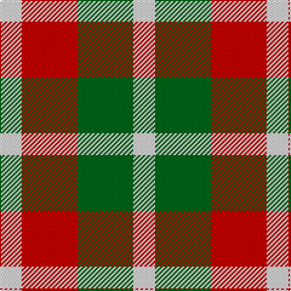

In pattern [WGRW](/stripes/wgrw/).

This was sourced from register-of-tartans.  It is a [4 stripe tartan](/stripes/stripes4/).

Original link https://www.tartanregister.gov.uk/tartanDetails.aspx?ref=3420

## Also known as

This cloth is also recorded under:

- Omani Regiment 2nd Pipe Sqn.
- Quaboos Pipers Plaid
- Quaboos Pipers Plaid Regimental
- Quaboos, Pipers Plaid

## Attestations

This cloth appears in 5 source records; the oldest owns this page.

- 01/01/2002 — Quaboos Pipers Plaid (register-of-tartans, [record](https://www.tartanregister.gov.uk/tartanDetails.aspx?ref=3420))
- pre 2002 — Qaboos (Corporate) (tartans-authority, [record](http://www.tartansauthority.com/tartan-ferret/display/1806/))
- pre 2006 — Omani Regiment 2nd Pipe Sqn. (Mil.) (tartans-authority, [record](http://www.tartansauthority.com/tartan-ferret/display/6852/))
- undated — Quaboos, Pipers Plaid (weddslist, [record](http://www.weddslist.com/cgi-bin/tartans/pg.pl?source=sts))
- undated — Quaboos Pipers Plaid Regimental Tartan Tartan Number: 1806. Earliest known date: 1983 The Sultan of Oman is the ruler of Quaboos. See products available Copyright © Blair Urquhart, Comrie, 2015 (house-of-tartan, [record](http://www.house-of-tartan.scotland.net/house/TartanViewjs.asp?colr=Def&tnam=1806))

## Register references

External register numbers recorded for this tartan.

- Scottish Register of Tartans: [3420](https://www.tartanregister.gov.uk/tartanDetails.aspx?ref=3420)
- Scottish Tartans Authority (ITI): 1806
- Scottish Tartans World Register: 1806

## Thread count
LN/18 R46 G46 LN/18

## Palette
Each colour and the base-6 reference it is a variant of.

| Colour | Shade | Base |
|---|---|---|
| G | <code style="background-color:#006818;">#006818</code> `oklch(45.0% 0.142 145.0)` <small>#006818</small> | G <code style="background-color:#006100;">#006100</code> |
| LN | <code style="background-color:#E0E0E0;">#E0E0E0</code> `oklch(90.7% 0.000 89.9)` <small>#E0E0E0</small> | W <code style="background-color:#F7F7F7;">#F7F7F7</code> |
| R | <code style="background-color:#C80000;">#C80000</code> `oklch(52.3% 0.215 29.2)` <small>#C80000</small> | R <code style="background-color:#CC0000;">#CC0000</code> |

# Sample pattern

## Nearest tartans

The nearest existing variants by ΔTartan distance.

1. [Omani Regiment 2nd Pipe Sqn.](/setts/s6/g23r23w9r23g23w9~x2/) — ΔT 1.28
1. [Wilson's, No 113](/setts/s4/r1g3p3w1~x4/) — ΔT 1.59
1. [Havel](/setts/s5/r21k21w10k10w21~x2/) — ΔT 1.63
1. [SAL Glindrande Stiernan](/setts/s4/r3g1k3w1~x20/) — ΔT 1.75
1. [Oakland Centre](/setts/s5/w3r2w1dt2r2~x4/) — ΔT 1.86
1. [Clark](/setts/s5/r3k1dg1k1lb3~x4/) — ΔT 1.88
1. [Wilson's No.203](/setts/s4/t2r4g5ly1~x4/) — ΔT 1.90
1. [Inverness Basque (District)](/setts/s5/r33g9k5g24w33~x2/) — ΔT 1.91
1. [Angle Dress (Fashion)](/setts/s5/k5g8lo5g3lo5~x4/) — ΔT 1.92
1. [Wilson's, No 214](/setts/s5/g4r3t1k1t3~x4/) — ΔT 1.96

## Neighbour map

Every grey dot is one of 14299 variants placed by the first two principal components of the ΔTartan feature space (44% of its variance). Red is this tartan; blue dots are its nearest — click one to open its page.

<svg viewBox="0 0 640 380" role="img" style="max-width:100%;height:auto;border:1px solid #e0e0e0;border-radius:4px;display:block" xmlns="http://www.w3.org/2000/svg"><image href="/nn/cloud.v1.png" width="640" height="380"/><a href="/setts/s6/g23r23w9r23g23w9~x2/"><circle cx="137.5" cy="302.8" r="4" fill="#3465a4"><title>Omani Regiment 2nd Pipe Sqn.</title></circle></a><a href="/setts/s4/r1g3p3w1~x4/"><circle cx="119.7" cy="284.7" r="4" fill="#3465a4"><title>Wilson's, No 113</title></circle></a><a href="/setts/s5/r21k21w10k10w21~x2/"><circle cx="75.6" cy="305.9" r="4" fill="#3465a4"><title>Havel</title></circle></a><a href="/setts/s4/r3g1k3w1~x20/"><circle cx="103.2" cy="269.4" r="4" fill="#3465a4"><title>SAL Glindrande Stiernan</title></circle></a><a href="/setts/s5/w3r2w1dt2r2~x4/"><circle cx="109.9" cy="292.5" r="4" fill="#3465a4"><title>Oakland Centre</title></circle></a><a href="/setts/s5/r3k1dg1k1lb3~x4/"><circle cx="74.4" cy="254.3" r="4" fill="#3465a4"><title>Clark</title></circle></a><a href="/setts/s4/t2r4g5ly1~x4/"><circle cx="177.5" cy="277.0" r="4" fill="#3465a4"><title>Wilson's No.203</title></circle></a><a href="/setts/s5/r33g9k5g24w33~x2/"><circle cx="117.9" cy="229.6" r="4" fill="#3465a4"><title>Inverness Basque (District)</title></circle></a><a href="/setts/s5/k5g8lo5g3lo5~x4/"><circle cx="149.5" cy="341.3" r="4" fill="#3465a4"><title>Angle Dress (Fashion)</title></circle></a><a href="/setts/s5/g4r3t1k1t3~x4/"><circle cx="108.9" cy="276.0" r="4" fill="#3465a4"><title>Wilson's, No 214</title></circle></a><circle cx="121.2" cy="306.9" r="5" fill="#c00000"/></svg>

ID: /setts/s4/w9r23g23w9~x2/
