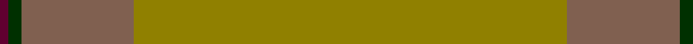
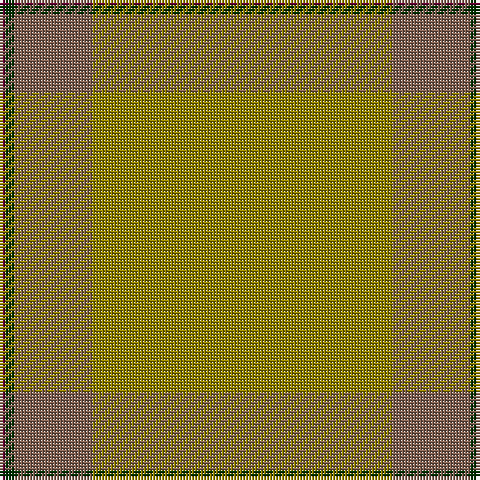

This page is one **sett** — a single exact thread-count. It belongs to the [tartan](/tartans/y100o26dg3dr2/)
(the same proportion at any scale), whose colour order is pattern [BGRG](/stripes/bgrg/).

Sourced from weddslist.  It is a [4 stripe tartan](/stripes/stripes4/).

Original link http://www.weddslist.com/cgi-bin/tartans/pg.pl?source=sts

## Thread count
LG/100 LT26 DG3 DR/2

## Palette

Palette: <strong>custom</strong>
<table><thead><tr><th>Colour</th><th>Threads</th><th>Shade</th><th>Base</th><th>OKLCh</th></tr></thead><tbody><tr><td>LG/</td><td style="text-align:right;font-variant-numeric:tabular-nums">100</td><td><code style="background-color:#908000;">#908000</code> <small style="color:#888">#908000</small></td><td>G <code style="background-color:#006100;">#006100</code></td><td><small style="color:#888">oklch(59.6% 0.124 100.6)</small></td></tr><tr><td>LT</td><td style="text-align:right;font-variant-numeric:tabular-nums">26</td><td><code style="background-color:#806050;">#806050</code> <small style="color:#888">#806050</small></td><td>R <code style="background-color:#CC0000;">#CC0000</code></td><td><small style="color:#888">oklch(51.7% 0.049 47.8)</small></td></tr><tr><td>DG</td><td style="text-align:right;font-variant-numeric:tabular-nums">3</td><td><code style="background-color:#003000;">#003000</code> <small style="color:#888">#003000</small></td><td>G <code style="background-color:#006100;">#006100</code></td><td><small style="color:#888">oklch(26.8% 0.091 142.5)</small></td></tr><tr><td>DR/</td><td style="text-align:right;font-variant-numeric:tabular-nums">2</td><td><code style="background-color:#600030;">#600030</code> <small style="color:#888">#600030</small></td><td>B <code style="background-color:#2A418A;">#2A418A</code></td><td><small style="color:#888">oklch(31.7% 0.129 359.5)</small></td></tr></tbody></table>

# Sample pattern

## Nearest tartans

The nearest existing variants by ΔTartan distance, with this tartan at the top so the swatches line up against it.

ΔTartan

Tartan

Sett

—

<a href="/ttd/edit/#slug=y100o26dg3dr2">13, Irish Regiment</a> <a class="nn-out" href="/setts/s4/y100o26dg3dr2/" title="open its dictionary page">↗</a>

1.80

<a href="/ttd/edit/#slug=y72k8y4dy16y7o2~x2">MacAndrew Hunting (Name)</a> <a class="nn-out" href="/setts/s6/y72k8y4dy16y7o2~x2/" title="open its dictionary page">↗</a>

2.70

<a href="/ttd/edit/#slug=n44dg12dt1r6~x2">Heslop, William D (Name)</a> <a class="nn-out" href="/setts/s4/n44dg12dt1r6~x2/" title="open its dictionary page">↗</a>

2.80

<a href="/ttd/edit/#slug=y23o4dy6g6y4lb1y4~x4">Tricor (Corporate)</a> <a class="nn-out" href="/setts/s7/y23o4dy6g6y4lb1y4~x4/" title="open its dictionary page">↗</a>

2.83

<a href="/ttd/edit/#slug=y32w2y9ly2y12o21r1~x2">Weathered Cyclist</a> <a class="nn-out" href="/setts/s7/y32w2y9ly2y12o21r1~x2/" title="open its dictionary page">↗</a>

2.83

<a href="/ttd/edit/#slug=y50dy25ly2dp6~x2">Highland Greenford (Personal)</a> <a class="nn-out" href="/setts/s4/y50dy25ly2dp6~x2/" title="open its dictionary page">↗</a>

3.13

<a href="/ttd/edit/#slug=y37dy9y3do9dy3~x2">Glen Boig Trade Tartan Tartan Number: 915. Earliest known date: Modern Many new designs have been given district names to promote their Scottish connections. However, these names should not be confused with the District tartans which have earned their title through 'use and wont' and not a little history. See products available Copyright © Blair Urquhart, Comrie, 2015</a> <a class="nn-out" href="/setts/s5/y37dy9y3do9dy3~x2/" title="open its dictionary page">↗</a>

3.22

<a href="/ttd/edit/#slug=lo81g6lo8g8~x2">Young in Australia (Name)</a> <a class="nn-out" href="/setts/s4/lo81g6lo8g8~x2/" title="open its dictionary page">↗</a>

3.22

<a href="/ttd/edit/#slug=y9y52dy15ly4~x2">McGuigan, Julia (St Monans, Fife) (Personal)</a> <a class="nn-out" href="/setts/s4/y9y52dy15ly4~x2/" title="open its dictionary page">↗</a>

3.23

<a href="/ttd/edit/#slug=n8o74lb8n42o11dp2o16n4">Orkney Slate (Fashion)</a> <a class="nn-out" href="/setts/s8/n8o74lb8n42o11dp2o16n4/" title="open its dictionary page">↗</a>

3.25

<a href="/ttd/edit/#slug=y3dy3y4k4dy14k3y41g2~x2">Huntsman</a> <a class="nn-out" href="/setts/s8/y3dy3y4k4dy14k3y41g2~x2/" title="open its dictionary page">↗</a>

## Neighbour map

Every grey dot is one of 14299 variants placed by the first two principal components of the ΔTartan feature space (44% of its variance). Red is this tartan; blue dots are its nearest — click one to open its page.

<svg viewBox="0 0 640 380" role="img" style="max-width:100%;height:auto;border:1px solid #e0e0e0;border-radius:4px;display:block" xmlns="http://www.w3.org/2000/svg"><image href="/nn/cloud.v1.png" width="640" height="380"/><a href="/setts/s6/y72k8y4dy16y7o2~x2/"><circle cx="626.0" cy="208.7" r="4" fill="#3465a4"><title>MacAndrew Hunting (Name)</title></circle></a><a href="/setts/s4/n44dg12dt1r6~x2/"><circle cx="586.0" cy="226.3" r="4" fill="#3465a4"><title>Heslop, William D (Name)</title></circle></a><a href="/setts/s7/y23o4dy6g6y4lb1y4~x4/"><circle cx="506.5" cy="221.6" r="4" fill="#3465a4"><title>Tricor (Corporate)</title></circle></a><a href="/setts/s7/y32w2y9ly2y12o21r1~x2/"><circle cx="560.9" cy="225.6" r="4" fill="#3465a4"><title>Weathered Cyclist</title></circle></a><a href="/setts/s4/y50dy25ly2dp6~x2/"><circle cx="505.7" cy="261.9" r="4" fill="#3465a4"><title>Highland Greenford (Personal)</title></circle></a><a href="/setts/s5/y37dy9y3do9dy3~x2/"><circle cx="554.6" cy="298.1" r="4" fill="#3465a4"><title>Glen Boig Trade Tartan Tartan Number: 915. Earliest known date: Modern Many new designs have been given district names to promote their Scottish connections. However, these names should not be confused with the District tartans which have earned their title through 'use and wont' and not a little history. See products available Copyright © Blair Urquhart, Comrie, 2015</title></circle></a><a href="/setts/s4/lo81g6lo8g8~x2/"><circle cx="626.0" cy="314.0" r="4" fill="#3465a4"><title>Young in Australia (Name)</title></circle></a><a href="/setts/s4/y9y52dy15ly4~x2/"><circle cx="537.8" cy="304.1" r="4" fill="#3465a4"><title>McGuigan, Julia (St Monans, Fife) (Personal)</title></circle></a><a href="/setts/s8/n8o74lb8n42o11dp2o16n4/"><circle cx="524.6" cy="194.5" r="4" fill="#3465a4"><title>Orkney Slate (Fashion)</title></circle></a><a href="/setts/s8/y3dy3y4k4dy14k3y41g2~x2/"><circle cx="499.9" cy="192.6" r="4" fill="#3465a4"><title>Huntsman</title></circle></a><circle cx="626.0" cy="223.1" r="5" fill="#c00000"/></svg>

ID: /setts/s4/y100o26dg3dr2/
