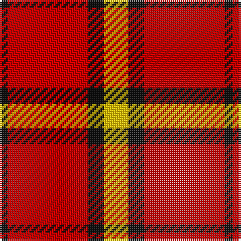

In pattern [KRKY](/patterns/krky/).

This was sourced from tartans-authority.  It is a [4 stripes tartan](/stripes/stripes4/).

Original link http://www.tartansauthority.com/tartan-ferret/display/7286/

## Thread count
K/4 R40 K8 Y/12

## Palette
Each colour and its ΔE from the base-6 reference it is a variant of.

| Colour | Shade | Base | ΔE (OKLab) |
|---|---|---|---|
| K | <code style="background-color:#101010;">#101010</code> `#101010` | K <code style="background-color:#000000;">#000000</code> | 0.17 |
| R | <code style="background-color:#C80000;">#C80000</code> `#C80000` | R <code style="background-color:#C80000;">#C80000</code> | 0.00 |
| Y | <code style="background-color:#E8C000;">#E8C000</code> `#E8C000` | Y <code style="background-color:#E8C000;">#E8C000</code> | 0.00 |

# Sample pattern

## Nearest tartans

The nearest existing variants by ΔTartan distance.

1. [Loch Morar](/setts/s5/r76w18r6b18w6-b401000-rc00000-we0e0e0/) — ΔT 1.09
1. [Loch Morar Trade Tartan Tartan Number: 1701. Earliest known date: pre 2003 Nothing See products available Copyright © Blair Urquhart, Comrie, 2015](/setts/s5/r76w18r6b18w6-b441800-rc80000-we0e0e0/) — ΔT 1.13
1. [McPeek (Fashion)](/setts/s4/r125k26w20y16-k101010-rc80000-wa8d0ec-yfca428/) — ΔT 1.17
1. [MacKeane](/setts/s5/r8k16r24k2y2-k101010-rc80000-ye8c000/) — ΔT 1.22
1. [Dunbar (Wilson's) District Tartan Tartan Number: 1236. Earliest known date: 1840 Restricted See products available Copyright © Blair Urquhart, Comrie, 2015](/setts/s4/r56k8w4k26-k101010-rc80000-we0e0e0/) — ΔT 1.26
1. [MacKinnon #6](/setts/s4/r12g80r100w12-g005020-rdc0000-we0e0e0/) — ΔT 1.27
1. [MacGregor, Black (Personal)](/setts/s5/r82k38r14k18w6-k101010-rc80000-wfcfcfc/) — ΔT 1.30
1. [Billy Apple® Red](/setts/s4/g6r78k48y6-g006818-k101010-rdc0000-yffe600/) — ΔT 1.33
1. [Masai Shuka 20 (Artefact)](/setts/s3/r120k40y12-k101010-rc80000-ye8c000/) — ΔT 1.35
1. [Glen Shiel (Fashion)](/setts/s5/r78w18r6g18w6-g003820-r880000-we8ccb8/) — ΔT 1.37

## Neighbour map

Every grey dot is one of 15726 variants placed by the first two principal components of the ΔTartan feature space (44% of its variance). Red is this tartan; blue dots are its nearest — click one to open its page.

<svg viewBox="0 0 640 380" role="img" style="max-width:100%;height:auto;border:1px solid #e0e0e0;border-radius:4px;display:block" xmlns="http://www.w3.org/2000/svg"><image href="/nn/cloud.v1.png" width="640" height="380"/><a href="/setts/s5/r76w18r6b18w6-b401000-rc00000-we0e0e0/"><circle cx="415.5" cy="186.4" r="4" fill="#3465a4"><title>Loch Morar</title></circle></a><a href="/setts/s5/r76w18r6b18w6-b441800-rc80000-we0e0e0/"><circle cx="417.5" cy="186.1" r="4" fill="#3465a4"><title>Loch Morar Trade Tartan Tartan Number: 1701. Earliest known date: pre 2003 Nothing See products available Copyright © Blair Urquhart, Comrie, 2015</title></circle></a><a href="/setts/s4/r125k26w20y16-k101010-rc80000-wa8d0ec-yfca428/"><circle cx="379.7" cy="204.7" r="4" fill="#3465a4"><title>McPeek (Fashion)</title></circle></a><a href="/setts/s5/r8k16r24k2y2-k101010-rc80000-ye8c000/"><circle cx="387.3" cy="215.9" r="4" fill="#3465a4"><title>MacKeane</title></circle></a><a href="/setts/s4/r56k8w4k26-k101010-rc80000-we0e0e0/"><circle cx="385.5" cy="213.7" r="4" fill="#3465a4"><title>Dunbar (Wilson's) District Tartan Tartan Number: 1236. Earliest known date: 1840 Restricted See products available Copyright © Blair Urquhart, Comrie, 2015</title></circle></a><a href="/setts/s4/r12g80r100w12-g005020-rdc0000-we0e0e0/"><circle cx="337.4" cy="242.3" r="4" fill="#3465a4"><title>MacKinnon #6</title></circle></a><a href="/setts/s5/r82k38r14k18w6-k101010-rc80000-wfcfcfc/"><circle cx="384.8" cy="205.0" r="4" fill="#3465a4"><title>MacGregor, Black (Personal)</title></circle></a><a href="/setts/s4/g6r78k48y6-g006818-k101010-rdc0000-yffe600/"><circle cx="331.7" cy="194.6" r="4" fill="#3465a4"><title>Billy Apple® Red</title></circle></a><a href="/setts/s3/r120k40y12-k101010-rc80000-ye8c000/"><circle cx="438.8" cy="244.3" r="4" fill="#3465a4"><title>Masai Shuka 20 (Artefact)</title></circle></a><a href="/setts/s5/r78w18r6g18w6-g003820-r880000-we8ccb8/"><circle cx="420.1" cy="194.9" r="4" fill="#3465a4"><title>Glen Shiel (Fashion)</title></circle></a><circle cx="370.5" cy="216.3" r="5" fill="#c00000"/></svg>

ID: /setts/s4/y12k8r40k4-k101010-rc80000-ye8c000/
