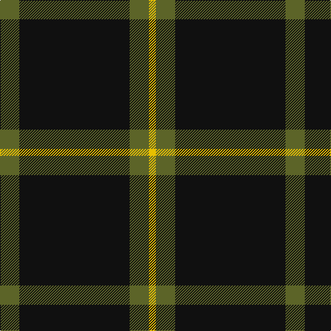

In pattern [GKGY](/stripes/gkgy/).

This was sourced from house-of-tartan.  It is a [4 stripe tartan](/stripes/stripes4/).

Original link http://www.house-of-tartan.scotland.net/house/TartanViewjs.asp?colr=Def&tnam=6019

## Thread count
G/28 K160 G28 Y/10

## Palette
Each colour and the base-6 reference it is a variant of.

| Colour | Shade | Base |
|---|---|---|
| G | <code style="background-color:#5C6428;">#5C6428</code> `oklch(48.3% 0.084 116.0)` <small>#5C6428</small> | G <code style="background-color:#006100;">#006100</code> |
| K | <code style="background-color:#101010;">#101010</code> `oklch(17.3% 0.000 89.9)` <small>#101010</small> | K <code style="background-color:#000000;">#000000</code> |
| Y | <code style="background-color:#E8C000;">#E8C000</code> `oklch(81.9% 0.168 93.7)` <small>#E8C000</small> | Y <code style="background-color:#F2BF00;">#F2BF00</code> |

# Sample pattern

## Nearest tartans

The nearest existing variants by ΔTartan distance, with this tartan at the top so the swatches line up against it.

ΔTartan

Tartan

Sett

—

<a href="/ttd/edit/#slug=y14k80y14ly5~x2">Westgate Fashion Tartan Tartan Number: 6019. Earliest known date: pre 2003 A fashion tartan See products available Copyright © Blair Urquhart, Comrie, 2015</a> <a class="nn-out" href="/setts/s4/y14k80y14ly5~x2/" title="open its dictionary page">↗</a>

1.17

<a href="/ttd/edit/#slug=r3n12k50ly3~x2">Rogues (United States), The</a> <a class="nn-out" href="/setts/s4/r3n12k50ly3~x2/" title="open its dictionary page">↗</a>

1.26

<a href="/ttd/edit/#slug=k62dt24lo5w3~x2">Perry (Calgary), Alex (Personal)</a> <a class="nn-out" href="/setts/s4/k62dt24lo5w3~x2/" title="open its dictionary page">↗</a>

1.26

<a href="/ttd/edit/#slug=k75y26y3k4ly6~x2">Perry Ancient (Personal)</a> <a class="nn-out" href="/setts/s5/k75y26y3k4ly6~x2/" title="open its dictionary page">↗</a>

1.30

<a href="/ttd/edit/#slug=r3t12k50ly3~x2">Rogues, The (Corporate)</a> <a class="nn-out" href="/setts/s4/r3t12k50ly3~x2/" title="open its dictionary page">↗</a>

1.35

<a href="/ttd/edit/#slug=r1k20lb5r1~x4">Dobelman (Personal)</a> <a class="nn-out" href="/setts/s4/r1k20lb5r1~x4/" title="open its dictionary page">↗</a>

1.42

<a href="/ttd/edit/#slug=k44g8k4g13k4w3~x2">Childers (Personal)</a> <a class="nn-out" href="/setts/s6/k44g8k4g13k4w3~x2/" title="open its dictionary page">↗</a>

1.46

<a href="/ttd/edit/#slug=r1k9o5k3o5k21o1~x4">Sunderland of Scotland (Fashion)</a> <a class="nn-out" href="/setts/s7/r1k9o5k3o5k21o1~x4/" title="open its dictionary page">↗</a>

1.54

<a href="/ttd/edit/#slug=k69r14ly5~x2">Batson (Personal)</a> <a class="nn-out" href="/setts/s3/k69r14ly5~x2/" title="open its dictionary page">↗</a>

1.61

<a href="/ttd/edit/#slug=k62db15w6ly4~x2">C-Tec N.I. Ltd</a> <a class="nn-out" href="/setts/s4/k62db15w6ly4~x2/" title="open its dictionary page">↗</a>

1.62

<a href="/ttd/edit/#slug=o4n6k4o8k49o2">Harley Davidson (Corporate)</a> <a class="nn-out" href="/setts/s6/o4n6k4o8k49o2/" title="open its dictionary page">↗</a>

## Neighbour map

Every grey dot is one of 14299 variants placed by the first two principal components of the ΔTartan feature space (44% of its variance). Red is this tartan; blue dots are its nearest — click one to open its page.

<svg viewBox="0 0 640 380" role="img" style="max-width:100%;height:auto;border:1px solid #e0e0e0;border-radius:4px;display:block" xmlns="http://www.w3.org/2000/svg"><image href="/nn/cloud.v1.png" width="640" height="380"/><a href="/setts/s4/r3n12k50ly3~x2/"><circle cx="465.9" cy="200.3" r="4" fill="#3465a4"><title>Rogues (United States), The</title></circle></a><a href="/setts/s4/k62dt24lo5w3~x2/"><circle cx="421.6" cy="203.4" r="4" fill="#3465a4"><title>Perry (Calgary), Alex (Personal)</title></circle></a><a href="/setts/s5/k75y26y3k4ly6~x2/"><circle cx="462.9" cy="182.4" r="4" fill="#3465a4"><title>Perry Ancient (Personal)</title></circle></a><a href="/setts/s4/r3t12k50ly3~x2/"><circle cx="456.2" cy="196.1" r="4" fill="#3465a4"><title>Rogues, The (Corporate)</title></circle></a><a href="/setts/s4/r1k20lb5r1~x4/"><circle cx="479.4" cy="198.4" r="4" fill="#3465a4"><title>Dobelman (Personal)</title></circle></a><a href="/setts/s6/k44g8k4g13k4w3~x2/"><circle cx="413.5" cy="192.8" r="4" fill="#3465a4"><title>Childers (Personal)</title></circle></a><a href="/setts/s7/r1k9o5k3o5k21o1~x4/"><circle cx="480.1" cy="194.2" r="4" fill="#3465a4"><title>Sunderland of Scotland (Fashion)</title></circle></a><a href="/setts/s3/k69r14ly5~x2/"><circle cx="514.4" cy="245.1" r="4" fill="#3465a4"><title>Batson (Personal)</title></circle></a><a href="/setts/s4/k62db15w6ly4~x2/"><circle cx="424.6" cy="199.4" r="4" fill="#3465a4"><title>C-Tec N.I. Ltd</title></circle></a><a href="/setts/s6/o4n6k4o8k49o2/"><circle cx="489.6" cy="164.4" r="4" fill="#3465a4"><title>Harley Davidson (Corporate)</title></circle></a><circle cx="475.7" cy="229.6" r="5" fill="#c00000"/></svg>

ID: /setts/s4/y14k80y14ly5~x2/
