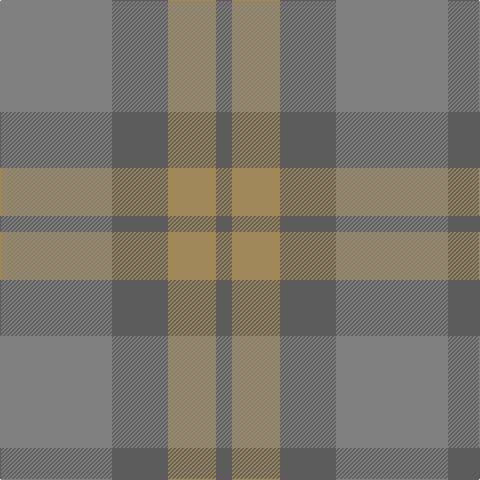

This page is one **sett** — a single exact thread-count. It belongs to the [tartan](/tartans/y14n7lo6n2/)
(the same proportion at any scale), whose colour order is pattern [BYBG](/stripes/bybg/).

Sourced from register-of-tartans.  It is a [4 stripe tartan](/stripes/stripes4/).

Original link https://www.tartanregister.gov.uk/tartanDetails.aspx?ref=11115

## Register references

External register numbers recorded for this tartan.

- Scottish Register of Tartans: [11115](https://www.tartanregister.gov.uk/tartanDetails.aspx?ref=11115)

## Thread count
N/112 Na56 LT48 Na/16

## Palette

Palette: <strong>Tartan Register</strong> <small style="color:#888">(2 of 3 colours)</small>
<table><thead><tr><th>Colour</th><th>Threads</th><th>Shade</th><th>Base</th><th>OKLCh</th></tr></thead><tbody><tr><td>N/</td><td style="text-align:right;font-variant-numeric:tabular-nums">112</td><td><code style="background-color:#808080;">#808080</code> <small style="color:#888">#808080</small></td><td>G <code style="background-color:#006100;">#006100</code></td><td><small style="color:#888">oklch(60.0% 0.000 89.9)</small></td></tr><tr><td>Na</td><td style="text-align:right;font-variant-numeric:tabular-nums">56</td><td><code style="background-color:#5C5C5C;">#5C5C5C</code> <small style="color:#888">#5C5C5C</small></td><td>B <code style="background-color:#2A418A;">#2A418A</code></td><td><small style="color:#888">oklch(47.5% 0.000 89.9)</small></td></tr><tr><td>LT</td><td style="text-align:right;font-variant-numeric:tabular-nums">48</td><td><code style="background-color:#A08858;">#A08858</code> <small style="color:#888">#A08858</small></td><td>Y <code style="background-color:#F2BF00;">#F2BF00</code></td><td><small style="color:#888">oklch(63.7% 0.071 84.0)</small></td></tr><tr><td>Na/</td><td style="text-align:right;font-variant-numeric:tabular-nums">16</td><td><code style="background-color:#5C5C5C;">#5C5C5C</code> <small style="color:#888">#5C5C5C</small></td><td>B <code style="background-color:#2A418A;">#2A418A</code></td><td><small style="color:#888">oklch(47.5% 0.000 89.9)</small></td></tr></tbody></table>

# Sample pattern

## Nearest tartans

The nearest existing variants by ΔTartan distance, with this tartan at the top so the swatches line up against it.

ΔTartan

Tartan

Sett

—

<a href="/ttd/edit/#slug=y14n7lo6n2~x8">Outlander #3</a> <a class="nn-out" href="/setts/s4/y14n7lo6n2~x8/" title="open its dictionary page">↗</a>

0.72

<a href="/ttd/edit/#slug=o14n7lo7n2~x8">Outlander #3</a> <a class="nn-out" href="/setts/s4/o14n7lo7n2~x8/" title="open its dictionary page">↗</a>

1.82

<a href="/ttd/edit/#slug=y34n27r3n27y34w3~x2">London Regiment (Military)</a> <a class="nn-out" href="/setts/s6/y34n27r3n27y34w3~x2/" title="open its dictionary page">↗</a>

2.09

<a href="/setts/s5/n7oi1ni6oi8o1~x8/">Callum (Buchan)</a>

2.16

<a href="/ttd/edit/#slug=n1o6n6oi6n1oi1~x4">Glen Burns (WCWM-2)</a> <a class="nn-out" href="/setts/s6/n1o6n6oi6n1oi1~x4/" title="open its dictionary page">↗</a>

2.20

<a href="/ttd/edit/#slug=n13do15n2~x4">Outlander #5</a> <a class="nn-out" href="/setts/s3/n13do15n2~x4/" title="open its dictionary page">↗</a>

2.44

<a href="/ttd/edit/#slug=db5y15o4y4o24y4o4db5">Daks, (Muted Skye)</a> <a class="nn-out" href="/setts/s8/db5y15o4y4o24y4o4db5/" title="open its dictionary page">↗</a>

2.56

<a href="/ttd/edit/#slug=do11n1do4n8r1~x8">Cairns, David (Personal)</a> <a class="nn-out" href="/setts/s5/do11n1do4n8r1~x8/" title="open its dictionary page">↗</a>

2.65

<a href="/ttd/edit/#slug=y22dp1yi22r4~x4">McWilliams (2014)</a> <a class="nn-out" href="/setts/s4/y22dp1yi22r4~x4/" title="open its dictionary page">↗</a>

2.66

<a href="/ttd/edit/#slug=w4o28t48ly3~x2">McKerrell of Hillhouse Dress (Clan)</a> <a class="nn-out" href="/setts/s4/w4o28t48ly3~x2/" title="open its dictionary page">↗</a>

2.69

<a href="/ttd/edit/#slug=do1dy6do6dy1n6dy1~x8">Brown Heather (Fashion)</a> <a class="nn-out" href="/setts/s6/do1dy6do6dy1n6dy1~x8/" title="open its dictionary page">↗</a>

## Neighbour map

Every grey dot is one of 14359 variants placed by the first two principal components of the ΔTartan feature space (44% of its variance). Red is this tartan; blue dots are its nearest — click one to open its page.

<svg viewBox="0 0 640 380" role="img" style="max-width:100%;height:auto;border:1px solid #e0e0e0;border-radius:4px;display:block" xmlns="http://www.w3.org/2000/svg"><image href="/nn/cloud.v1.png" width="640" height="380"/><a href="/setts/s4/o14n7lo7n2~x8/"><circle cx="407.4" cy="366.0" r="4" fill="#3465a4"><title>Outlander #3</title></circle></a><a href="/setts/s6/y34n27r3n27y34w3~x2/"><circle cx="468.5" cy="328.4" r="4" fill="#3465a4"><title>London Regiment (Military)</title></circle></a><a href="/setts/s5/n7oi1ni6oi8o1~x8/"><circle cx="375.8" cy="338.5" r="4" fill="#3465a4"><title>Callum (Buchan)</title></circle></a><a href="/setts/s6/n1o6n6oi6n1oi1~x4/"><circle cx="351.2" cy="327.0" r="4" fill="#3465a4"><title>Glen Burns (WCWM-2)</title></circle></a><a href="/setts/s3/n13do15n2~x4/"><circle cx="522.8" cy="366.0" r="4" fill="#3465a4"><title>Outlander #5</title></circle></a><a href="/setts/s8/db5y15o4y4o24y4o4db5/"><circle cx="415.1" cy="309.7" r="4" fill="#3465a4"><title>Daks, (Muted Skye)</title></circle></a><a href="/setts/s5/do11n1do4n8r1~x8/"><circle cx="545.4" cy="340.4" r="4" fill="#3465a4"><title>Cairns, David (Personal)</title></circle></a><a href="/setts/s4/y22dp1yi22r4~x4/"><circle cx="469.0" cy="293.4" r="4" fill="#3465a4"><title>McWilliams (2014)</title></circle></a><a href="/setts/s4/w4o28t48ly3~x2/"><circle cx="501.7" cy="294.2" r="4" fill="#3465a4"><title>McKerrell of Hillhouse Dress (Clan)</title></circle></a><a href="/setts/s6/do1dy6do6dy1n6dy1~x8/"><circle cx="365.8" cy="341.2" r="4" fill="#3465a4"><title>Brown Heather (Fashion)</title></circle></a><circle cx="437.4" cy="366.0" r="5" fill="#c00000"/></svg>

ID: /setts/s4/y14n7lo6n2~x8/
