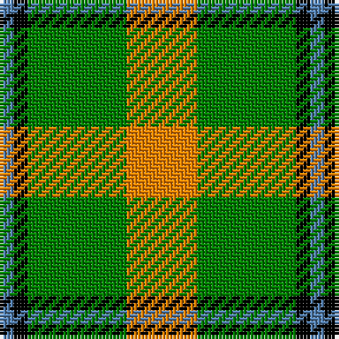

In pattern [BKGY](/patterns/bkgy/).

This was sourced from weddslist.  It is a [4 stripes tartan](/stripes/stripes4/).

Original link http://www.weddslist.com/cgi-bin/tartans/pg.pl?source=sts

## Thread count
B/4 K4 G28 O/20

## Palette
Each colour and its ΔE from the base-6 reference it is a variant of.

| Colour | Shade | Base | ΔE (OKLab) |
|---|---|---|---|
| B | <code style="background-color:#5480B0;">#5480B0</code> `#5480B0` | B <code style="background-color:#2A418A;">#2A418A</code> | 0.19 |
| G | <code style="background-color:#008000;">#008000</code> `#008000` | G <code style="background-color:#006100;">#006100</code> | 0.10 |
| K | <code style="background-color:#000000;">#000000</code> `#000000` | K <code style="background-color:#000000;">#000000</code> | 0.00 |
| O | <code style="background-color:#FF8500;">#FF8500</code> `#FF8500` | Y <code style="background-color:#F2BF00;">#F2BF00</code> | 0.14 |

# Sample pattern

## Nearest tartans

The nearest existing variants by ΔTartan distance.

1. [Englehart, City of](/setts/s4/g108r36b8y56-b506878-g00540c-rc80000-ye8c000/) — ΔT 1.10
1. [Unidentfied (Ligioner Highland Games](/setts/s6/b8g50y20g6y36r8-b441800-g006818-rc80000-yfcb464/) — ΔT 1.15
1. [Wilson's, No 193](/setts/s5/g24k4r4b8r8-b5480b0-g008000-k000000-rc00000/) — ΔT 1.24
1. [Wilson's, No 179](/setts/s5/g24y4r4b8r8-b5480b0-g008000-rc00000-yf0c000/) — ΔT 1.32
1. [Dunoon Irish Corporate Tartan Tartan Number: 1802. Earliest known date: 1935 Glasgow Irish Pipe Band See products available Copyright © Blair Urquhart, Comrie, 2015](/setts/s4/w12g78y78w12-g006818-we0e0e0-yd87c00/) — ΔT 1.34
1. [Loch Lomond #3](/setts/s4/g44w28r14y4-g006818-rc80000-wfcfcfc-yd8b000/) — ΔT 1.39
1. [Barclay Dress](/setts/s4/w10y64b64y10-b1c1c1c-we0e0e0-ye8c000/) — ΔT 1.48
1. [Dunoon Irish (Corporate)](/setts/s4/w12g78r78w12-g006c3c-rb84c00-wfcfcfc/) — ΔT 1.51
1. [Bonhill Primary School](/setts/s4/r8k50y50w8-k101010-rc80000-wfcfcfc-ye8c000/) — ΔT 1.54
1. [Dunoon](/setts/s4/w12g78y78w12-g008000-we0e0e0-yff8500/) — ΔT 1.55

## Neighbour map

Every grey dot is one of 15726 variants placed by the first two principal components of the ΔTartan feature space (44% of its variance). Red is this tartan; blue dots are its nearest — click one to open its page.

<svg viewBox="0 0 640 380" role="img" style="max-width:100%;height:auto;border:1px solid #e0e0e0;border-radius:4px;display:block" xmlns="http://www.w3.org/2000/svg"><image href="/nn/cloud.v1.png" width="640" height="380"/><a href="/setts/s4/g108r36b8y56-b506878-g00540c-rc80000-ye8c000/"><circle cx="265.5" cy="219.1" r="4" fill="#3465a4"><title>Englehart, City of</title></circle></a><a href="/setts/s6/b8g50y20g6y36r8-b441800-g006818-rc80000-yfcb464/"><circle cx="222.0" cy="206.8" r="4" fill="#3465a4"><title>Unidentfied (Ligioner Highland Games</title></circle></a><a href="/setts/s5/g24k4r4b8r8-b5480b0-g008000-k000000-rc00000/"><circle cx="224.1" cy="236.5" r="4" fill="#3465a4"><title>Wilson's, No 193</title></circle></a><a href="/setts/s5/g24y4r4b8r8-b5480b0-g008000-rc00000-yf0c000/"><circle cx="244.6" cy="241.9" r="4" fill="#3465a4"><title>Wilson's, No 179</title></circle></a><a href="/setts/s4/w12g78y78w12-g006818-we0e0e0-yd87c00/"><circle cx="253.9" cy="260.6" r="4" fill="#3465a4"><title>Dunoon Irish Corporate Tartan Tartan Number: 1802. Earliest known date: 1935 Glasgow Irish Pipe Band See products available Copyright © Blair Urquhart, Comrie, 2015</title></circle></a><a href="/setts/s4/g44w28r14y4-g006818-rc80000-wfcfcfc-yd8b000/"><circle cx="214.8" cy="215.8" r="4" fill="#3465a4"><title>Loch Lomond #3</title></circle></a><a href="/setts/s4/w10y64b64y10-b1c1c1c-we0e0e0-ye8c000/"><circle cx="250.5" cy="245.3" r="4" fill="#3465a4"><title>Barclay Dress</title></circle></a><a href="/setts/s4/w12g78r78w12-g006c3c-rb84c00-wfcfcfc/"><circle cx="249.7" cy="258.0" r="4" fill="#3465a4"><title>Dunoon Irish (Corporate)</title></circle></a><a href="/setts/s4/r8k50y50w8-k101010-rc80000-wfcfcfc-ye8c000/"><circle cx="186.0" cy="228.2" r="4" fill="#3465a4"><title>Bonhill Primary School</title></circle></a><a href="/setts/s4/w12g78y78w12-g008000-we0e0e0-yff8500/"><circle cx="251.8" cy="256.0" r="4" fill="#3465a4"><title>Dunoon</title></circle></a><circle cx="237.1" cy="236.4" r="5" fill="#c00000"/></svg>

ID: /setts/s4/y20g28k4b4-b5480b0-g008000-k000000-yff8500/
