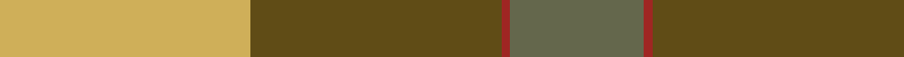
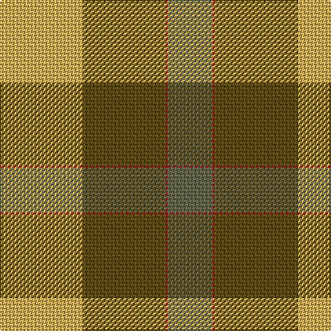

In pattern [GRGY](/patterns/grgy/).

This was sourced from register-of-tartans.  It is a [4 stripes tartan](/stripes/stripes4/).

Original link https://www.tartanregister.gov.uk/tartanDetails.aspx?ref=10535

## Thread count
LG/60 T60 DR2 N/32

## Palette
Each colour and its ΔE from the base-6 reference it is a variant of.

| Colour | Shade | Base | ΔE (OKLab) |
|---|---|---|---|
| DR | <code style="background-color:#9F2623;">#9F2623</code> `#9F2623` | R <code style="background-color:#CC0000;">#CC0000</code> | 0.09 |
| LG | <code style="background-color:#CFAF59;">#CFAF59</code> `#CFAF59` | Y <code style="background-color:#F2BF00;">#F2BF00</code> | 0.08 |
| N | <code style="background-color:#64674C;">#64674C</code> `#64674C` | G <code style="background-color:#006100;">#006100</code> | 0.14 |
| T | <code style="background-color:#604C16;">#604C16</code> `#604C16` | G <code style="background-color:#006100;">#006100</code> | 0.12 |

# Sample pattern

## Nearest tartans

The nearest existing variants by ΔTartan distance.

1. [Dohmen Family (Zuid-Nederland)](/setts/s4/g30y3b8r25~b5f749c-g649848-ra32d18-ye0a126~x2/) — ΔT 1.89
1. [MacKintosh, Geddes](/setts/s7/b1r5g18r4b9r10w1~b304080-g008000-rc00000-we0e0e0~x4/) — ΔT 2.06
1. [British Hills](/setts/s5/y2b8r8g17r1~b2c2c80-g006818-rc80000-yfccc00~x4/) — ΔT 2.16
1. [Buncle (Name)](/setts/s5/b9g2ga12r31y9~b5c8ca8-g604000-ga006818-ra00000-ybc8c00~x2/) — ΔT 2.17
1. [Dohmen (Personal)](/setts/s4/g30y3b8r25~b2c2c80-g006818-ra00000-yfccc00~x2/) — ΔT 2.21
1. [Abernethy (Colerain USA) (Personal)](/setts/s7/y1b14r28g14r1g14y1~b2c2c80-g006818-rc80000-ydc943c~x2/) — ΔT 2.22
1. [McCook/Cook (Name)](/setts/s7/g12b6g6r15k1r1k2~b2888c4-g006818-k101010-rc80000~x4/) — ΔT 2.25
1. [Ballintrae](/setts/s7/r10ra5r62g40r5ga44ra10~g003000-ga30a010-r806050-rac00000/) — ΔT 2.25
1. [Buchanhaven Heritage](/setts/s7/b24r27g20y6g20r2w3~b5c8ca8-g408060-rc82828-we0e0e0-ye0a126~x2/) — ΔT 2.29
1. [Christmas](/setts/s5/y2g17ga4r15g1~g0e3923-ga207449-rbb001a-ye3b235~x2/) — ΔT 2.29

## Neighbour map

Every grey dot is one of 15726 variants placed by the first two principal components of the ΔTartan feature space (44% of its variance). Red is this tartan; blue dots are its nearest — click one to open its page.

<svg viewBox="0 0 640 380" role="img" style="max-width:100%;height:auto;border:1px solid #e0e0e0;border-radius:4px;display:block" xmlns="http://www.w3.org/2000/svg"><image href="/nn/cloud.v1.png" width="640" height="380"/><a href="/setts/s4/g30y3b8r25~b5f749c-g649848-ra32d18-ye0a126~x2/"><circle cx="294.4" cy="254.3" r="4" fill="#3465a4"><title>Dohmen Family (Zuid-Nederland)</title></circle></a><a href="/setts/s7/b1r5g18r4b9r10w1~b304080-g008000-rc00000-we0e0e0~x4/"><circle cx="247.8" cy="181.6" r="4" fill="#3465a4"><title>MacKintosh, Geddes</title></circle></a><a href="/setts/s5/y2b8r8g17r1~b2c2c80-g006818-rc80000-yfccc00~x4/"><circle cx="263.9" cy="202.0" r="4" fill="#3465a4"><title>British Hills</title></circle></a><a href="/setts/s5/b9g2ga12r31y9~b5c8ca8-g604000-ga006818-ra00000-ybc8c00~x2/"><circle cx="283.6" cy="195.5" r="4" fill="#3465a4"><title>Buncle (Name)</title></circle></a><a href="/setts/s4/g30y3b8r25~b2c2c80-g006818-ra00000-yfccc00~x2/"><circle cx="261.5" cy="246.2" r="4" fill="#3465a4"><title>Dohmen (Personal)</title></circle></a><a href="/setts/s7/y1b14r28g14r1g14y1~b2c2c80-g006818-rc80000-ydc943c~x2/"><circle cx="277.6" cy="161.0" r="4" fill="#3465a4"><title>Abernethy (Colerain USA) (Personal)</title></circle></a><a href="/setts/s7/g12b6g6r15k1r1k2~b2888c4-g006818-k101010-rc80000~x4/"><circle cx="247.8" cy="188.1" r="4" fill="#3465a4"><title>McCook/Cook (Name)</title></circle></a><a href="/setts/s7/r10ra5r62g40r5ga44ra10~g003000-ga30a010-r806050-rac00000/"><circle cx="252.5" cy="203.3" r="4" fill="#3465a4"><title>Ballintrae</title></circle></a><a href="/setts/s7/b24r27g20y6g20r2w3~b5c8ca8-g408060-rc82828-we0e0e0-ye0a126~x2/"><circle cx="224.5" cy="201.4" r="4" fill="#3465a4"><title>Buchanhaven Heritage</title></circle></a><a href="/setts/s5/y2g17ga4r15g1~g0e3923-ga207449-rbb001a-ye3b235~x2/"><circle cx="300.9" cy="200.2" r="4" fill="#3465a4"><title>Christmas</title></circle></a><circle cx="280.8" cy="214.2" r="5" fill="#c00000"/></svg>

ID: /setts/s4/y30g30r1ga16~g604c16-ga64674c-r9f2623-ycfaf59~x2/
