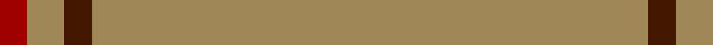
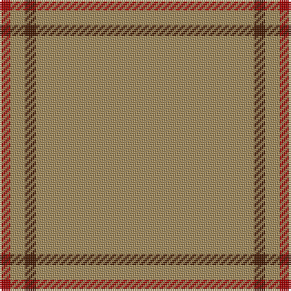

In pattern [RYBY](/patterns/ryby/).

This was sourced from tartans-authority.  It is a [4 stripes tartan](/stripes/stripes4/).

Original link http://www.tartansauthority.com/tartan-ferret/display/7530/

## Attestations

This cloth appears in 2 source records; the oldest owns this page.

- pre 2008 — Rabbie's Dram (Fashion) (tartans-authority, [record](http://www.tartansauthority.com/tartan-ferret/display/7530/))
- undated — Rabbie's Dram (register-of-tartans, [record](https://www.tartanregister.gov.uk/tartanDetails.aspx?ref=5566))

## Thread count
DRa/6 LT8 DR6 LT/120

## Palette
Each colour and its ΔE from the base-6 reference it is a variant of.

| Colour | Shade | Base | ΔE (OKLab) |
|---|---|---|---|
| DR | <code style="background-color:#441800;">#441800</code> `#441800` | B <code style="background-color:#2A418A;">#2A418A</code> | 0.23 |
| DRa | <code style="background-color:#A00000;">#A00000</code> `#A00000` | R <code style="background-color:#CC0000;">#CC0000</code> | 0.09 |
| LT | <code style="background-color:#A08858;">#A08858</code> `#A08858` | Y <code style="background-color:#F2BF00;">#F2BF00</code> | 0.21 |

# Sample pattern

## Nearest tartans

The nearest existing variants by ΔTartan distance.

1. [Dutch Football (Corporate)](/setts/s4/y24r1w1b1x11~b003c64-rc80000-we0e0e0-ybc8c00/) — ΔT 1.63
1. [Dunbar of Pitgaveny](/setts/s3/r1g19w1x2~g808080-r900030-we0e0e0/) — ΔT 1.65
1. [Dunbar of Pitgaveny (Clan)](/setts/s3/r1ra19w1x2~ra00048-ra888888-wfcfcfc/) — ΔT 1.69
1. [Dunbar of Pitgaveny Family Tartan Tartan Number: 1634. Earliest known date: c.1815 In 1815, members of the Highland Society of London resolved to request of each of the Highland chiefs, a sample of their clan tartan. The swatches were to be signed and sealed in the chief's own hand. This sett is one of those delivered to the Society between 1815 and 1822. See products available Copyright © Blair Urquhart, Comrie, 2015](/setts/s3/r1ra19w1x2~ra00048-ra888888-we0e0e0/) — ΔT 1.73
1. [Kincardine Tweed](/setts/s4/r30ra1r15b4~b0000c8-r9b7a0b-rac80000/) — ΔT 2.19
1. [Dunbar of Pitgaveny](/setts/s4/r19w1r19ra1x2~r888888-raa00048-wfcfcfc/) — ΔT 2.30
1. [Pasteur](/setts/s4/g10y1g30ga3x4~g483824-ga789484-ye4cca4/) — ΔT 2.45
1. [Walters (Personal)](/setts/s6/g2b2g20g2g2b1x4~b6c0070-g006818/) — ΔT 2.87
1. [Connacht](/setts/s10/r64g6r2g3r2g6r64b2r2b6x2~b401000-g008000-r806050/) — ΔT 2.93
1. [MacNab, Ancient](/setts/s5/g62r7k4r4g62x2~g005020-k101010-rdc0000/) — ΔT 2.94

## Neighbour map

Every grey dot is one of 15726 variants placed by the first two principal components of the ΔTartan feature space (44% of its variance). Red is this tartan; blue dots are its nearest — click one to open its page.

<svg viewBox="0 0 640 380" role="img" style="max-width:100%;height:auto;border:1px solid #e0e0e0;border-radius:4px;display:block" xmlns="http://www.w3.org/2000/svg"><image href="/nn/cloud.v1.png" width="640" height="380"/><a href="/setts/s4/y24r1w1b1x11~b003c64-rc80000-we0e0e0-ybc8c00/"><circle cx="626.0" cy="191.1" r="4" fill="#3465a4"><title>Dutch Football (Corporate)</title></circle></a><a href="/setts/s3/r1g19w1x2~g808080-r900030-we0e0e0/"><circle cx="626.0" cy="258.4" r="4" fill="#3465a4"><title>Dunbar of Pitgaveny</title></circle></a><a href="/setts/s3/r1ra19w1x2~ra00048-ra888888-wfcfcfc/"><circle cx="626.0" cy="249.3" r="4" fill="#3465a4"><title>Dunbar of Pitgaveny (Clan)</title></circle></a><a href="/setts/s3/r1ra19w1x2~ra00048-ra888888-we0e0e0/"><circle cx="626.0" cy="259.9" r="4" fill="#3465a4"><title>Dunbar of Pitgaveny Family Tartan Tartan Number: 1634. Earliest known date: c.1815 In 1815, members of the Highland Society of London resolved to request of each of the Highland chiefs, a sample of their clan tartan. The swatches were to be signed and sealed in the chief's own hand. This sett is one of those delivered to the Society between 1815 and 1822. See products available Copyright © Blair Urquhart, Comrie, 2015</title></circle></a><a href="/setts/s4/r30ra1r15b4~b0000c8-r9b7a0b-rac80000/"><circle cx="626.0" cy="229.2" r="4" fill="#3465a4"><title>Kincardine Tweed</title></circle></a><a href="/setts/s4/r19w1r19ra1x2~r888888-raa00048-wfcfcfc/"><circle cx="626.0" cy="275.4" r="4" fill="#3465a4"><title>Dunbar of Pitgaveny</title></circle></a><a href="/setts/s4/g10y1g30ga3x4~g483824-ga789484-ye4cca4/"><circle cx="626.0" cy="241.4" r="4" fill="#3465a4"><title>Pasteur</title></circle></a><a href="/setts/s6/g2b2g20g2g2b1x4~b6c0070-g006818/"><circle cx="626.0" cy="225.1" r="4" fill="#3465a4"><title>Walters (Personal)</title></circle></a><a href="/setts/s10/r64g6r2g3r2g6r64b2r2b6x2~b401000-g008000-r806050/"><circle cx="626.0" cy="182.9" r="4" fill="#3465a4"><title>Connacht</title></circle></a><a href="/setts/s5/g62r7k4r4g62x2~g005020-k101010-rdc0000/"><circle cx="626.0" cy="264.2" r="4" fill="#3465a4"><title>MacNab, Ancient</title></circle></a><circle cx="626.0" cy="228.8" r="5" fill="#c00000"/></svg>

ID: /setts/s4/y60b3y4r3x2~b441800-ra00000-ya08858/
