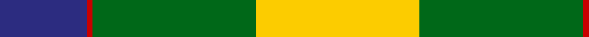
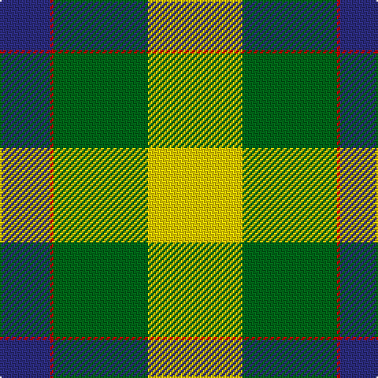

In pattern [BRGY](/patterns/brgy/).

This was sourced from tartans-authority.  It is a [4 stripes tartan](/stripes/stripes4/).

Original link http://www.tartansauthority.com/tartan-ferret/display/10535/

## Thread count
DB/32 R2 G60 Y/60

## Palette
Each colour and its ΔE from the base-6 reference it is a variant of.

| Colour | Shade | Base | ΔE (OKLab) |
|---|---|---|---|
| DB | <code style="background-color:#2C2C80;">#2C2C80</code> `#2C2C80` | B <code style="background-color:#2A418A;">#2A418A</code> | 0.06 |
| G | <code style="background-color:#006818;">#006818</code> `#006818` | G <code style="background-color:#006100;">#006100</code> | 0.02 |
| R | <code style="background-color:#C80000;">#C80000</code> `#C80000` | R <code style="background-color:#CC0000;">#CC0000</code> | 0.01 |
| Y | <code style="background-color:#FCCC00;">#FCCC00</code> `#FCCC00` | Y <code style="background-color:#F2BF00;">#F2BF00</code> | 0.04 |

# Sample pattern

## Nearest tartans

The nearest existing variants by ΔTartan distance.

1. [Loch Lomond](/setts/s4/g44w28r14y2-g008000-rc00000-we0e0e0-yf0c000/) — ΔT 1.26
1. [Delaware Fine Spirits Guild (Corp)](/setts/s6/k10g50k20y30ya2y10-g589058-k101010-y9cc484-yae8c000/) — ΔT 1.31
1. [Delaware Fine Spirits Guild](/setts/s6/k20g50k20y30w2y10-g006400-k101010-wfff68f-y90ee90/) — ΔT 1.57
1. [Michigan State University (Corporate](/setts/s7/g18w55r19g20w2g20k5-g006818-k101010-r888888-wfcfcfc/) — ΔT 1.80
1. [Loch Lomond #3](/setts/s4/g44w28r14y4-g006818-rc80000-wfcfcfc-yd8b000/) — ΔT 1.81
1. [Michigan State University](/setts/s7/g18w55r19g20w2g20k5-g006818-k101010-r888888-wffffff/) — ΔT 1.81
1. [Englehart, City of](/setts/s4/g108r36b8y56-b506878-g00540c-rc80000-ye8c000/) — ΔT 1.90
1. [MacKinnon, dress](/setts/s4/g36r28w28ra4-g008000-r703000-rac00000-we0e0e0/) — ΔT 1.99
1. [McCabe (2016)](/setts/s6/b48y6g30y72r6g12-b000080-g003820-rdc0000-yfff000/) — ΔT 2.06
1. [Brandon Manitoba Trade Tartan Tartan Number: 1884. Earliest known date: pre 1997 From Dalgleish as Hamilton of Brandon. There is a similarity to Cape Breton. And to Paton's Jacobite. See products available Copyright © Blair Urquhart, Comrie, 2015](/setts/s6/y83k35w3g35k3y10-g006818-k101010-we0e0e0-ye8c000/) — ΔT 2.10

## Neighbour map

Every grey dot is one of 15726 variants placed by the first two principal components of the ΔTartan feature space (44% of its variance). Red is this tartan; blue dots are its nearest — click one to open its page.

<svg viewBox="0 0 640 380" role="img" style="max-width:100%;height:auto;border:1px solid #e0e0e0;border-radius:4px;display:block" xmlns="http://www.w3.org/2000/svg"><image href="/nn/cloud.v1.png" width="640" height="380"/><a href="/setts/s4/g44w28r14y2-g008000-rc00000-we0e0e0-yf0c000/"><circle cx="267.3" cy="195.1" r="4" fill="#3465a4"><title>Loch Lomond</title></circle></a><a href="/setts/s6/k10g50k20y30ya2y10-g589058-k101010-y9cc484-yae8c000/"><circle cx="222.2" cy="172.3" r="4" fill="#3465a4"><title>Delaware Fine Spirits Guild (Corp)</title></circle></a><a href="/setts/s6/k20g50k20y30w2y10-g006400-k101010-wfff68f-y90ee90/"><circle cx="183.0" cy="178.8" r="4" fill="#3465a4"><title>Delaware Fine Spirits Guild</title></circle></a><a href="/setts/s7/g18w55r19g20w2g20k5-g006818-k101010-r888888-wfcfcfc/"><circle cx="217.5" cy="147.3" r="4" fill="#3465a4"><title>Michigan State University (Corporate</title></circle></a><a href="/setts/s4/g44w28r14y4-g006818-rc80000-wfcfcfc-yd8b000/"><circle cx="214.8" cy="215.8" r="4" fill="#3465a4"><title>Loch Lomond #3</title></circle></a><a href="/setts/s7/g18w55r19g20w2g20k5-g006818-k101010-r888888-wffffff/"><circle cx="216.3" cy="146.7" r="4" fill="#3465a4"><title>Michigan State University</title></circle></a><a href="/setts/s4/g108r36b8y56-b506878-g00540c-rc80000-ye8c000/"><circle cx="265.5" cy="219.1" r="4" fill="#3465a4"><title>Englehart, City of</title></circle></a><a href="/setts/s4/g36r28w28ra4-g008000-r703000-rac00000-we0e0e0/"><circle cx="149.2" cy="248.2" r="4" fill="#3465a4"><title>MacKinnon, dress</title></circle></a><a href="/setts/s6/b48y6g30y72r6g12-b000080-g003820-rdc0000-yfff000/"><circle cx="186.2" cy="177.5" r="4" fill="#3465a4"><title>McCabe (2016)</title></circle></a><a href="/setts/s6/y83k35w3g35k3y10-g006818-k101010-we0e0e0-ye8c000/"><circle cx="240.4" cy="123.1" r="4" fill="#3465a4"><title>Brandon Manitoba Trade Tartan Tartan Number: 1884. Earliest known date: pre 1997 From Dalgleish as Hamilton of Brandon. There is a similarity to Cape Breton. And to Paton's Jacobite. See products available Copyright © Blair Urquhart, Comrie, 2015</title></circle></a><circle cx="213.0" cy="190.6" r="5" fill="#c00000"/></svg>

ID: /setts/s4/y60g60r2b32-b2c2c80-g006818-rc80000-yfccc00/
